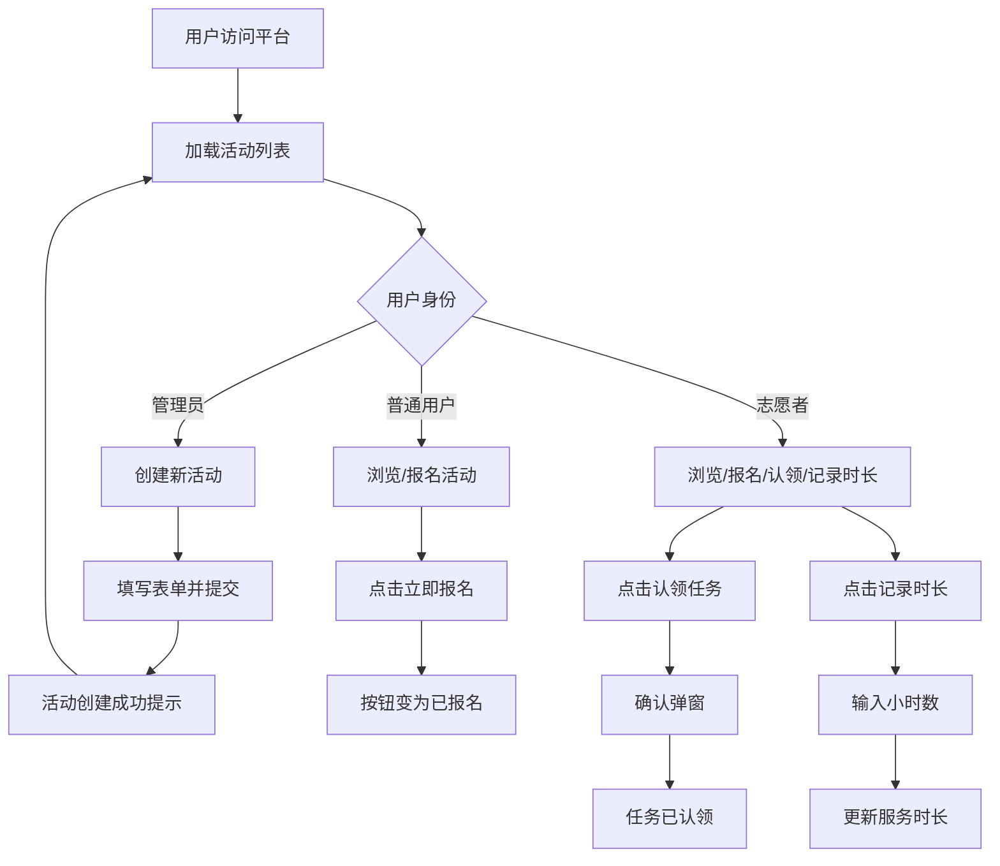

## 1. 产品概述

社区微公益互动平台——一个让管理员快速创建公益活动、用户在线报名、志愿者认领任务并记录服务时长的全流程社区公益管理平台。目标用户为社区管理员、普通居民和志愿者，旨在降低公益参与门槛，提升社区凝聚力与公益透明度。

## 2. 核心功能

### 2.1 用户角色

| 角色 | 注册方式 | 核心权限 |
|------|----------|----------|
| 管理员 | 系统预设 | 创建活动、管理活动状态 |
| 普通用户 | 下拉选择身份 | 浏览活动、报名参加活动 |
| 志愿者 | 下拉选择身份 | 浏览活动、报名参加、认领任务、记录服务时长 |

### 2.2 功能模块

1. **主页面**: 顶部导航栏、活动筛选、活动卡片网格、创建活动浮动按钮、用户信息面板
2. **创建活动弹窗**: 标题输入、描述文本域、日期选择、输入验证
3. **认领任务确认弹窗**: 深色遮罩确认弹窗
4. **记录时长弹窗**: 深色输入弹窗

### 2.3 页面详情

| 页面名称 | 模块名称 | 功能描述 |
|----------|----------|----------|
| 主页面 | 顶部导航栏 | 左侧"益公里"Logo，右侧UserInfo用户信息面板 |
| 主页面 | 活动筛选栏 | 全部/进行中/已结束三个筛选按钮 |
| 主页面 | 活动卡片网格 | 两列网格展示活动卡片，每卡片含标题、描述、日期、报名按钮、认领按钮、记录时长按钮 |
| 主页面 | 创建活动浮动按钮 | 右下角圆形按钮，点击展开ActivityForm弹窗 |
| 创建活动弹窗 | ActivityForm | 全屏遮罩表单弹窗，含标题、描述、日期输入及验证逻辑 |
| 认领任务弹窗 | 确认弹窗 | 深色遮罩+确认/取消按钮 |
| 记录时长弹窗 | 时长输入弹窗 | 深色输入框，输入0.5-24小时数 |

## 3. 核心流程

### 3.1 创建活动流程
管理员点击右下角浮动按钮→弹出ActivityForm弹窗→填写标题(≥5字符)、描述(≥20字符)、日期(不早于今天)→验证通过后提交→活动创建成功→顶部显示绿色提示条"活动创建成功！"→2秒后消失→新活动卡片出现在列表最上方，带有"进行中"绿色标签

### 3.2 用户报名流程
用户浏览活动卡片→点击"立即报名"按钮→调用API→按钮变为"已报名"(灰色禁止点击)→实时更新报名人数

### 3.3 志愿者认领任务流程
志愿者点击活动卡片上的认领按钮→弹出确认弹窗(深色遮罩)→点击确认→按钮变为"任务已认领"→UserInfo面板更新认领任务数

### 3.4 记录服务时长流程
志愿者点击"记录时长"按钮→弹出输入框→输入0.5-24小时数→提交→UserInfo面板总服务时长增加→卡片显示"已服务X小时"

### 3.5 活动筛选流程
用户点击筛选按钮(全部/进行中/已结束)→列表即时切换→响应时间不超过200ms

## 4. 用户界面设计

### 4.1 设计风格

- 主色调: 深蓝色背景(#0a1929)，卡片背景(#1e1e2e)
- 辅助色: 强调色(#64ffda)，进行中标签(#4caf50)，报名按钮(#1976d2)
- 按钮风格: 圆角胶囊按钮、深色主题扁平设计
- 字体: 系统字体栈，标题18px白色，正文14px(#b0bec5)，日期12px(#78909c)
- 布局风格: 卡片式网格布局，顶部固定导航栏
- 图标风格: 使用lucide-react图标库

### 4.2 页面设计概览

| 页面名称 | 模块名称 | UI元素 |
|----------|----------|--------|
| 主页面 | 导航栏 | 高60px，背景#0d2137，阴影2px #00000040，左侧Logo(#64ffda 24px)，右侧UserInfo |
| 主页面 | 筛选按钮行 | 3个按钮(宽120px高36px圆角18px)，选中#1976d2白字，未选#2a2a3e/#b0b0b0，过渡0.2s |
| 主页面 | 活动卡片网格 | 两列网格(>900px两列，≤900px一列)，卡片320x360px圆角12px#1e1e2e，悬浮上移4px阴影变大 |
| 主页面 | 创建浮动按钮 | 圆形56px#0d47a1，悬浮#1565c0旋转45度0.3s |
| 创建弹窗 | 表单区域 | 全屏遮罩#00000080，表单480x400px圆角16px#1e1e2e，输入框100%高48px圆角8px |
| 确认弹窗 | 认领确认 | 遮罩#00000066，弹窗#1e1e2e圆角16px，确认#4caf50，取消#757575 |
| 时长弹窗 | 输入框 | 深色#333，宽200px圆角8px边框#555 |

### 4.3 响应式设计

- 桌面端优先(>900px): 两列网格布局
- 平板端(600-900px): 单列布局
- 移动端(<600px): 单列布局，卡片宽度100%
- 所有弹窗和交互在移动端保持可用

### 4.4 动画与过渡

- 页面切换和弹窗: 淡入淡出(opacity 0→1, duration 0.3s)
- 卡片悬浮: 上移4px + 阴影变大 + 边框#303f9f
- 筛选按钮: 平滑过渡0.2s
- 浮动按钮: 旋转45度动画0.3s
- 成功提示条: 显示2秒后自动消失
