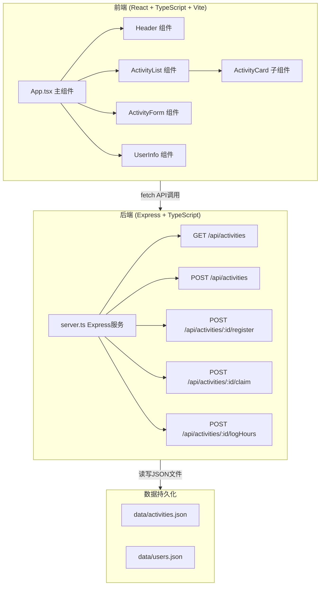
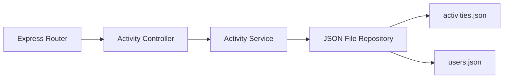
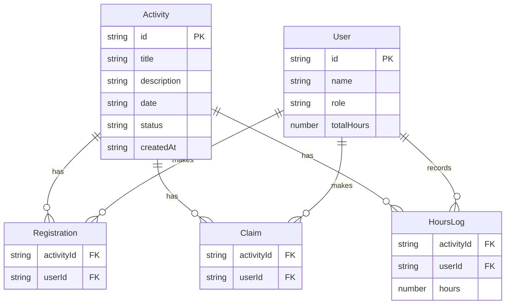

## 1. 架构设计



## 2. 技术说明

- 前端: React@18 + TypeScript + Tailwind CSS + Vite
- 初始化工具: vite-init (react-express-ts 模板)
- 后端: Express@4 + TypeScript
- 数据库: JSON文件持久化 (data/activities.json, data/users.json)
- 状态管理: Zustand
- 图标: lucide-react

## 3. 路由定义

| 路由 | 用途 |
|------|------|
| / | 主页面 - 活动列表、筛选、创建活动、用户信息 |

> 本项目为单页应用，所有功能在同一页面通过组件和弹窗交互完成

## 4. API定义

### 4.1 TypeScript类型定义

```typescript
interface Activity {
  id: string;
  title: string;
  description: string;
  date: string;
  status: '进行中' | '已结束';
  registrations: string[];
  claimedBy: string[];
  hoursLogged: { userId: string; hours: number }[];
  createdAt: string;
}

interface User {
  id: string;
  name: string;
  role: '管理员' | '普通用户' | '志愿者';
  registeredActivities: string[];
  claimedTasks: string[];
  totalHours: number;
}
```

### 4.2 请求/响应Schema

| API | 方法 | 请求体 | 响应 |
|-----|------|--------|------|
| /api/activities | GET | - | `{ activities: Activity[] }` |
| /api/activities | POST | `{ title, description, date }` | `{ activity: Activity }` |
| /api/activities/:id/register | POST | `{ userId }` | `{ activity: Activity }` |
| /api/activities/:id/claim | POST | `{ userId }` | `{ activity: Activity }` |
| /api/activities/:id/logHours | POST | `{ userId, hours }` | `{ activity: Activity }` |

## 5. 服务端架构图



## 6. 数据模型

### 6.1 数据模型定义



### 6.2 数据初始化

JSON文件初始数据包含：
- 3个预设用户(管理员、普通用户、志愿者)
- 3个示例活动(含不同状态)
- 预填充的报名、认领和时长记录
