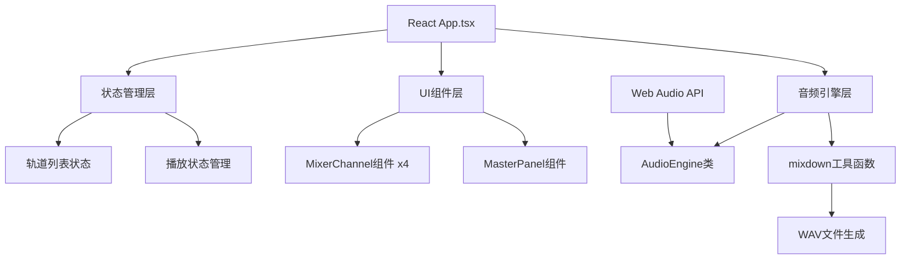

## 1. 架构设计



## 2. 技术描述

- 前端框架：React 18 + TypeScript 5
- 构建工具：Vite 5
- 音频处理：Web Audio API（浏览器原生）
- 状态管理：React useState/useReducer（轻量场景无需额外状态库）
- 样式方案：原生CSS（无Tailwind，使用CSS变量和styled-components风格的内联样式）
- 图标：lucide-react

## 3. 项目结构

```
src/
├── App.tsx              # 主应用组件，全局状态管理
├── components/
│   └── MixerChannel.tsx  # 单个混音通道组件
│   └── MasterPanel.tsx # 主控面板组件
├── audio/
│   └── AudioEngine.ts  # 音频引擎核心类
├── utils/
│   └── mixdown.ts     # WAV混音导出工具
└── samples/           # 音频样本（Base64编码）
```

## 4. 核心数据结构

### Track 接口

```typescript
interface Track {
  id: string;
  name: string;
  volume: number;      // 0-1
  pan: number;     // -1到1
  muted: boolean;
  solo: boolean;
  playing: boolean;
  effectEnabled: boolean;
  buffer: AudioBuffer | null;
  sourceNode: AudioBufferSourceNode | null;
  gainNode: GainNode | null;
  panNode: StereoPannerNode | null;
}
```

## 5. 音频信号链

```
AudioBufferSourceNode → GainNode (音量) → StereoPannerNode (声像) → GainNode (静音/独奏) → AnalyserNode (VU表) → MasterGain (总音量) → AudioDestination
```

## 6. 性能优化策略

- 音频资源使用Float32Array处理，避免频繁GC
- 音频缓冲预加载，播放时零延迟
- Canvas波形绘制使用requestAnimationFrame节流
- 混音导出使用OfflineAudioContext离线渲染
- 组件按需重渲染优化（React.memo）

## 7. 关键技术点

1. **Web Audio API 节点管理**：每个轨道独立的AudioNode链，动态连接/断开
2. **循环播放**：使用AudioBufferSourceNode.loop = true
3. **声像定位**：StereoPannerNode实现立体声定位
4. **静音/独奏逻辑**：独奏时其他轨道静音处理
5. **WAV编码**：AudioBuffer转16bit PCM WAV格式
6. **波形可视化**：Canvas绘制音频波形和动态VU表
7. **文件下载**：Blob + URL.createObjectURL

