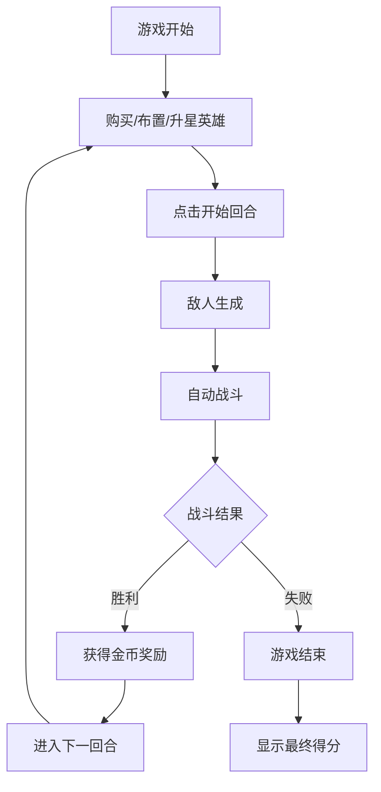

## 1. 产品概述

像素风自走棋是一款基于浏览器的策略小游戏，玩家在6x6棋盘上布置英雄阵容，通过经济管理购买和升星英雄，与自动生成的敌方单位进行战斗以赢得对局。

- 核心玩法：策略布阵 + 经济管理 + 自动战斗
- 目标用户：喜欢休闲策略游戏的玩家
- 产品价值：轻量级、易上手、有策略深度的网页游戏体验

## 2. 核心功能

### 2.1 功能模块

1. **游戏主界面**：状态栏、棋盘区域、英雄购买面板、回合开始按钮
2. **英雄系统**：英雄购买、英雄放置、英雄升星、英雄属性
3. **战斗系统**：回合制自动战斗、英雄攻击、敌人移动与攻击
4. **经济系统**：金币获取、金币消耗、连胜奖励
5. **胜负判定**：回合胜利/失败、游戏结束、得分展示

### 2.2 页面详情

| 页面名称 | 模块名称 | 功能描述 |
|-----------|-------------|---------------------|
| 游戏主界面 | 状态栏 | 显示金币数量、回合数、上阵英雄数 |
| 游戏主界面 | 棋盘区域 | 6x6网格，放置英雄，显示战斗过程 |
| 游戏主界面 | 英雄购买面板 | 展示待选英雄卡牌，购买和升星操作 |
| 游戏主界面 | 回合开始按钮 | 触发战斗阶段开始 |
| 游戏主界面 | 结果弹窗 | 显示胜利/失败信息和奖励 |

## 3. 核心流程

玩家进入游戏后，初始拥有5金币。玩家可以从英雄面板购买英雄放置到棋盘上，也可以对已有英雄进行升星。准备就绪后点击开始回合，敌方单位从右侧出现，自动战斗开始。战斗结束后根据结果结算奖励，进入下一回合。

## 4. 用户界面设计

### 4.1 设计风格

- **整体风格**：暗黑像素风，复古游戏感
- **主色调**：深灰色背景 #0d0d0d，面板背景 #1a1a2e
- **强调色**：金币黄 #fdd835，危险红 #c62828，成功绿 #2e7d32
- **字体**：等宽字体 monospace，像素感
- **按钮风格**：圆角设计，悬停有交互反馈
- **动效**：平滑过渡动画，弹窗缩放动画

### 4.2 页面设计概述

| 页面名称 | 模块名称 | UI元素 |
|-----------|-------------|-------------|
| 游戏主界面 | 状态栏 | 深灰背景，金色金币数值，白色回合数和英雄数，底部分隔线 |
| 游戏主界面 | 棋盘 | 6x6网格，#2a2a3e网格线，选中格子金色发光边框 |
| 游戏主界面 | 英雄卡牌 | 80x100px，圆角8px，像素emoji头像，底部金币花费 |
| 游戏主界面 | 回合按钮 | 120x40px，圆角20px，红色背景，不可用时半透明 |
| 游戏主界面 | 结果弹窗 | 300x200px，圆角16px，中心缩放动画 |

### 4.3 响应性

- 桌面端优先设计
- 棋盘居中显示，HeroPanel位于棋盘下方
- 回合按钮位于棋盘右侧

### 4.4 动画效果

- 英雄移动：0.3秒CSS transition平滑移动
- 卡牌悬停：放大1.1倍 + 白色半透明阴影
- 弹窗出现：从中心缩放，持续0.4秒
- 战斗过程：每100ms一帧更新，requestAnimationFrame驱动
