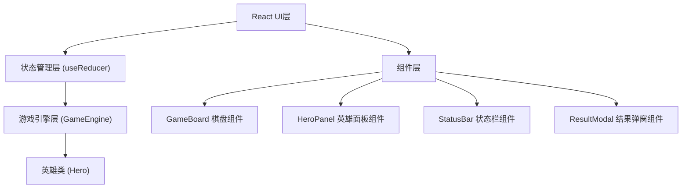

## 1. 架构设计



## 2. 技术描述

- **前端框架**：React 18 + TypeScript
- **构建工具**：Vite
- **状态管理**：React useReducer + 事件驱动
- **游戏循环**：requestAnimationFrame
- **样式方案**：内联样式 + CSS transition
- **初始化工具**：手动搭建Vite + React + TypeScript项目

## 3. 文件结构

```
src/
├── components/
│   ├── GameBoard.tsx      # 棋盘渲染与交互
│   ├── HeroPanel.tsx      # 英雄购买面板
│   ├── StatusBar.tsx      # 顶部状态栏
│   └── ResultModal.tsx    # 结果弹窗
├── core/
│   ├── GameEngine.ts      # 游戏循环引擎
│   └── Hero.ts            # 英雄类定义
├── types/
│   └── index.ts           # 类型定义
├── App.tsx                # 根组件
└── main.tsx               # 入口文件
```

## 4. 核心模块设计

### 4.1 Hero 类

- **属性**：name, star, atk, hp, maxHp, pos, range, speed, isEnemy, emoji
- **方法**：
  - `attack(target: Hero): void` - 攻击目标
  - `move(targetPos: Position): void` - 移动到目标位置
  - `takeDamage(damage: number): void` - 受到伤害
  - `upgrade(): void` - 升星

### 4.2 GameEngine 类

- **属性**：heroes数组, boardState对象, gold, round, winStreak, gameState
- **方法**：
  - `placeHero(heroId, pos): boolean` - 放置英雄
  - `buyHero(heroType): Hero | null` - 购买英雄
  - `upgradeHero(heroType): boolean` - 升星英雄
  - `startRound(): void` - 开始回合
  - `update(deltaTime): void` - 每帧更新
  - `on(event, callback): void` - 事件订阅
- **事件**：stateUpdate, roundEnd, gameOver

### 4.3 状态管理

- 使用useReducer管理UI状态
- GameEngine通过事件驱动通知组件更新
- 组件仅订阅必要的状态变化，避免不必要重渲染

## 5. 性能优化

- 游戏循环使用requestAnimationFrame，60FPS运行
- 单次update计算耗时小于5ms
- React组件使用memo优化，仅在状态变化时重渲染
- 使用CSS transform实现平滑移动，开启硬件加速
- 及时清理动画帧和事件监听器，避免内存泄漏

## 6. 游戏平衡参数

| 参数 | 数值 |
|------|------|
| 初始金币 | 5 |
| 金币上限 | 20 |
| 基础回合奖励 | 2 |
| 连胜额外奖励 | 1/连胜场 |
| 棋盘大小 | 6x6 |
| 每帧间隔 | 100ms |
| 移动动画时长 | 0.3s |
| 升星属性倍率 | 1.5x |
| 敌人血量范围 | 20-40 |
| 敌人攻击范围 | 3-6 |
