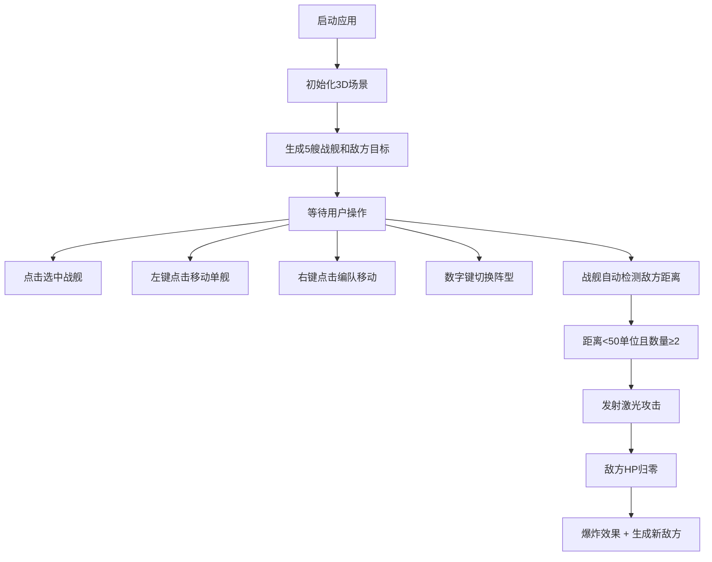

## 1. 产品概述

太空战舰3D编队飞行模拟器是一款基于WebGL的实时三维战术协同应用，解决玩家在太空策略游戏中难以直观规划多艘舰船编队运动和协同攻击路线的问题。通过沉浸式的3D星图环境，玩家可以直观地指挥多艘战舰进行编队飞行、阵型切换和协同攻击。

- 核心目标：提供直观的太空战舰编队指挥体验，让玩家能够可视化地规划和执行复杂的编队战术
- 目标用户：太空策略游戏玩家、战术模拟爱好者
- 产品价值：将抽象的编队指挥转化为可视化的3D交互体验，降低战术规划的认知门槛

## 2. 核心功能

### 2.1 功能模块

1. **3D场景渲染**：深空背景、星光粒子效果、多艘战舰模型、敌方目标
2. **战舰控制系统**：单舰选中、单舰移动、编队跟随移动
3. **编队阵型系统**：四种阵型切换（菱形、V型、纵队、圆圈）、平滑过渡动画
4. **战斗系统**：自动攻击、激光发射、敌方HP管理、爆炸效果
5. **UI信息面板**：编队信息显示、舰船数量统计、阵型状态

### 2.2 功能详情

| 功能模块 | 子功能 | 功能描述 |
|----------|--------|----------|
| 3D场景渲染 | 战舰生成 | 至少5艘不同颜色和形状的战舰，由椭球体舰身、圆柱体引擎、三角柱翼片拼合 |
| 3D场景渲染 | 场景环境 | 深空蓝黑背景、100个星光粒子、敌方红色球体目标 |
| 战舰控制 | 单舰选中 | 点击战舰显示半透明选中圆环，其他舰船保持原色 |
| 战舰控制 | 单舰移动 | 左键点击目标位置，选中战舰平滑移动，舰首朝向目标，带偏航旋转 |
| 战舰控制 | 编队移动 | 右键点击目标位置，所有未选中舰船以选中舰为首形成三角形编队 |
| 编队阵型 | 阵型切换 | 数字键1-4切换菱形、V型、纵队、圆圈阵型 |
| 编队阵型 | 平滑过渡 | 2秒内贝塞尔曲线路径移动到新阵型位置，颜色过渡1.5秒 |
| 战斗系统 | 自动攻击 | 两艘及以上舰船距敌小于50单位时自动发射激光 |
| 战斗系统 | 敌方系统 | 敌方HP100点，每30秒随机刷新，被击毁时爆炸效果 |
| UI面板 | 编队信息 | 左下角显示当前阵型名称和选中舰船数量 |
| UI面板 | 统计信息 | 左上角显示舰船总数和存活数 |
| 视角控制 | 相机操作 | 默认俯视45度缓慢自转，支持拖拽旋转、滚轮缩放 |

## 3. 核心流程

用户打开应用后，场景中自动生成5艘战舰和1个敌方目标。用户可以点击选中任意战舰，通过左键控制其移动，右键指挥编队移动，通过数字键切换编队阵型。当战舰接近敌方时自动进入攻击状态，击毁敌方后生成新目标。

## 4. 用户界面设计

### 4.1 设计风格

- **主题配色**：深空蓝黑主题，主背景#0a0a1a，半透明面板#1a1a2e
- **色彩系统**：
  - 阵型主题色：菱形#ff4444（红）、V型#44ff44（绿）、纵队#4444ff（蓝）、圆圈#ffaa00（橙）
  - 选中标记：#00ffff（青色）半透明
  - 文字颜色：#c8d6e5（浅蓝灰）、白色
- **视觉效果**：星光粒子闪烁、激光光束、爆炸粒子、平滑移动动画
- **布局风格**：固定定位UI面板，3D场景全屏显示

### 4.2 页面设计

| 区域 | 模块名称 | UI元素 |
|------|----------|--------|
| 全屏 | 3D场景 | 星空背景、战舰模型、敌方目标、激光、爆炸效果 |
| 左下角 | 编队信息面板 | 宽280px高200px圆角12px半透明面板，显示阵型名称、选中舰船数 |
| 左上角 | 统计信息 | 白色文字，显示舰船总数/存活数 |

### 4.3 交互设计

- **鼠标左键**：点击战舰选中、点击空白处移动选中舰、拖拽旋转视角
- **鼠标右键**：点击目标位置指挥编队移动
- **鼠标滚轮**：缩放视角（50-500单位范围）
- **键盘1-4**：切换编队阵型
- **默认视角**：俯视45度，绕Y轴每秒0.5度缓慢自转

### 4.4 3D场景指导

- **环境**：深空蓝黑背景（#0a0a1a），100个星光粒子随机分布，缓慢闪烁
- **光照**：环境光+方向光组合，突出战舰金属质感
- **相机**：初始位置俯视45度，距离场景中心约200单位，支持OrbitControls
- **性能**：总对象数≤200，保持30FPS以上
- **动画**：舰船悬停浮动、偏航旋转、贝塞尔曲线移动、颜色过渡、爆炸粒子
