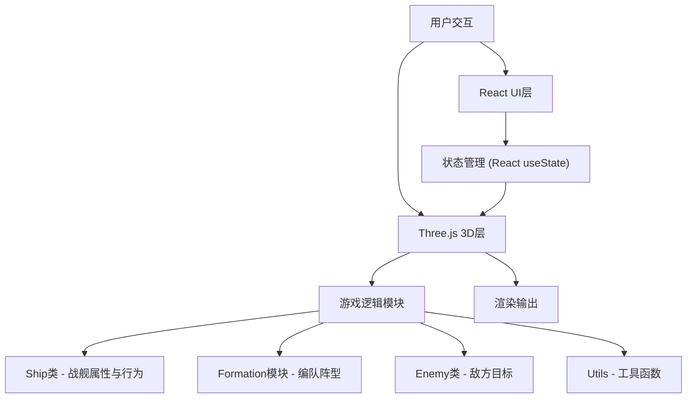

## 1. 架构设计

本项目为纯前端3D应用，采用React组件化架构，结合Three.js进行3D渲染，游戏逻辑与UI层分离。



## 2. 技术描述

### 2.1 核心技术栈

| 技术 | 版本 | 用途 |
|------|------|------|
| React | ^18 | 前端框架，UI组件化 |
| react-dom | ^18 | React DOM渲染 |
| TypeScript | ^5 | 类型安全的JavaScript |
| Vite | ^5 | 构建工具，开发服务器 |
| three | ^0.160 | 3D渲染引擎 |
| @react-three/fiber | ^8 | React Three.js渲染器 |
| @react-three/drei | ^9 | Three.js辅助组件库 |
| @vitejs/plugin-react | ^4 | Vite React插件 |

### 2.2 项目初始化

- 使用 `npm init vite-init@latest . -- --template react-ts --force` 初始化React + TypeScript项目
- 安装Three.js相关依赖：`three`, `@react-three/fiber`, `@react-three/drei`
- 安装类型定义：`@types/react`, `@types/react-dom`, `@types/three`

## 3. 文件结构

```
.
├── package.json
├── index.html
├── tsconfig.json
├── vite.config.js
└── src/
    ├── main.tsx          # React入口
    ├── App.tsx           # 主组件，场景状态管理
    ├── ship.ts           # Ship类，战舰逻辑
    ├── formation.ts      # 编队阵型逻辑
    ├── enemy.ts          # Enemy类，敌方逻辑
    └── utils.ts          # 工具函数
```

## 4. 数据模型

### 4.1 Ship类型

```typescript
interface Ship {
  id: string;
  position: THREE.Vector3;
  targetPosition: THREE.Vector3 | null;
  color: string;
  targetColor: string;
  hp: number;
  maxHp: number;
  speed: number;
  rotation: THREE.Euler;
  isSelected: boolean;
  isMoving: boolean;
  isAttacking: boolean;
  attackCooldown: number;
  yawRotation: number;
  hoverOffset: number;
  formationPosition: THREE.Vector3 | null;
  bezierPath: BezierPoint[] | null;
  pathProgress: number;
  colorTransition: {
    from: string;
    to: string;
    progress: number;
    duration: number;
  } | null;
}
```

### 4.2 Enemy类型

```typescript
interface Enemy {
  id: string;
  position: THREE.Vector3;
  hp: number;
  maxHp: number;
  spawnTime: number;
  isExploding: boolean;
  explosionParticles: ExplosionParticle[];
}
```

### 4.3 FormationType枚举

```typescript
enum FormationType {
  DIAMOND = 'diamond',
  V_SHAPE = 'v_shape',
  COLUMN = 'column',
  CIRCLE = 'circle',
}
```

## 5. 核心模块设计

### 5.1 ship.ts - 战舰模块

- `createShip(id: string, position: THREE.Vector3, color: string): Ship` - 创建战舰
- `moveShip(ship: Ship, target: THREE.Vector3, delta: number): void` - 移动战舰
- `rotateShip(ship: Ship, delta: number): void` - 旋转战舰朝向目标
- `updateShip(ship: Ship, delta: number, enemy: Enemy | null): void` - 更新战舰状态

### 5.2 formation.ts - 编队模块

- `formationPositions(type: FormationType, count: number, leader: THREE.Vector3): THREE.Vector3[]` - 计算阵型位置
- `updateFormation(ships: Ship[], type: FormationType, leaderId: string): void` - 更新编队位置

### 5.3 enemy.ts - 敌方模块

- `spawnEnemy(): Enemy` - 生成敌方目标
- `updateEnemy(enemy: Enemy, delta: number): void` - 更新敌方状态
- `createExplosion(position: THREE.Vector3): ExplosionParticle[]` - 创建爆炸效果

### 5.4 utils.ts - 工具函数

- `bezierInterpolation(p0: THREE.Vector3, p1: THREE.Vector3, p2: THREE.Vector3, t: number): THREE.Vector3` - 贝塞尔曲线插值
- `colorInterpolation(color1: string, color2: string, t: number): string` - 颜色插值
- `randomRange(min: number, max: number): number` - 随机数生成
- `randomPositionInSphere(radius: number): THREE.Vector3` - 球形区域随机位置

## 6. 性能优化

- 使用对象池管理激光和爆炸粒子，避免频繁创建销毁
- 限制场景总对象数≤200
- 使用InstancedMesh渲染大量重复对象（如星光粒子）
- 合理设置渲染循环，只在必要时更新状态
- 使用requestAnimationFrame驱动动画，保持30FPS以上
