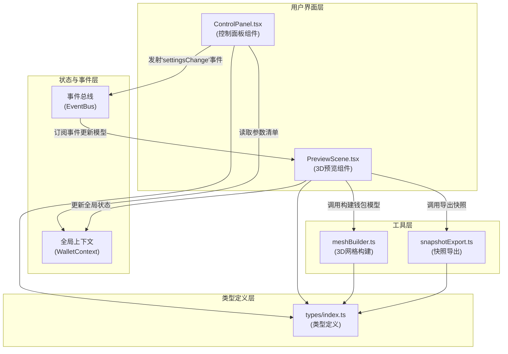

## 1. 架构设计



**数据流向说明：**
1. 用户交互 → ControlPanel → 发射'settingsChange'事件（含color、texture、stitchType、style）
2. 事件总线 → PreviewScene订阅 → 更新3D对象材质/几何体
3. PreviewScene → meshBuilder.buildWalletModel() → 返回THREE.Mesh组合
4. 用户点击导出 → PreviewScene → snapshotExport.exportSnapshot() → 生成ZIP下载
5. 参数变更 → 更新全局上下文 → 参数清单实时展示

## 2. 技术描述

- **前端框架**：React@18 + TypeScript@5
- **构建工具**：Vite@5 + @vitejs/plugin-react@4
- **3D渲染**：three@0.160 + @react-three/fiber@8 + @react-three/drei@9
- **状态管理**：React Context + 自定义事件总线
- **样式方案**：CSS Modules / 内联样式（按需求具体实现）
- **打包下载**：JSZip@3（用于生成ZIP文件）

### 核心依赖说明
- `three`：WebGL 3D渲染引擎核心
- `@react-three/fiber`：React渲染器，将Three.js对象声明为React组件
- `@react-three/drei`：Three.js常用组件库（OrbitControls等）
- `jszip`：ZIP文件打包库
- `file-saver`：文件下载辅助库（可选）

## 3. 路由定义
本应用为单页面应用，无需多路由配置。

| 路由 | 用途 |
|-------|---------|
| / | 主页面，包含控制面板和3D预览区 |

## 4. 目录结构

```
auto60/
├── src/
│   ├── components/
│   │   ├── ControlPanel.tsx      # 控制面板组件
│   │   └── PreviewScene.tsx      # 3D预览场景组件
│   ├── utils/
│   │   ├── meshBuilder.ts        # 3D网格构建工具
│   │   ├── snapshotExport.ts     # 快照导出工具
│   │   └── eventBus.ts           # 自定义事件总线
│   ├── context/
│   │   └── WalletContext.tsx     # 全局状态上下文
│   ├── types/
│   │   └── index.ts              # TypeScript类型定义
│   ├── textures/                 # 皮革纹理贴图资源
│   │   ├── cross.webp
│   │   ├── litchi.webp
│   │   ├── grain.webp
│   │   └── wax.webp
│   ├── App.tsx                   # 根应用组件
│   └── main.tsx                  # 应用入口
├── index.html
├── vite.config.js
├── tsconfig.json
└── package.json
```

## 5. 数据模型

### 5.1 核心接口定义

```typescript
// 钱包款式枚举
export enum WalletStyle {
  SHORT_FOLD = 'short_fold',    // 短款两折
  LONG_ZIPPER = 'long_zipper',  // 长款拉链
  COIN_POUCH = 'coin_pouch'     // 硬币卡包
}

// 缝线类型枚举
export type StitchType = 'single' | 'double' | 'cross'

// 钱包设置接口
export interface IWalletSettings {
  style: WalletStyle
  color: string
  texture: string
  stitchType: StitchType
}

// 事件总线事件类型
export enum EventType {
  SETTINGS_CHANGE = 'settingsChange'
}

// 事件处理函数类型
export type EventHandler<T = any> = (data: T) => void

// 导出参数接口
export interface IExportParams {
  styleName: string
  colorHex: string
  textureName: string
  stitchType: string
  timestamp: number
}
```

### 5.2 款式参数映射

| 款式 | 尺寸（宽x高x深） | 圆角半径 | 特殊结构 |
|------|-----------------|----------|----------|
| 短款两折 | 180 x 100 x 40 | 8px | 中间折痕凹槽 |
| 长款拉链 | 200 x 110 x 25 | 6px | 边缘拉链轨道 |
| 硬币卡包 | 120 x 90 x 30 | 10px | 顶部硬币袋开口 |

### 5.3 缝线配置

| 缝线类型 | 线径 | 间距 | 角度 | 排列方式 |
|----------|------|------|------|----------|
| single（单直线） | 0.8px | 6px | 0° | 单排沿边 |
| double（双直线） | 0.6px | 5px | 0° | 双排平行 |
| cross（X形交叉） | 0.5px | 8px | ±45° | 交叉编织 |
