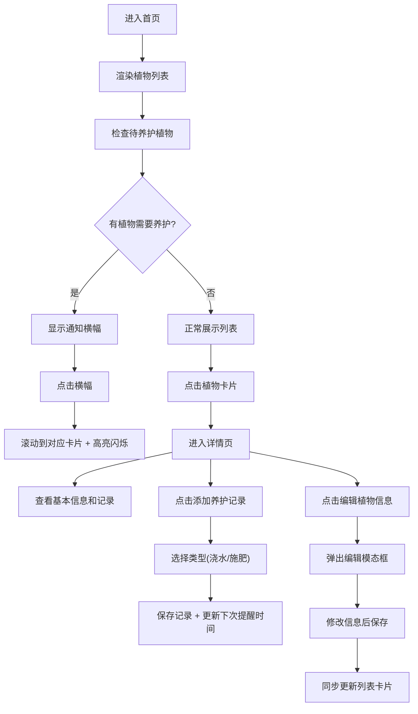

## 1. 产品概述

家庭植物养护记录与智能提醒系统，为植物爱好者提供植物信息管理、养护记录追踪和智能提醒功能，帮助用户科学养护每一盆植物。

- 核心价值：解决植物养护"忘记浇水施肥"的痛点，通过数据记录和智能计算，让植物养护更科学、更省心
- 目标用户：家庭植物爱好者、新手养花人群

## 2. 核心功能

### 2.1 功能模块

1. **首页主界面**：植物列表卡片展示、通知横幅、快捷操作按钮
2. **植物详情页**：植物详细信息展示、养护记录历史、添加养护记录入口
3. **编辑植物模态框**：修改植物基本信息（名称、品种、光照、位置偏好）
4. **智能提醒系统**：后台定时检查、待养护通知横幅、高亮定位功能

### 2.2 页面详情

| 页面名称 | 模块名称 | 功能描述 |
|---------|---------|---------|
| 首页主界面 | 通知横幅 | 顶部显示待养护植物数量，点击滚动并高亮对应卡片 |
| 首页主界面 | 植物列表 | 左侧320px宽白色区域，展示所有植物卡片 |
| 首页主界面 | 植物卡片 | 280x100px圆角卡片，显示名称、品种、浇水倒计时、快捷按钮 |
| 植物详情页 | 大头贴区域 | 顶部200px高圆角占位图，展示植物照片 |
| 植物详情页 | 基本信息区 | 品种、光照偏好、位置偏好、上次浇水/施肥时间 |
| 植物详情页 | 操作按钮区 | 添加养护记录按钮（160x44px圆角绿色） |
| 植物详情页 | 养护记录列表 | 历史记录，显示操作类型、时间、操作人 |
| 编辑模态框 | 表单区域 | 植物名、品种、光照、位置偏好编辑表单 |
| 编辑模态框 | 保存/取消 | 保存同步更新列表，取消关闭模态框 |

## 3. 核心流程

用户进入首页 → 查看植物列表和通知横幅 → 点击植物卡片查看详情 → 点击快捷按钮添加养护记录 → 或点击编辑修改植物信息 → 系统后台每日定时检查 → 生成待养护通知

## 4. 用户界面设计

### 4.1 设计风格

- **主色调**：浅绿色主题，背景色 `#f0fdf4`，营造自然清新的花园感
- **辅助色**：
  - 卡片背景白色 `#ffffff`
  - 浇水按钮蓝色 `#3b82f6`
  - 施肥按钮绿色 `#22c55e`
  - 警告红色背景 `#fef2f2`
  - 通知横幅黄色 `#fef9c3` 配文字 `#854d0e`
  - 主按钮绿色 `#16a34a`
- **按钮样式**：圆形快捷按钮（直径36px），胶囊形主按钮（圆角22px）
- **圆角规范**：列表容器16px，卡片12px，倒计时徽章8px，通知横幅8px，主按钮22px
- **图标风格**：水滴、叶子、太阳等自然元素线条图标
- **阴影规范**：轻微阴影，营造卡片悬浮感

### 4.2 页面设计概览

| 页面名称 | 模块名称 | UI元素 |
|---------|---------|--------|
| 首页 | 通知横幅 | 高48px，黄色背景，圆角8px，边距12px，点击有缓动动画 |
| 首页 | 植物列表容器 | 宽320px，白色背景，圆角16px，轻微阴影 |
| 首页 | 植物卡片 | 280x100px，圆角12px，内边距12px，transform 0.3s过渡动画 |
| 首页 | 快捷按钮 | 圆形36px，悬浮放大1.1倍，水蓝色水滴/绿色叶子图标 |
| 详情页 | 大头贴 | 宽100%高200px，圆角12px，浅蓝背景 |
| 详情页 | 添加记录按钮 | 160x44px，圆角22px，绿色背景白色文字 |
| 模态框 | 编辑面板 | 400x500px，白色背景圆角16px，遮罩半透明#00000055 |

### 4.3 响应式设计

- **桌面端**（>640px）：左侧植物列表（320px宽）+ 右侧详情区域并排布局
- **移动端**（≤640px）：列表占满全屏，详情页在列表下方堆叠显示
- **触摸优化**：按钮尺寸确保移动端易点击，卡片间距适合触控

### 4.4 动画效果

- 卡片切换：transform 0.3s ease 平滑过渡
- 模态框打开：背景模糊 + 缩放进入
- 模态框关闭：缩放回缩动画
- 快捷按钮悬浮：scale(1.1) 放大效果
- 通知高亮：边框闪烁 `#16a34a` 2px 缓动 0.5s
