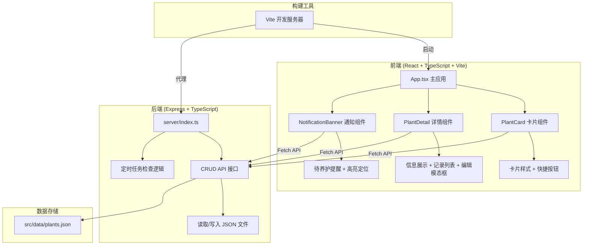

## 1. 架构设计



## 2. 技术选型

- **前端框架**：React 18 + TypeScript（严格模式）
- **构建工具**：Vite 5 + @vitejs/plugin-react
- **样式方案**：CSS Modules + 内联样式（无需额外CSS框架）
- **后端框架**：Express 4 + TypeScript
- **数据存储**：JSON 文件（plants.json）
- **跨域处理**：cors 中间件
- **ID生成**：uuid 库

## 3. 项目文件结构

```
auto62/
├── package.json              # 项目配置与依赖
├── index.html                # Vite 入口HTML
├── vite.config.js            # Vite 配置（含代理）
├── tsconfig.json             # TypeScript 严格模式配置
├── src/
│   ├── App.tsx               # 主应用组件（路由+全局状态）
│   ├── components/
│   │   ├── PlantCard.tsx     # 植物卡片组件
│   │   ├── PlantDetail.tsx   # 植物详情组件
│   │   └── NotificationBanner.tsx  # 通知横幅组件
│   └── data/
│       └── plants.json       # 初始植物数据
└── server/
    └── index.ts              # Express 后端服务
```

## 4. API 定义

### 4.1 TypeScript 类型定义

```typescript
// 光照偏好类型
type LightPreference = 'direct' | 'scattered' | 'shady';

// 位置偏好类型
type LocationPreference = 'balcony' | 'living_room' | 'bedroom';

// 养护操作类型
type CareType = 'water' | 'fertilize';

// 养护记录接口
interface CareRecord {
  id: string;
  type: CareType;
  time: string;           // ISO 时间戳
  operator: string;       // 操作人
}

// 植物接口
interface Plant {
  id: string;
  name: string;           // 植物名
  variety: string;        // 品种名
  lightPreference: LightPreference;
  locationPreference: LocationPreference;
  waterInterval: number;  // 浇水间隔（天）
  fertilizeInterval: number; // 施肥间隔（天）
  lastWaterTime: string;  // 上次浇水时间
  lastFertilizeTime: string; // 上次施肥时间
  careRecords: CareRecord[];
  isSucculent: boolean;   // 是否多肉（影响默认间隔）
}
```

### 4.2 RESTful API 接口

| 方法 | 路径 | 用途 | 请求体 | 响应 |
|------|------|------|--------|------|
| GET | `/api/plants` | 获取所有植物列表 | - | Plant[] |
| GET | `/api/plants/:id` | 获取单株植物详情 | - | Plant |
| POST | `/api/plants` | 新增植物 | Partial\<Plant\> | Plant |
| PUT | `/api/plants/:id` | 更新植物信息 | Partial\<Plant\> | Plant |
| DELETE | `/api/plants/:id` | 删除植物 | - | { success: boolean } |
| POST | `/api/plants/:id/care` | 添加养护记录 | { type: CareType, operator: string } | Plant |
| GET | `/api/plants/need-care` | 获取需要养护的植物列表 | - | { plantId: string, type: CareType, daysOverdue: number }[] |

## 5. 智能提醒算法

### 5.1 间隔规则

| 植物类型 | 浇水间隔（天） | 施肥间隔（天） |
|---------|--------------|--------------|
| 多肉植物 | 14 | 30 |
| 其他植物 | 7 | 21 |

### 5.2 检查逻辑

```
对于每株植物：
  下次浇水时间 = 上次浇水时间 + 浇水间隔（天）
  下次施肥时间 = 上次施肥时间 + 施肥间隔（天）
  
  如果 当前日期 > 下次浇水时间：
    标记为需要浇水，逾期天数 = 当前日期 - 下次浇水时间
  
  如果 当前日期 > 下次施肥时间：
    标记为需要施肥，逾期天数 = 当前日期 - 下次施肥时间
```

### 5.3 定时任务

- 触发方式：后端启动时 + 每24小时执行一次（setInterval 模拟）
- 执行内容：遍历所有植物，计算待养护列表并缓存
- 前端：每次加载页面时调用 `/api/plants/need-care` 获取最新数据

## 6. 性能要求

- 操作响应时间：添加记录、编辑植物 ≤ 200ms
- 数据持久化：写入 JSON 文件采用 fs 同步/异步操作
- 前端状态：使用 React useState/useReducer，避免不必要的重渲染
- 动画：CSS transform/transition 硬件加速

## 7. 启动方式

```bash
# 安装依赖
npm install

# 启动开发（Vite前端 + Express后端同时运行）
npm run dev
```

开发模式采用 Vite 配置 `server.proxy` 将 `/api` 请求代理到 Express 后端端口（如 3001）。
