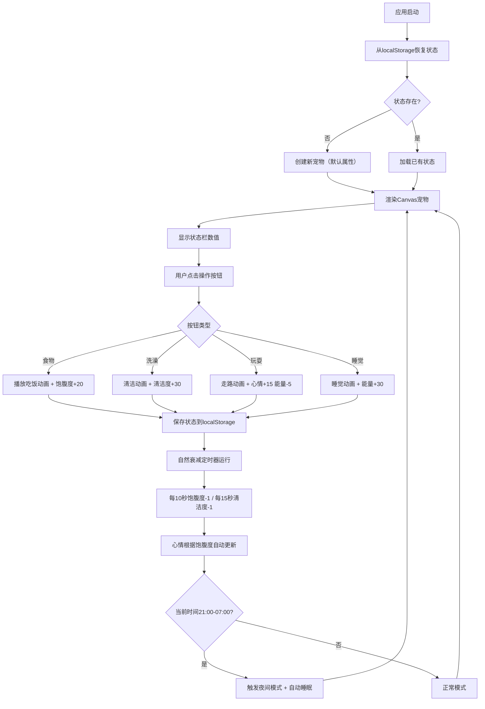

## 1. 产品概述
复古像素风电子宠物养成应用，模拟早期掌机体验，用户通过喂食、清洁、玩耍、睡觉等交互照料一只像素小精灵，观察其心情和健康状态变化。
- 主要目的：提供怀旧的电子宠物养成体验，满足用户对复古游戏的情感需求
- 目标用户：喜欢复古像素风格、电子宠物类游戏的玩家

## 2. 核心功能

### 2.1 功能模块
1. **主页面**：Canvas宠物显示区、顶部状态栏、底部操作面板

### 2.2 页面详情
| 页面名称 | 模块名称 | 功能描述 |
|-----------|-------------|---------------------|
| 主页面 | Canvas宠物区 | 480x320像素画布，绘制16x16像素精灵图，支持4种动画（站立眨眼、走路、吃饭、睡觉） |
| 主页面 | 顶部状态栏 | 心情图标（30x30px）+ 四个进度条（心情/饱腹度/清洁度/能量，各120x14px） |
| 主页面 | 底部操作面板 | 四个功能按钮（食物/洗澡/玩耍/睡觉，直径48px圆角） |
| 主页面 | 夜间模式 | 21:00-07:00自动切换深蓝背景+星星粒子，禁用进食和玩耍按钮 |

## 3. 核心流程
用户打开应用 → 从localStorage恢复宠物状态（或创建新宠物） → 观察宠物当前状态（心情/饱腹度/清洁度/能量） → 根据状态选择操作（喂食/洗澡/玩耍/睡觉）→ 触发对应动画和属性变化 → 状态自动保存 → 自然属性衰减（每10秒饱腹度-1，每15秒清洁度-1） → 心情根据饱腹度自动变化 → 夜间模式自动触发

## 4. 用户界面设计

### 4.1 设计风格
- **主色调**：Game Boy绿色#9bbc0f（画布背景）、深棕色#2b1b0e（页面背景）、深色#1a1a2e（UI容器）
- **像素调色板**：#4a2e1b、#f5d742、#2b8c4e、#c94f4f、#3b82f6、#22c55e、#7c3aed、#ff6b6b、#ffa502、#1e90ff、#ffd700、#0a0a2e
- **按钮风格**：圆形/圆角，按下时缩放至0.85倍，150ms回弹
- **字体**：Press Start 2P 像素字体
- **布局风格**：掌机屏幕式布局，居中对齐，画布带2px深色边框和半圆角
- **图标**：使用emoji图标（🍔🚿🎮🌙❤️🍖✨⚡😊😐😢）

### 4.2 页面设计概述
| 页面名称 | 模块名称 | UI元素 |
|-----------|-------------|-------------|
| 主页面 | 标题区 | "Pocket Pet"白色11px像素字体，位于画布上方 |
| 主页面 | Canvas区 | 480x320px，#9bbc0f背景，2px深色边框，半圆角 |
| 主页面 | 顶部状态栏 | #1a1a2e容器，圆角8px，内边距12px，心情图标+4条渐变进度条 |
| 主页面 | 底部操作面板 | #1a1a2e容器，圆角8px，内边距12px，4个彩色圆形按钮水平排列 |
| 主页面 | 夜间模式 | Canvas背景切换为#0a0a2e，50颗闪烁星星粒子，进食/玩耍按钮灰色半透明禁用 |

### 4.3 响应式
- 桌面端优先设计，整体容器水平居中
- 按钮支持触摸设备点击优化
- 最小支持宽度：520px
