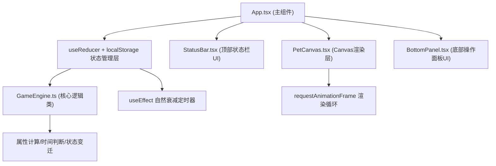

## 1. 架构设计



## 2. 技术描述
- **前端框架**：React@18 + TypeScript@5
- **构建工具**：Vite@5 + @vitejs/plugin-react@4
- **状态管理**：React useReducer（按用户要求，不使用zustand）
- **数据持久化**：localStorage（自定义hook封装）
- **图形渲染**：Canvas 2D API + requestAnimationFrame
- **字体**：Google Fonts - Press Start 2P
- **后端**：无（纯前端应用）
- **数据库**：无（localStorage存储）

## 3. 文件结构
| 文件路径 | 用途 |
|----------|------|
| package.json | 依赖：react, react-dom, typescript, vite, @vitejs/plugin-react, @types/react, @types/react-dom |
| index.html | 入口页面，引入Press Start 2P字体，背景色#2b1b0e |
| tsconfig.json | TypeScript严格模式配置 |
| vite.config.js | Vite基础配置 |
| src/App.tsx | 主组件，useReducer管理全局状态，子组件布局 |
| src/PetCanvas.tsx | Canvas组件，requestAnimationFrame循环，像素精灵绘制 |
| src/GameEngine.ts | 核心逻辑类，宠物属性、时间作息、状态变迁 |
| src/ui/BottomPanel.tsx | 底部操作面板，4个功能按钮 |
| src/ui/StatusBar.tsx | 顶栏，心情图标、4个进度条 |

## 4. 数据模型

### 4.1 PetState 接口
```typescript
interface PetState {
  name: string;
  happiness: number;      // 心情 0-100
  hunger: number;         // 饱腹度 0-100
  cleanliness: number;    // 清洁度 0-100
  energy: number;         // 能量 0-100
  currentAnimation: AnimationType;  // idle/walk/eat/sleep
  animationFrame: number; // 当前帧
  lastUpdateTime: number; // 上次更新时间戳
  isNightMode: boolean;   // 是否夜间模式
  simulatedHour: number;  // 模拟时间（小时0-23）
}

type AnimationType = 'idle' | 'walk' | 'eat' | 'sleep';
type MoodType = 'happy' | 'normal' | 'sad';
```

### 4.2 Action 类型
```typescript
type PetAction =
  | { type: 'FEED' }
  | { type: 'BATH' }
  | { type: 'PLAY' }
  | { type: 'SLEEP' }
  | { type: 'TICK' }
  | { type: 'SET_ANIMATION'; payload: AnimationType }
  | { type: 'ADVANCE_FRAME' }
  | { type: 'LOAD'; payload: PetState }
  | { type: 'TOGGLE_NIGHT'; payload: boolean };
```

## 5. 性能优化策略
- **Canvas重绘优化**：仅在状态变化标记时执行重绘，使用requestAnimationFrame循环，目标帧率30fps+
- **定时器合并**：自然衰减使用单个setInterval（每5秒检查一次累积衰减量）
- **localStorage防抖**：状态变化后1秒批量写入，避免频繁IO
- **组件拆分**：UI组件纯渲染，逻辑集中在reducer和GameEngine
- **像素绘制优化**：预计算像素坐标，使用fillRect批量绘制，避免路径操作
