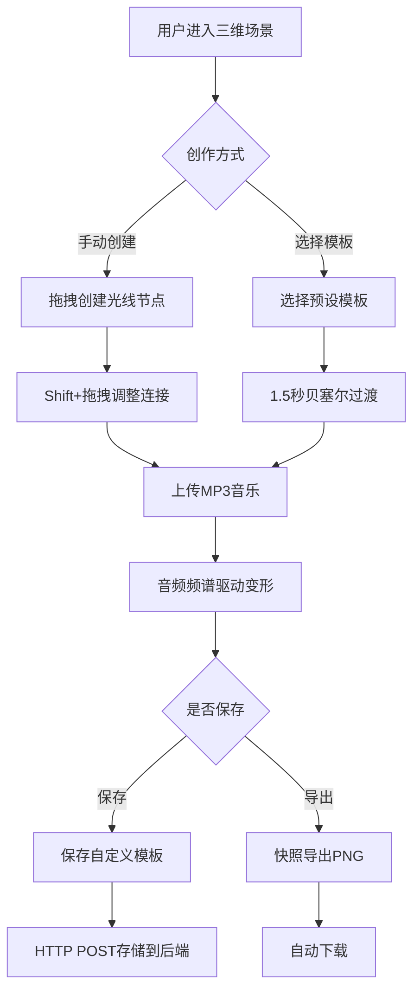

## 1. 产品概述

交互式三维光影雕塑生成系统——为抽象数字艺术展打造的沉浸式创作工具，用户可在三维空间中通过手势和声音实时生成、变形和操控动态光影雕塑，结合环境音乐节奏驱动雕塑形态与色彩的实时变换，并支持高清快照导出。

- 面向艺术策展人、数字艺术家和沉浸式展览观众
- 替代传统静态画作，实现"人-光-音"三位一体的交互式艺术体验

## 2. 核心功能

### 2.1 功能模块

1. **主场景页面**：三维光影雕塑交互画布、音频可视化、模板切换、快照导出

### 2.2 页面详情

| 页面名称 | 模块名称 | 功能描述 |
|---------|---------|---------|
| 主场景页面 | 三维光影画布 | Three.js渲染的三维空间，用户通过鼠标拖拽创建光线节点，Shift+拖拽调整连接强度，节点最多30个，限制在半径20单位球形区域内，弹簧物理模拟驱动弹性形变 |
| 主场景页面 | 音乐驱动引擎 | 上传MP3（≤5MB），Web Audio API实时频谱分析，低频驱动颜色偏移、中频驱动节点缩放、高频驱动连线闪烁，含进度条和暂停按钮 |
| 主场景页面 | 预设模板系统 | 6种预设模板（星云螺旋、晶体网格、珊瑚分支、电磁场、花瓣层叠、水母触须），1.5秒三次贝塞尔插值平滑过渡，支持保存自定义模板 |
| 主场景页面 | 快照导出 | 1920×1080 PNG高清截图，暂停动画200ms确保清晰，自动下载 |
| 主场景页面 | 左侧控制面板 | 节点拖拽滑条、圆形色环选择器、音乐上传、导出按钮，暗色科幻风格，768px以下折叠为浮动按钮 |

## 3. 核心流程

用户打开应用后看到深色三维场景，可通过以下流程进行创作：

1. **创建雕塑**：在三维空间中鼠标拖拽创建光线节点，节点从中心辐射生长
2. **调整形态**：Shift+拖拽调整节点间连接强度，拖拽节点触发弹簧物理弹性形变
3. **音乐驱动**：上传MP3文件，雕塑随音频频谱实时变换颜色、大小和闪烁频率
4. **模板切换**：选择预设模板，雕塑1.5秒内平滑过渡到目标形态
5. **保存模板**：将当前雕塑保存为自定义模板，通过HTTP POST存储到后端
6. **导出快照**：点击导出按钮生成高清PNG图片并自动下载

## 4. 用户界面设计

### 4.1 设计风格

- **主题**：暗色科幻风格（Cyber-SciFi）
- **主背景色**：#0a0a0a
- **面板背景色**：#14141e，圆角12px，backdrop-filter: blur(10px)
- **强调色**：#6c63ff（紫蓝色）
- **分区标题**：14px，颜色#6c63ff
- **分隔线**：#2a2a3e到透明渐变
- **圆角**：滑块/输入框/按钮8px，导出按钮20px
- **过渡动画**：hover缩放1.05倍+阴影，0.2s ease-out
- **字体**：Orbitron（显示字体）+ Rajdhani（UI字体）

### 4.2 页面设计概览

| 页面名称 | 模块名称 | UI元素 |
|---------|---------|--------|
| 主场景页面 | 三维画布 | 全屏Three.js画布，深色背景#0a0a0a，发光球体节点，半透明发光连线 |
| 主场景页面 | 左侧控制面板 | 宽320px固定，分区：节点控制/颜色选择/音乐上传/模板列表/导出，圆形色环直径120px |
| 主场景页面 | 音乐播放控件 | 进度条+圆形暂停按钮36px背景#2a2a3e，hover缩放1.1倍 |
| 主场景页面 | 导出按钮 | 宽120px高40px圆角20px背景#6c63ff，hover阴影#6c63ff66 |
| 主场景页面 | 上传区域 | 虚线边框#3a3a4e dashed 2px，拖入时实线+高亮#6c63ff1a |
| 主场景页面 | 移动端折叠按钮 | 直径48px浮动按钮，右下角固定，768px以下显示 |

### 4.3 响应式设计

- 桌面优先设计，面板固定320px宽度
- 768px以下：控制面板折叠为右下角48px浮动按钮，点击滑出覆盖场景
- 三维画布始终全屏

### 4.4 三维场景指引

- **环境**：深空黑背景，无HDRI，纯黑环境突出发光雕塑
- **灯光**：最小环境光(0x111122, intensity 0.3) + 点光源跟随相机
- **相机**：PerspectiveCamera，FOV 60，近裁剪0.1，远裁剪1000，OrbitControls交互
- **节点渲染**：SphereGeometry + MeshStandardMaterial + emissive发光，使用InstancedMesh批量渲染
- **连线渲染**：BufferGeometry + LineBasicMaterial半透明，合并渲染优化
- **后处理**：UnrealBloomPass泛光效果，增强发光质感
- **性能预算**：维持30FPS+，30节点+435连线，BufferGeometry合并渲染
