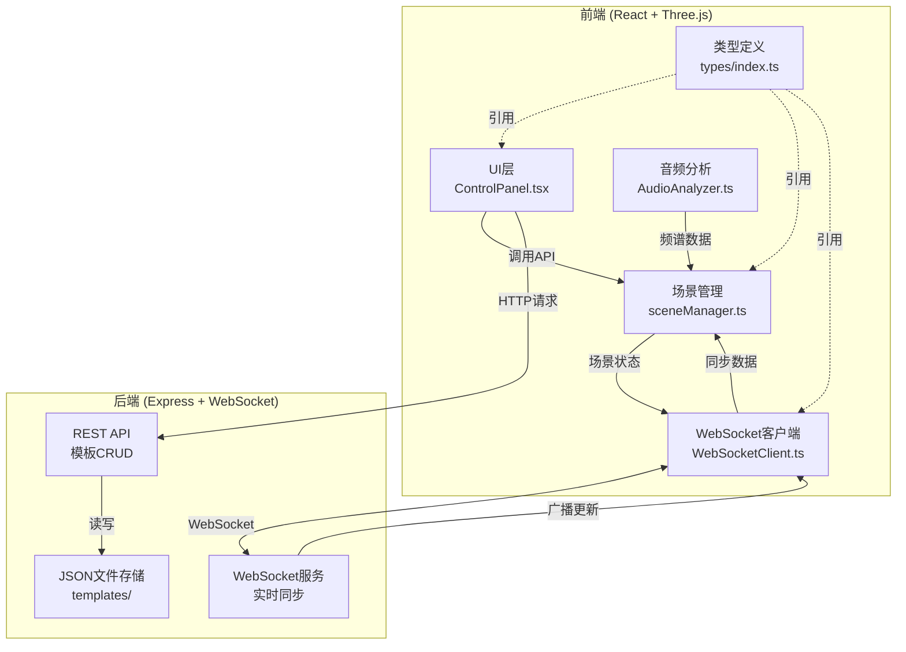
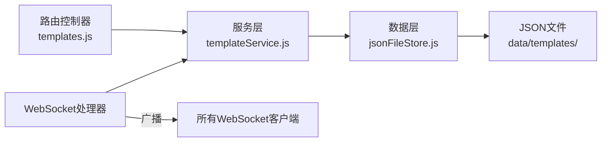
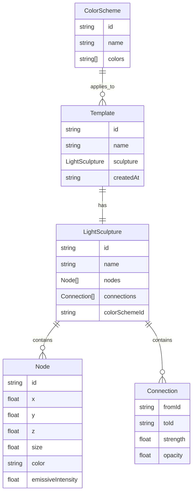

## 1. 架构设计



## 2. 技术说明

- **前端**：React 18 + TypeScript + Three.js + @react-three/fiber + @react-three/drei + Zustand
- **构建工具**：Vite + @vitejs/plugin-react
- **后端**：Express 4 + ws + cors + uuid
- **数据存储**：JSON文件存储（server/data/templates/）
- **实时通信**：WebSocket（ws库）
- **音频处理**：Web Audio API（浏览器原生）

## 3. 路由定义

| 路由 | 用途 |
|------|------|
| / | 主场景页面，三维光影雕塑交互画布 |

## 4. API定义

### 4.1 REST API

```typescript
// 获取所有模板
GET /api/templates
Response: { templates: Template[] }

// 创建模板
POST /api/templates
Body: { name: string; sculpture: LightSculpture }
Response: { template: Template }

// 删除模板
DELETE /api/templates/:id
Response: { success: boolean }

// 获取颜色方案
GET /api/color-schemes
Response: { schemes: ColorScheme[] }
```

### 4.2 WebSocket事件

```typescript
// 客户端 → 服务端
"sculpture:update"    // 雕塑状态变更
"template:save"       // 保存模板

// 服务端 → 客户端
"template:created"    // 新模板创建广播
"template:deleted"    // 模板删除广播
"sync:state"          // 状态同步
```

## 5. 服务端架构图



## 6. 数据模型

### 6.1 数据模型定义



### 6.2 数据定义

```typescript
interface Vector3 {
  x: number;
  y: number;
  z: number;
}

interface Node {
  id: string;
  position: Vector3;
  size: number;
  color: string;
  emissiveIntensity: number;
}

interface Connection {
  fromId: string;
  toId: string;
  strength: number;
  opacity: number;
}

interface LightSculpture {
  id: string;
  name: string;
  nodes: Node[];
  connections: Connection[];
  colorSchemeId: string;
}

interface Template {
  id: string;
  name: string;
  sculpture: LightSculpture;
  createdAt: string;
}

interface ColorScheme {
  id: string;
  name: string;
  colors: string[];
}
```

## 7. 文件结构与调用关系

```
project/
├── package.json                    # 依赖与脚本
├── vite.config.js                  # Vite构建配置，含proxy代理
├── tsconfig.json                   # TypeScript严格模式配置
├── index.html                      # 入口页面
├── src/
│   ├── types/
│   │   └── index.ts               # 核心类型定义（所有模块引用）
│   ├── core/
│   │   └── sceneManager.ts         # Three.js场景管理
│   │     ← 被ControlPanel调用
│   │     ← 接收AudioAnalyzer频谱数据
│   │     ← 接收WebSocketClient同步数据
│   │     → 通过WebSocket发送状态到后端
│   ├── ui/
│   │   ├── ControlPanel.tsx        # React控制面板组件
│   │   │     → 调用sceneManager方法
│   │   │     → 触发WebSocket同步
│   │   ├── AudioAnalyzer.ts        # Web Audio API音频分析
│   │   │     → 频谱数据传给sceneManager
│   │   │     ← 接收ControlPanel上传的音频文件
│   │   └── SceneCanvas.tsx         # R3F画布组件
│   │       ← 渲染sceneManager管理的场景
│   ├── network/
│   │   └── WebSocketClient.ts      # WebSocket连接管理
│   │       ← 监听后端广播
│   │       → 分发数据给sceneManager
│   ├── store/
│   │   └── useStore.ts            # Zustand全局状态管理
│   ├── App.tsx                     # 根组件
│   └── main.tsx                    # 入口文件
├── server/
│   ├── index.js                    # Express+WebSocket服务
│   │     ← HTTP请求→路由处理→JSON存储
│   │     ← WebSocket事件→广播同步
│   └── data/
│       └── templates/              # JSON模板存储目录
└── public/
```

## 8. 关键技术方案

### 8.1 弹簧物理模拟
- 每帧计算节点间弹簧力（k=0.1，阻尼0.8）
- 拖拽节点时，相连节点产生弹性形变
- 位置更新使用Verlet积分

### 8.2 音频频谱分析
- AudioContext + AnalyserNode，FFT大小2048
- 低频(20-250Hz)：驱动颜色偏移，饱和度+30%
- 中频(250-4000Hz)：驱动节点缩放0.5-1.5倍
- 高频(4000-20000Hz)：驱动连线闪烁0.5-2Hz

### 8.3 模板过渡动画
- 三次贝塞尔插值，1.5秒过渡
- 同时插值节点位置、大小、颜色
- 使用requestAnimationFrame驱动

### 8.4 性能优化
- InstancedMesh批量渲染节点球体
- BufferGeometry合并渲染连线
- UnrealBloomPass后处理泛光
- 节点上限30个，连线上限435条
