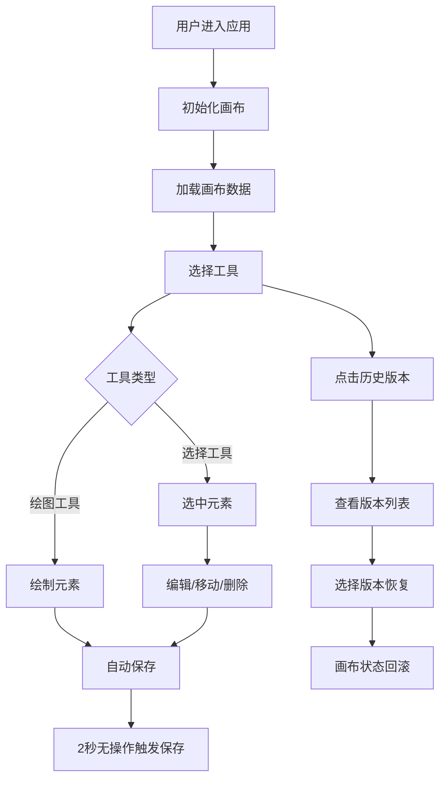

## 1. 产品概述

团队在线协作白板应用，让用户能在共享的无限画布上使用画笔、形状、文本和便签进行实时绘图与标注，并支持历史版本回溯。

- 主要用途：团队协作、头脑风暴、远程教学、产品设计评审
- 目标用户：设计团队、产品团队、远程办公团队
- 产品价值：提供直观、流畅的协作绘图体验，支持历史版本管理

## 2. 核心功能

### 2.1 用户角色

| 角色 | 注册方式 | 核心权限 |
|------|----------|----------|
| 普通用户 | 无需注册，直接使用 | 绘图、添加元素、管理历史版本、保存画布 |

### 2.2 功能模块

1. **无限画布**：支持缩放、平移、网格背景
2. **绘图工具**：画笔、矩形、圆形、直线、文本、便签
3. **选择工具**：框选元素、批量操作（删除、复制、移动）
4. **撤销/重做**：操作历史栈管理
5. **历史版本**：版本快照、版本列表、版本回滚
6. **自动保存**：操作停止后自动保存，定时创建版本快照

### 2.3 页面详情

| 页面名称 | 模块名称 | 功能描述 |
|----------|----------|----------|
| 主画布页 | 左侧工具栏 | 9个绘图工具切换（画笔、矩形、圆形、直线、文本、便签、选择、撤销、重做） |
| 主画布页 | 顶部状态栏 | 当前工具名称显示、历史版本按钮、保存到本地按钮 |
| 主画布页 | 画布区域 | 无限画布、网格背景、水波纹点击反馈 |
| 主画布页 | 历史版本面板 | 版本列表展示、版本恢复操作 |
| 主画布页 | 颜色选择器 | 12色调色板、画笔粗细选择 |

## 3. 核心流程

### 3.1 绘图流程

用户选择绘图工具 → 在画布上点击/拖动 → 生成绘图元素 → 自动保存到后端

### 3.2 选择操作流程

用户选择选择工具 → 框选/点击元素 → 显示选中状态 → 拖动/删除/复制元素 → 自动保存

### 3.3 历史版本流程

用户点击历史版本按钮 → 打开版本面板 → 选择版本 → 确认恢复 → 画布回滚到指定版本

### 3.4 Mermaid 流程图

## 4. 用户界面设计

### 4.1 设计风格

- 主色调：深蓝色系 (#1a1a2e, #16213e, #0f3460)
- 强调色：红色 (#e94560)、青色 (#00d2ff)
- 背景色：深色主题，画布浅灰网格
- 按钮风格：圆角按钮，悬浮缩放效果，0.2s 过渡动画
- 字体：系统无衬线字体，清晰易读
- 布局：左侧工具栏 + 顶部状态栏 + 主画布区域

### 4.2 页面设计概述

| 页面名称 | 模块名称 | UI 元素 |
|----------|----------|---------|
| 主画布页 | 左侧工具栏 | 深色背景 #16213e，宽 60px，圆形工具图标，选中态 #0f3460 |
| 主画布页 | 顶部状态栏 | 高 48px，背景 #1a1a2e，工具名称显示，历史版本按钮，保存按钮 |
| 主画布页 | 画布区域 | 浅灰网格背景，水波纹点击动画，无限滚动 |
| 主画布页 | 历史版本面板 | 右侧滑出，宽 300px，圆角 16px，版本列表，恢复按钮 |
| 主画布页 | 便签组件 | 黄色背景 #ffe4a0，圆角 12px，可编辑文本，删除按钮 |

### 4.3 响应式设计

- 桌面端优先设计
- 画布区域自适应窗口大小
- 工具栏和状态栏固定定位
- 支持鼠标和触摸操作

### 4.4 动画与交互

- 所有按钮和卡片 0.2s 缓入缓出过渡
- 工具图标悬浮时缩放 1.1 倍
- 水波纹点击反馈：半径从 0 扩散至 40px，透明度从 0.5 渐变至 0，持续 300ms
- 历史面板滑入滑出动画
- 选中元素虚线边框 + 蓝色光晕效果
