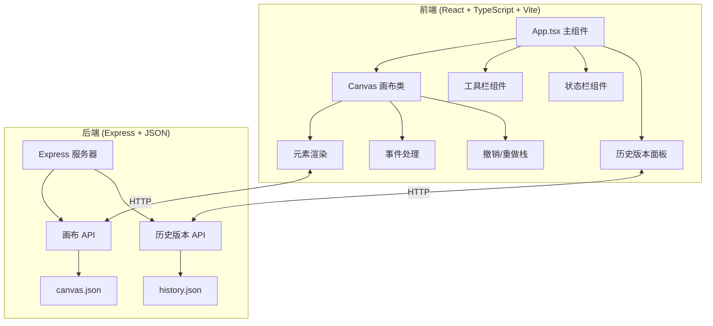

## 1. 架构设计



## 2. 技术描述

- 前端：React 18 + TypeScript + Vite 5
- 构建工具：Vite 5
- 后端：Express 4 + TypeScript
- 数据存储：JSON 文件存储（canvas.json, history.json）
- 样式：CSS Modules / 内联样式
- 图标：Lucide React

## 3. 文件结构

```
├── package.json
├── index.html
├── tsconfig.json
├── vite.config.js
├── src/
│   ├── App.tsx          # React 主组件
│   ├── canvas.ts        # 核心画布逻辑类
│   └── server.ts        # Express 服务器
└── data/
    ├── canvas.json      # 当前画布数据
    └── history.json     # 历史版本数据
```

## 4. API 定义

### 4.1 画布 API

#### GET /api/canvas
获取当前画布数据

**响应：**
```typescript
interface CanvasData {
  elements: CanvasElement[];
  version: number;
  lastModified: string;
}
```

#### POST /api/canvas
保存画布数据

**请求体：**
```typescript
interface CanvasData {
  elements: CanvasElement[];
  version: number;
}
```

**响应：**
```typescript
{ success: boolean; timestamp: string }
```

### 4.2 历史版本 API

#### GET /api/history
获取历史版本列表

**响应：**
```typescript
interface HistoryEntry {
  id: string;
  timestamp: string;
  versionNumber: number;
  elements: CanvasElement[];
}

type HistoryListResponse = HistoryEntry[];
```

#### POST /api/history
创建历史版本快照

**请求体：**
```typescript
{ elements: CanvasElement[] }
```

**响应：**
```typescript
{ success: boolean; id: string; timestamp: string }
```

#### POST /api/history/:id/restore
回滚到指定版本

**响应：**
```typescript
{ success: boolean; timestamp: string }
```

## 5. 数据模型

### 5.1 画布元素类型定义

```typescript
type ElementType = 'path' | 'rectangle' | 'circle' | 'line' | 'text' | 'sticky';

interface BaseElement {
  id: string;
  type: ElementType;
  x: number;
  y: number;
  createdAt: string;
  updatedAt: string;
}

interface PathElement extends BaseElement {
  type: 'path';
  points: { x: number; y: number }[];
  color: string;
  strokeWidth: number;
}

interface RectangleElement extends BaseElement {
  type: 'rectangle';
  width: number;
  height: number;
  color: string;
  strokeWidth: number;
}

interface CircleElement extends BaseElement {
  type: 'circle';
  radiusX: number;
  radiusY: number;
  color: string;
  strokeWidth: number;
}

interface LineElement extends BaseElement {
  type: 'line';
  x2: number;
  y2: number;
  color: string;
  strokeWidth: number;
}

interface TextElement extends BaseElement {
  type: 'text';
  content: string;
  color: string;
  fontSize: number;
}

interface StickyElement extends BaseElement {
  type: 'sticky';
  width: number;
  height: number;
  content: string;
  backgroundColor: string;
}

type CanvasElement = PathElement | RectangleElement | CircleElement | LineElement | TextElement | StickyElement;
```

### 5.2 画布状态

```typescript
interface CanvasState {
  elements: CanvasElement[];
  scale: number;
  offsetX: number;
  offsetY: number;
  selectedIds: string[];
  currentTool: ToolType;
  currentColor: string;
  strokeWidth: number;
}
```

## 6. 核心类设计

### 6.1 Canvas 类

```typescript
class WhiteboardCanvas {
  elements: CanvasElement[];
  undoStack: CanvasElement[][];
  redoStack: CanvasElement[][];
  scale: number;
  offsetX: number;
  offsetY: number;
  
  addElement(element: CanvasElement): void;
  removeElement(id: string): void;
  undo(): void;
  redo(): void;
  getSnapshot(): CanvasElement[];
  handleMouseDown(e: MouseEvent): void;
  handleMouseMove(e: MouseEvent): void;
  handleMouseUp(e: MouseEvent): void;
  handleWheel(e: WheelEvent): void;
  render(ctx: CanvasRenderingContext2D): void;
}
```

## 7. 性能优化

- 虚拟化渲染：元素超过 500 个时，仅渲染视口内元素
- 元素拾取优化：空间索引，响应时间 < 50ms
- 画布帧率：保持 60fps
- 节流防抖：自动保存使用防抖（2秒）
