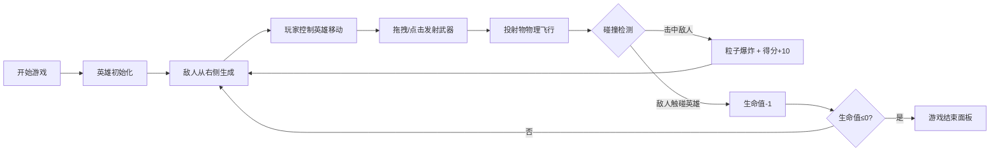

## 1. 产品概述

中世纪暗色调2D塔防射击游戏，玩家控制英雄角色通过发射不同武器迎击从右侧入侵的敌人，结合真实弹道物理和主动操作体验。

- 核心目标：在塔防基础上增加主动操作和真实弹道物理体验
- 目标用户：喜欢策略动作类小游戏的玩家
- 产品价值：提供兼具策略性和操作性的休闲游戏体验

## 2. 核心功能

### 2.1 用户角色
| 角色 | 注册方式 | 核心权限 |
|------|----------|----------|
| 玩家 | 无需注册 | 完整游戏体验 |

### 2.2 功能模块
1. **游戏主界面**：Canvas游戏画布、得分显示、生命值显示
2. **英雄控制**：鼠标点击/拖拽移动、武器发射
3. **武器系统**：三种武器切换（弓箭、魔法球、投掷斧）
4. **敌人系统**：敌人生成、移动、碰撞检测
5. **战斗系统**：弹道物理、碰撞判定、粒子特效
6. **UI系统**：工具栏、游戏结束面板、数值动画

### 2.3 页面详情
| 页面名称 | 模块名称 | 功能描述 |
|---------|---------|----------|
| 游戏主界面 | Canvas画布 | 渲染游戏场景、英雄、敌人、投射物、粒子效果 |
| 游戏主界面 | HUD显示 | 右上角显示得分和生命值，带数值变化动画 |
| 游戏主界面 | 工具栏 | 底部居中显示武器选择按钮，点击切换武器 |
| 游戏主界面 | 游戏结束面板 | 生命值归零时弹出，显示最终得分 |

## 3. 核心流程

玩家进入游戏后，英雄出现在地图左侧。敌人从右侧持续生成并向左移动。玩家通过点击或拖拽控制英雄移动，点击敌人或拖拽划出轨迹线后松开发射武器。武器击中敌人产生粒子爆散效果并得分。敌人触碰英雄会损失生命值，生命值归零则游戏结束。

## 4. 用户界面设计

### 4.1 设计风格
- 主色调：中世纪暗色调 #1a1a2e
- 地图区：浅灰 #2d2d44 圆角8px
- 英雄：金色圆形 #ffd700，描边发光 #ffd700 2px
- 敌人：绿色方块40x40px，描边 #00ff88 1px
- 投射物轨迹线：#ff5252，线宽2px
- 粒子效果：#ffaa00至#ff3300渐变
- 工具栏：半透明深灰 rgba(30,30,30,0.9) 圆角16px
- 字体：无衬线字体，得分24px白色

### 4.2 页面设计概述
| 页面名称 | 模块名称 | UI元素 |
|---------|---------|--------|
| 游戏主界面 | Canvas画布 | 深色背景、地图区域、英雄、敌人、投射物轨迹、粒子爆炸效果 |
| 游戏主界面 | HUD区域 | 右上角得分（带缩放抖动动画）、红色心形生命值图标 |
| 游戏主界面 | 工具栏 | 底部居中，三个武器图标按钮，选中时金色边框高亮 |
| 游戏主界面 | 游戏结束面板 | 居中显示，半透明背景，最终得分，重新开始按钮 |

### 4.3 响应式
- Desktop-first设计，自适应窗口大小
- 地图区最小宽度600px
- 工具栏宽度始终为画布的60%

## 4.4 性能要求
- 连续15个敌人 + 20个投射物时帧率≥50fps
- 所有交互反馈≤0.15秒
- 粒子效果、数值动画使用高效渲染
