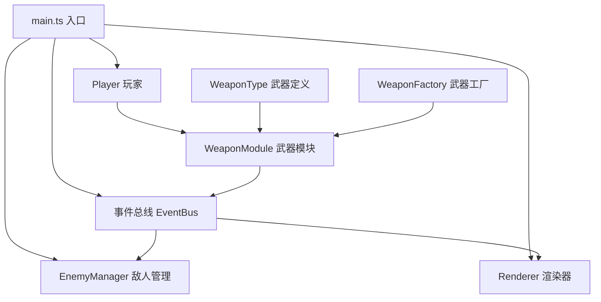
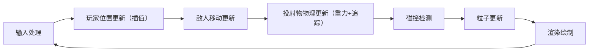

## 1. 架构设计



## 2. 技术描述

- 前端：TypeScript + Vite + HTML5 Canvas
- 构建工具：Vite 5.x
- 语言：TypeScript 5.x (严格模式, target ES2020)
- 无后端，纯前端游戏
- 模块通信：自定义事件总线（EventBus）

## 3. 文件结构

| 文件路径 | 用途 |
|---------|------|
| `package.json` | 项目依赖和脚本 |
| `vite.config.js` | Vite构建配置 |
| `tsconfig.json` | TypeScript配置 |
| `index.html` | 入口HTML页面 |
| `src/WeaponModule/WeaponType.ts` | 武器类型和接口定义 |
| `src/WeaponModule/WeaponFactory.ts` | 武器工厂类，创建武器实例 |
| `src/BattleModule/Player.ts` | 玩家英雄类，管理移动和射击 |
| `src/BattleModule/EnemyManager.ts` | 敌人生成、移动、碰撞检测 |
| `src/BattleModule/Renderer.ts` | Canvas渲染，绘制所有游戏元素 |
| `src/main.ts` | 入口文件，初始化模块和游戏循环 |

## 4. 核心数据模型

### 4.1 武器接口
```typescript
interface IWeapon {
  type: WeaponType;
  speed: number;
  gravity: number;
  trackingAngle: number;  // 追踪修正角度（度/帧）
  splashRadius: number;   // 溅射伤害半径
  icon: string;           // 图标标识
}
```

### 4.2 投射物接口
```typescript
interface IProjectile {
  id: number;
  x: number;
  y: number;
  vx: number;
  vy: number;
  weapon: IWeapon;
  targetId?: number;
}
```

### 4.3 敌人接口
```typescript
interface IEnemy {
  id: number;
  x: number;
  y: number;
  width: number;
  height: number;
  speed: number;
  health: number;
}
```

### 4.4 粒子接口
```typescript
interface IParticle {
  id: number;
  x: number;
  y: number;
  vx: number;
  vy: number;
  radius: number;
  color: string;
  life: number;
  maxLife: number;
}
```

## 5. 事件总线定义

### 5.1 事件类型
| 事件名 | 数据类型 | 触发方 | 监听方 |
|--------|----------|--------|--------|
| `weapon:fire` | `{ projectile: IProjectile }` | WeaponFactory | EnemyManager, Renderer |
| `enemy:hit` | `{ enemyId: number, projectileId: number, splashRadius?: number }` | EnemyManager | Player, Renderer |
| `enemy:death` | `{ enemyId: number, x: number, y: number }` | EnemyManager | Player, Renderer |
| `player:damage` | `{ damage: number }` | EnemyManager | Player |
| `player:score` | `{ score: number }` | Player | Renderer |
| `game:over` | `{ finalScore: number }` | Player | Renderer |
| `weapon:switch` | `{ weapon: IWeapon }` | Player | WeaponFactory, Renderer |

## 6. 性能优化策略

1. **对象池模式**：投射物和粒子使用对象池复用，避免频繁GC
2. **空间分区**：碰撞检测使用网格空间分区，减少检测次数
3. **批量渲染**：同类型元素批量绘制，减少Canvas状态切换
4. **帧率控制**：使用 requestAnimationFrame 并计算 deltaTime
5. **事件节流**：鼠标移动事件适当节流
6. **离屏Canvas**：静态背景预渲染到离屏Canvas

## 7. 游戏循环


