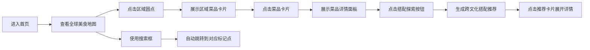

## 1. 产品概述

交互式美食地图应用，帮助用户直观感受不同国家和地区风味美食搭配，解决人们在尝试跨文化美食时不知如何搭配佐餐饮料和小菜的难题。

- **核心价值**：通过可视化地图和交互体验，让用户轻松探索全球美食文化，发现创意搭配组合
- **目标用户**：美食爱好者、餐饮从业者、喜欢尝试新文化的年轻人

## 2. 核心特性

### 2.1 用户角色
| 角色 | 注册方式 | 核心权限 |
|------|---------|---------|
| 普通用户 | 无需注册 | 浏览地图、查看菜品详情、获取搭配推荐 |

### 2.2 功能模块
1. **美食地图交互区**：Canvas绘制的全球简化地图，8个美食文化区域标记点，搜索跳转功能
2. **菜品展示区**：选中区域的代表菜品卡片列表，支持悬浮动效
3. **详情面板**：菜品完整信息展示，包含产地描述、饮品搭配、佐餐小菜推荐
4. **搭配探索模块**：随机推荐跨文化美食搭配方案，瀑布流展示

### 2.3 页面详情
| 页面名称 | 模块名称 | 功能描述 |
|---------|---------|---------|
| 首页 | 搜索框 | 输入食物名或国家名快速跳转到对应标记点，响应时间<100ms |
| 首页 | 全球美食地图 | Canvas 2D绘制简化世界地图，8个文化区域以彩色圆点标记，悬浮放大显示名称 |
| 首页 | 菜品卡片列表 | 横向滚动展示选中区域的4道代表菜品，悬浮上移增加阴影 |
| 首页 | 详情面板 | 展示菜品完整信息，搭配信息以标签形式展示，支持淡入动画 |
| 首页 | 搭配探索 | 点击按钮随机生成3种跨文化搭配方案，瀑布流布局，支持展开详情 |

## 3. 核心流程

## 4. 用户界面设计

### 4.1 设计风格
- **主色调**：深色背景 `#0d1b2a`，地图底色 `#1b4965`，陆地 `#caf0f8`，海洋 `#0077b6`
- **强调色**：各国家区域特色色（意大利 `#e63946`、日本 `#f4a261` 等）
- **按钮样式**：圆角24px，绿色 `#2d6a4f`，悬浮变 `#40916c`，底部阴影 `#1b4332`
- **卡片样式**：白色 `#ffffff` 圆角12px/16px，交替使用 `#f8f9fa` 区分层次
- **字体**：Inter 字体族，标题24px加粗，正文14px灰色
- **布局风格**：左侧地图区占50%宽度，右侧详情面板，移动端上下堆叠
- **动效风格**：淡入0.3秒，卡片悬浮上移6px，推荐卡片错位滑入

### 4.2 页面设计概述
| 页面名称 | 模块名称 | UI元素 |
|---------|---------|-------|
| 首页 | 搜索框 | 宽240px高40px圆角20px，背景`#1a1a2e`，边框`#3a3a5c` |
| 首页 | 地图区域 | Canvas绘制，标记圆点直径18px，悬浮放大至24px，显示14px白色标签 |
| 首页 | 菜品卡片 | 宽200px高280px圆角12px，渐变食物图，悬浮上移6px加阴影 |
| 首页 | 详情面板 | 宽360px圆角16px内边距24px，背景`#ffffff`，淡入动画0.3秒 |
| 首页 | 搭配标签 | 高28px圆角14px内边距12px，背景`#f0f4ff`，文字`#3b82f6` |
| 首页 | 搭配推荐卡片 | 瀑布流布局，加载时错开0.1秒从下方滑入 |

### 4.3 响应式设计
- **桌面端**（≥768px）：左右分栏布局，地图占50%宽度
- **移动端**（<768px）：上下堆叠布局，地图区域在上，详情面板在下
- 所有交互元素支持触摸操作

### 4.4 性能要求
- 搜索响应时间 < 100ms
- 地图交互流畅度 ≥ 30fps
- 所有动画使用CSS transform和opacity保证性能
