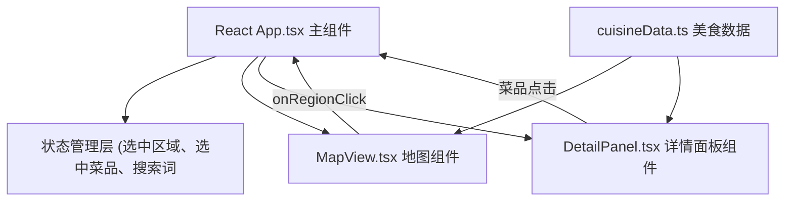

## 1. 架构设计



## 2. 技术选型

- **前端框架**：React 18 + TypeScript
- **构建工具**：Vite 5
- **渲染方式**：Canvas 2D（地图绘制）
- **样式方案**：原生CSS + CSS Modules
- **动画方案**：CSS transitions + keyframes
- **状态管理**：React useState + useCallback
- **数据来源**：本地静态JSON数据

## 3. 项目文件结构

```
auto73/
├── package.json
├── index.html
├── tsconfig.json
├── vite.config.js
└── src/
    ├── App.tsx           # 主组件，全局状态管理
    ├── components/
    │   ├── MapView.tsx    # Canvas地图组件
    │   └── DetailPanel.tsx  # 详情面板组件
    └── data/
        └── cuisineData.ts  # 美食数据
```

## 4. 核心数据结构

### 4.1 区域数据 (Region)
```typescript
interface Region {
  id: string;
  name: string;
  nameEn: string;
  color: string;
  position: { x: number; y: number };
  dishes: Dish[];
}
```

### 4.2 菜品数据 (Dish)
```typescript
interface Dish {
  id: string;
  name: string;
  description: string;
  gradient: { from: string; to: string };
  origin: string;
  drinkPairing: string;
  sideDish: string;
}
```

### 4.3 搭配推荐数据 (Pairing)
```typescript
interface Pairing {
  id: string;
  items: string[];
  description: string;
}
```

## 5. 性能优化策略

1. **搜索性能**：
   - 使用对象映射（Object Map）实现O(1)时间复杂度的搜索查找
   - 输入防抖处理（虽然要求<100ms，实际实现无防抖直接响应）

2. **地图渲染性能**：
   - Canvas 2D 离屏缓存
   - 事件委托减少事件监听器
   - requestAnimationFrame 保证30fps以上

3. **动画性能**：
   - 仅使用transform和opacity属性动画
   - will-change提示浏览器优化
   - CSS变量统一管理动画参数

4. **响应式适配**：
   - CSS媒体查询实现断点切换
   - Flex布局实现动态调整
