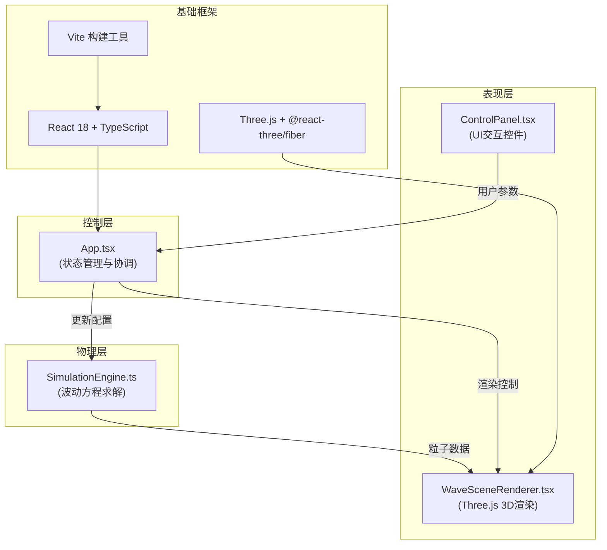

## 1. 架构设计
本应用采用分层架构，通过控制器（App.tsx）协调物理模拟层与渲染层，实现关注点分离。数据流单向流动：用户输入 → 状态更新 → 物理计算 → 渲染输出。



## 2. 技术描述
- **前端框架**：React@18 + TypeScript@5
- **3D渲染**：Three.js + @react-three/fiber + @react-three/drei
- **构建工具**：Vite@5 + @vitejs/plugin-react
- **物理引擎**：自研简化各向异性波动方程求解器
- **状态管理**：React useState/useRef（轻量级场景，无需额外状态库）
- **样式方案**：内联样式 + CSS变量（避免引入额外CSS框架）

## 3. 项目文件结构与调用关系
```
auto74/
├── package.json              # 项目依赖与脚本配置
├── vite.config.js            # Vite构建配置（输出到docs，端口3000）
├── tsconfig.json             # TypeScript配置（严格模式，ES2020）
├── index.html                # 入口HTML（全屏深空蓝背景）
└── src/
    ├── main.tsx              # ReactDOM渲染入口，传入基准配置
    ├── App.tsx               # 根组件，协调数据流
    ├── scene/
    │   └── WaveSceneRenderer.tsx  # 3D场景渲染器（地形+震源+粒子）
    ├── physics/
    │   └── SimulationEngine.ts    # 物理模拟引擎（波动方程求解）
    ├── controls/
    │   └── ControlPanel.tsx       # UI控制面板（滑块+按钮+下拉框）
    └── types/
        └── index.ts               # 全局TypeScript类型定义
```

**调用关系与数据流**：
1. `main.tsx` → `App.tsx`：传入基准频率和采样率配置
2. `App.tsx` → `ControlPanel.tsx`：传递当前参数值和回调函数
3. `ControlPanel.tsx` → `App.tsx`：用户操作通过onFrequencyChange、onAnisotropyChange等回调更新状态
4. `App.tsx` → `SimulationEngine.ts`：调用update(deltaTime, params)传入最新参数
5. `SimulationEngine.ts` → `WaveSceneRenderer.tsx`：输出粒子位置数组、颜色数组、透明度数组
6. `WaveSceneRenderer.tsx` → Three.js：更新BufferGeometry属性，渲染3D场景

## 4. 核心数据结构定义
```typescript
// 模拟参数接口
interface SimulationParams {
  frequency: number;           // 震源频率 (1-10 Hz)
  anisotropyStrength: number;  // 各向异性强度 (0.5-3.0)
  waveType: 'P' | 'S';         // 波类型：P波/纵波 或 S波/横波
  isRunning: boolean;          // 模拟运行状态
}

// 各向异性张量 (3x3矩阵)
interface AnisotropyTensor {
  matrix: number[][];  // 3x3矩阵，默认对角线[1.0, 1.2, 0.8]，非对角线0.3
}

// 粒子状态
interface ParticleState {
  position: Float32Array;   // 位置数组 [x1,y1,z1, x2,y2,z2, ...]
  color: Float32Array;      // 颜色数组 [r1,g1,b1, r2,g2,b2, ...]
  opacity: Float32Array;    // 透明度数组 [a1, a2, ...]
  size: Float32Array;       // 粒子尺寸数组 [s1, s2, ...]
}

// 物理引擎输出
interface SimulationOutput {
  particles: ParticleState;
  particleCount: number;
}
```

## 5. 关键算法实现

### 5.1 各向异性波动方程简化求解
基于波动方程的几何光学近似解，粒子沿波前法向传播，速度由各向异性张量决定：
```
v(θ,φ) = √(T(θ,φ) · n(θ,φ) · n(θ,φ))
其中T为刚度张量，n为传播方向单位向量
```

简化实现：粒子初始速度方向由球坐标系(θ,φ)均匀分布，速度大小通过各向异性矩阵变换计算。

### 5.2 能量衰减模型
采用指数衰减模型，每个粒子的能量随时间衰减：
```
E(t) = E₀ × (attenuation)^(t/τ)
其中衰减系数=0.98，τ为时间常数
```

### 5.3 动态粒子数量调整
帧率监控每500ms采样一次：
- FPS < 30 → 粒子数 = 1200
- 30 ≤ FPS ≤ 50 → 粒子数 = 2000
- FPS > 50 → 粒子数 = 2800

## 6. 性能优化策略
1. **BufferGeometry复用**：粒子系统使用单个BufferGeometry，仅更新属性数组，避免频繁创建销毁对象
2. **LOD地形**：创建3个细节层次的地形网格，根据相机距离自动切换
3. **帧间插值**：物理模拟与渲染解耦，物理步进固定时间步长，渲染使用插值
4. **TypedArray**：使用Float32Array存储粒子数据，减少GC压力
5. **按需更新**：仅当参数变化时重建各向异性张量，避免重复计算
