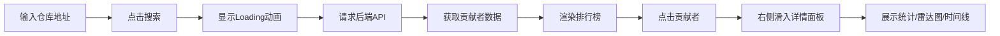

## 1. 产品概述

开源项目贡献者排行榜与技能图谱系统，帮助开发者和项目维护者可视化分析GitHub仓库的贡献者数据。用户输入仓库地址后，系统自动生成贡献者排行榜、技能雷达图和贡献时间线，直观展现每位贡献者的多维度贡献情况。

- 目标用户：开源项目维护者、技术管理者、开发者
- 核心价值：多维度量化贡献、可视化技能图谱、辅助团队协作决策

## 2. 核心功能

### 2.1 功能模块

1. **首页搜索模块**：仓库地址输入、搜索按钮、加载动画
2. **贡献者排行榜模块**：排行列表、维度筛选、排序切换、虚拟滚动
3. **贡献者详情模块**：统计卡片、技能雷达图、贡献时间线

### 2.2 页面详情

| 页面名称 | 模块名称 | 功能描述 |
|-----------|-------------|---------------------|
| 主页面 | 搜索栏 | 输入GitHub仓库地址，点击搜索触发数据分析，带Loading动画 |
| 主页面 | 排行榜 | 左侧展示贡献者排行卡片，支持维度筛选和排序，超过100条启用虚拟滚动 |
| 主页面 | 用户详情面板 | 右侧滑入面板，展示统计总览、六维技能雷达图、贡献时间线 |

## 3. 核心流程

用户在搜索框输入GitHub仓库地址，点击搜索按钮后显示加载动画，数据加载完成后左侧展示贡献者排行榜，点击某位贡献者后右侧滑入详情面板，展示该用户的多维度贡献数据和技能雷达图。

## 4. 用户界面设计

### 4.1 设计风格

- 主色调：#6366f1（紫色），辅助色：#a5b4fc（浅紫），背景色：#f1f5f9
- 卡片风格：圆角设计，带轻微阴影（0 1px 3px rgba(0,0,0,0.1)）
- 字体：清晰现代的无衬线字体，层次分明
- 交互：所有交互元素带0.2s-0.3s平滑过渡动画
- 整体风格：精致、专业、数据可视化导向

### 4.2 页面设计概述

| 页面名称 | 模块名称 | UI元素 |
|-----------|-------------|-------------|
| 主页面 | 搜索栏 | 360x48px输入框、120x48px搜索按钮、三点闪烁Loading动画、紫色主题 |
| 主页面 | 排行榜 | 行卡片布局（64px高）、圆形头像、进度条、筛选按钮组、排序下拉框 |
| 主页面 | 用户详情 | 滑入动画、统计卡片网格、Canvas雷达图、可滚动时间线 |

### 4.3 响应式

- 桌面端（768px以上）：左右双栏布局，左侧60%排行榜，右侧40%详情面板
- 移动端（768px以下）：单列布局，排行榜全宽，详情面板从底部弹出
- 触摸优化：加大点击区域，确保移动端操作流畅

### 4.4 性能要求

- 页面加载与渲染时间不超过2秒
- 排行榜超过100条时启用虚拟滚动，仅渲染可见行
- 雷达图重绘控制在30fps以上
