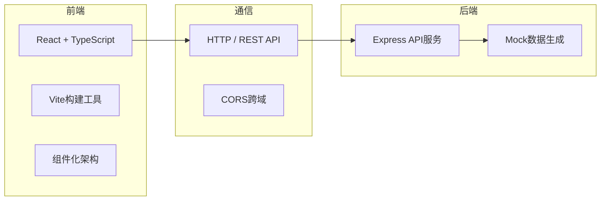
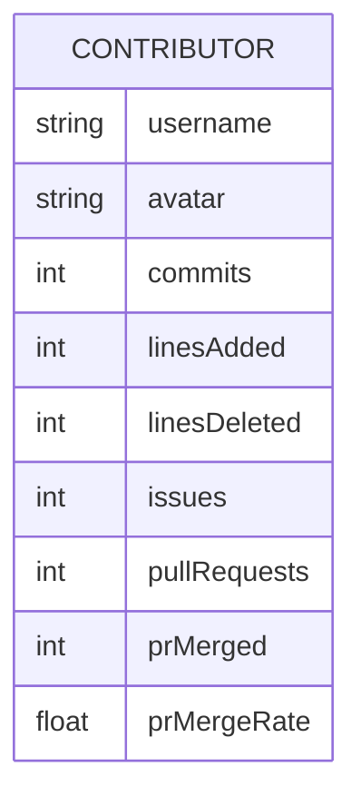

## 1. 架构设计



## 2. 技术描述

- 前端：React 18 + TypeScript + Vite
- 后端：Express 4.x + Node.js 文件系统模拟数据
- 样式：CSS Modules / 内联样式（按用户要求的精确像素值）
- 状态管理：React Hooks (useState, useEffect)
- 图表：Canvas 2D 绘制雷达图
- 虚拟滚动：自定义实现

## 3. 文件结构

```
├── package.json
├── index.html
├── tsconfig.json
├── vite.config.js
├── server.js
├── src/
│   ├── App.tsx
│   ├── types.ts
│   ├── components/
│   │   ├── SearchBar.tsx
│   │   ├── Leaderboard.tsx
│   │   └── UserDetail.tsx
│   └── utils/
│       ├── radarChart.ts
│       └── mockData.ts
```

## 4. API 定义

### 4.1 获取仓库贡献者列表

**GET** `/api/contributors/:owner/:repo`

返回数据结构：
```typescript
interface RepoData {
  name: string;
  owner: string;
  contributors: Contributor[];
}

interface Contributor {
  username: string;
  avatar: string;
  commits: number;
  linesAdded: number;
  linesDeleted: number;
  issues: number;
  pullRequests: number;
  prMerged: number;
  prMergeRate: number;
  skills: SkillData;
  timeline: TimelineEvent[];
}
```

### 4.2 获取单个贡献者详情

**GET** `/api/contributors/:owner/:repo/:username`

返回单个 `Contributor` 对象的详细数据。

## 5. 核心组件说明

| 组件 | 职责 | 关键特性 |
|------|------|----------|
| SearchBar | 搜索输入与加载状态 | 输入验证、Loading动画、过渡效果 |
| Leaderboard | 排行榜展示 | 维度筛选、排序切换、虚拟滚动 |
| UserDetail | 用户详情面板 | 滑入动画、统计卡片、雷达图、时间线 |

## 6. 数据模型

### 6.1 Contributor（贡献者）



### 6.2 SkillData（技能数据）

| 维度 | 说明 |
|------|------|
| codeContribution | 代码贡献 |
| issueManagement | Issue管理 |
| codeReview | 代码审查 |
| documentation | 文档编写 |
| communityEngagement | 社区互动 |
| projectManagement | 项目管理 |
