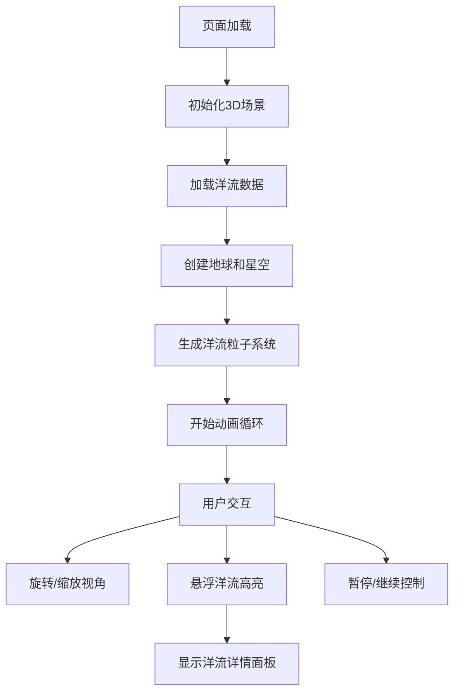

## 1. 产品概述

全球海洋洋流3D可视化应用，基于Three.js构建交互式3D地球场景，实时模拟表层洋流在大陆之间的流动路线和速度变化。面向地理研究人员、教育工作者和海洋爱好者，提供直观的洋流运动可视化体验。

- 核心价值：将抽象的海洋洋流数据转化为直观的3D动态视觉效果，帮助用户理解全球洋流系统
- 目标用户：地理教育工作者、学生、海洋研究爱好者、科普机构

## 2. 核心功能

### 2.1 用户角色

| 角色 | 注册方式 | 核心权限 |
|------|----------|----------|
| 普通用户 | 无需注册 | 浏览3D场景、交互控制、查看洋流详情 |

### 2.2 功能模块

1. **3D地球场景**：带等高线纹理的地球球体、深蓝色星空背景、缓慢自转效果
2. **洋流粒子系统**：10组主要洋流的动态粒子流动效果，沿大圆路径循环运动
3. **交互控制系统**：鼠标拖拽旋转视角、滚轮缩放、悬浮高亮洋流
4. **控制面板**：暂停/继续动画播放
5. **信息面板**：显示选中洋流的名称、流速范围、总长度
6. **流速图例**：常驻右下角的流速颜色渐变图例

### 2.3 页面详情

| 页面名称 | 模块名称 | 功能描述 |
|---------|----------|----------|
| 主场景 | 3D地球渲染 | 半径8单位的半透明地球，等高线纹理，接受光照阴影 |
| 主场景 | 星空背景 | 200颗随机分布的星星，大小1-3px |
| 主场景 | 洋流粒子流 | 10组洋流，每组200个粒子，沿大圆路径流动 |
| 主场景 | 洋流路径管 | 半透明细管表示洋流路径，颜色与粒子一致 |
| 控制面板 | 暂停/继续按钮 | 控制动画播放状态，80x32px圆角按钮 |
| 信息面板 | 洋流详情 | 悬浮洋流时显示名称、流速、长度，淡入动画 |
| 流速图例 | 渐变条 | 160x12px三色渐变条，标注慢速-快速 |

## 3. 核心流程

用户进入页面后，自动加载3D场景和洋流数据，开始播放洋流动画。用户可以通过鼠标拖拽旋转地球视角，滚轮缩放观察距离。当鼠标悬浮在某条洋流上时，该洋流高亮显示，右下角面板显示详细信息。用户可通过右上角控制面板暂停/继续动画播放。

## 4. 用户界面设计

### 4.1 设计风格

- **主色调**：深蓝色系，#0b0f2a 到 #000000 渐变背景
- **强调色**：#00d4ff（慢速洋流）、#ff6b35（中速洋流）、#e63946（快速洋流）
- **按钮风格**：圆角8px，背景#1a1a2e，悬浮时#16213e，白色文字
- **字体**：系统默认无衬线字体，14px常规文字，12px小文字
- **布局风格**：全屏3D场景，UI元素悬浮于场景之上，采用半透明毛玻璃效果
- **视觉风格**：深海科技感，柔和光泽，半透明叠加层次

### 4.2 页面设计概述

| 页面名称 | 模块名称 | UI元素 |
|---------|----------|--------|
| 主场景 | 3D地球 | 半径8单位，半透明表面，等高线纹理，柔和光照 |
| 主场景 | 星空背景 | 200颗星星随机分布，静态显示 |
| 主场景 | 洋流粒子 | 3px大小，颜色按流速渐变，动态流动 |
| 主场景 | 洋流路径管 | 半透明（0.3），颜色与粒子一致，悬浮时0.6 |
| 控制面板 | 暂停按钮 | 200x64px容器，背景rgba(0,0,0,0.5)，圆角16px |
| 信息面板 | 详情卡片 | 宽240px，背景rgba(0,0,0,0.6)，圆角12px，淡入0.3秒 |
| 流速图例 | 渐变条 | 常驻右下角，160x12px，圆角4px，两侧标注 |

### 4.3 响应式

- 桌面端（≥1024px）：3D场景占满全屏，UI元素按原尺寸显示
- 平板端（768px-1024px）：适当缩小UI元素，保持场景全屏
- 移动端（<768px）：右下角图例缩小为120x8px，其他UI相应缩小

### 4.4 3D场景设计

- **环境**：深蓝色星空背景，无HDRI，营造深邃宇宙感
- **光照**：平行光源模拟太阳光，柔和环境光补充，地球表面呈现光泽
- **相机**：PerspectiveCamera，初始距离15单位，可在5-30单位间缩放
- **运动**：地球缓慢自转（0.002弧度/秒），洋流粒子循环流动
- **交互**：OrbitControls支持拖拽旋转、滚轮缩放，禁用平移
- **后期处理**：无额外后期，保持原生Three.js渲染性能
- **性能预算**：粒子总数≤2500个，帧率≥30FPS，初始化时间≤2秒
