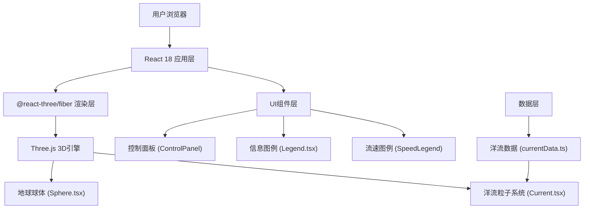

## 1. 架构设计



## 2. 技术描述

- **前端框架**：React 18 + TypeScript
- **3D引擎**：Three.js 0.160+
- **React 3D绑定**：@react-three/fiber 8.x + @react-three/drei 9.x
- **构建工具**：Vite 5.x
- **样式方案**：CSS Modules + 内联样式
- **后端**：无（纯前端应用）
- **数据库**：无（使用本地Mock数据）
- **初始化方式**：手动配置Vite + React + TypeScript项目

## 3. 路由定义

| 路由 | 用途 |
|------|------|
| / | 主场景页面，包含完整3D可视化 |

## 4. 目录结构

```
d:\VersionFastPro\tasks\auto77\
├── package.json
├── index.html
├── tsconfig.json
├── vite.config.js
└── src/
    ├── main.tsx
    ├── App.tsx
    ├── scene/
    │   ├── Sphere.tsx
    │   └── Current.tsx
    ├── ui/
    │   ├── Legend.tsx
    │   ├── ControlPanel.tsx
    │   └── SpeedLegend.tsx
    └── utils/
        └── currentData.ts
```

## 5. 数据模型

### 5.1 洋流数据类型定义

```typescript
interface OceanCurrent {
  name: string;
  start: [number, number];  // [纬度, 经度]
  end: [number, number];    // [纬度, 经度]
  speedRange: [number, number];  // [最小流速, 最大流速] 单位: m/s
  color: string;  // 基础颜色
}
```

### 5.2 应用状态类型

```typescript
interface AppState {
  isPlaying: boolean;
  selectedCurrent: OceanCurrent | null;
  hoveredCurrent: string | null;
}
```

### 5.3 洋流数据定义（10组主要洋流）

1. 墨西哥湾流 - 墨西哥湾到北大西洋
2. 黑潮 - 菲律宾到日本东部
3. 南极环流 - 环绕南极大陆
4. 北大西洋暖流 - 北大西洋到欧洲
5. 秘鲁寒流 - 智利南部到秘鲁
6. 加利福尼亚寒流 - 加拿大到墨西哥
7. 东澳大利亚暖流 - 澳大利亚东岸
8. 巴西暖流 - 巴西东岸
9. 本格拉寒流 - 南非到安哥拉
10. 北太平洋暖流 - 太平洋北部

## 6. 核心技术实现

### 6.1 大圆路径计算

使用球面三角学计算两点间的大圆路径，将经纬度转换为3D坐标：
- 经纬度转3D坐标：x = R * cos(lat) * cos(lon), y = R * sin(lat), z = R * cos(lat) * sin(lon)
- 使用四元数球面插值(slerp)生成平滑路径

### 6.2 粒子系统优化

- 使用BufferGeometry存储所有粒子位置
- 单帧更新所有粒子位置，避免逐粒子遍历开销
- 粒子总数控制：10组 × 200粒子 = 2000 ≤ 2500

### 6.3 交互检测

- 使用Three.js Raycaster进行洋流路径拾取
- 悬浮时更新粒子材质亮度和路径管透明度

### 6.4 性能优化

- 地球自转使用useFrame钩子，每帧更新rotation.y
- 粒子位置更新在GPU友好的BufferAttribute上操作
- 禁用不必要的阴影计算
- 使用Low-poly地球模型（球体细分数64×32）
