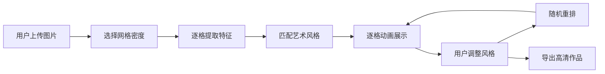

## 1. 产品概述

艺术风格迁移拼贴墙是一款在线创意工具，用户上传照片后，系统将图片分割为网格小块，每块根据色彩和纹理特征匹配不同艺术风格的画作局部，最终拼接成一幅融合多种艺术流派的视觉拼贴作品。

- 核心价值：将普通照片转化为充满艺术感的拼贴画作，提供趣味化的艺术创作体验
- 目标用户：艺术爱好者、设计从业者、普通用户寻求创意图片处理

## 2. 核心功能

### 2.1 功能模块

1. **图片上传模块**：拖拽/点击上传，实时预览缩略图
2. **网格分割模块**：支持8x8和16x16两种网格密度选择
3. **风格匹配模块**：基于RGB平均值和纹理方差的20种艺术风格匹配算法
4. **交互调整模块**：单格风格手动调整、一键随机重排
5. **作品导出模块**：2048x2048高清PNG导出
6. **动画展示模块**：逐格展开的匹配动画效果

### 2.2 页面详情

| 页面名称 | 模块名称 | 功能描述 |
|-----------|-------------|---------------------|
| 主页面 | 顶部标题栏 | 品牌展示，64px高度深色背景 |
| 主页面 | 上传区域 | 中央虚线框上传，支持拖拽和点击 |
| 主页面 | 展示区域 | 左右双画框布局，原图与拼贴作品对比 |
| 主页面 | 底部操作栏 | 网格选择、随机重排、导出按钮 |
| 主页面 | 风格选择弹窗 | 点击小格弹出20种风格下拉选择 |

## 3. 核心流程

用户上传照片 → 选择网格密度(8x8/16x16) → 系统逐格提取色彩纹理特征 → 匹配最相似的艺术风格 → 展示逐格展开动画 → 用户可手动调整单格风格或随机重排 → 点击导出下载高清作品

## 4. 用户界面设计

### 4.1 设计风格

- **设计方向**：画廊质感/美术馆风格，深邃暗色背景营造沉浸式艺术氛围
- **主色调**：深邃暗蓝 #1a1a2e（背景），深蓝 #16213e（标题栏），宝蓝 #0f3460（操作栏）
- **强调色**：紫色 #8b5cf6（上传/交互），粉色 #ec4899（导出/主按钮）
- **文字色**：纯白 #ffffff（标题），灰色 #9ca3af（辅助文字），半透明白 #ffffff80（匹配度）
- **字体**：现代无衬线字体，标题24px细字重，正文16px
- **布局**：卡片式画框布局，左右对称展示，圆角设计
- **动效**：逐格淡入动画（0.5s递增延迟，ease-out），按钮hover缩放/阴影过渡0.2s

### 4.2 页面设计概述

| 页面名称 | 模块名称 | UI元素 |
|-----------|-------------|-------------|
| 主页面 | 上传区域 | 400x300px虚线框(2px dashed #8b5cf6)，16px圆角，中心48px灰色上传图标，拖拽高亮效果 |
| 主页面 | 展示区域 | 左右各45%宽度画框，1px #6b7280边框，8px圆角，内部图片保持比例居中 |
| 主页面 | 操作栏 | 80px高度深色底，按钮居中排列间距12px，骰子图标按钮44x44px圆形，导出按钮160x48px圆角24px |
| 主页面 | 匹配度标签 | 10px白色半透明文字，4px圆角，#00000040半透明黑底，位于每格左下角 |

### 4.3 响应式设计

- **设计原则**：Desktop-first，移动端自适应
- **断点**：768px宽度以下切换垂直布局
- **移动端调整**：
  - 标题栏缩小至48px
  - 上传框缩小至宽90%高200px
  - 左右展示区变为上下堆叠，各宽95%
  - 操作栏缩小至60px

### 4.4 性能要求

- 16x16网格模式风格匹配处理时间 ≤ 1.5秒
- 导出2048x2048 PNG图片生成时间 ≤ 3秒
- 所有动画保持60fps流畅度
