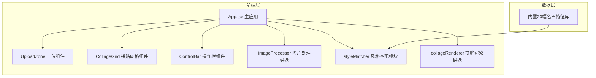

## 1. 架构设计



## 2. 技术选型

- **前端框架**：React 18 + TypeScript
- **构建工具**：Vite 5
- **状态管理**：React useState/useReducer（轻量级，无需额外状态库）
- **样式方案**：CSS Modules / 内联样式（按用户需求使用指定色值）
- **图像处理**：Canvas API（原生）
- **图标**：Lucide React

## 3. 目录结构

```
src/
├── main.tsx              # 入口文件
├── App.tsx               # 主应用组件
├── features/
│   ├── imageProcessor.ts # 图片处理模块
│   ├── styleMatcher.ts   # 风格匹配模块
│   └── collageRenderer.ts # 拼贴渲染模块
└── components/
    ├── UploadZone.tsx    # 上传区域组件
    ├── CollageGrid.tsx   # 拼贴网格组件
    └── ControlBar.tsx    # 底部操作栏组件
```

## 4. 核心模块说明

### 4.1 imageProcessor 模块

**职责**：图片读取、网格分割、特征提取

**核心函数**：
- `loadImage(file: File): Promise<HTMLImageElement>` - 加载图片
- `splitIntoGrid(image: HTMLImageElement, gridSize: number): GridCell[]` - 分割网格
- `extractFeatures(imageData: ImageData): CellFeatures` - 提取RGB平均值和方差

**数据结构**：
```typescript
interface CellFeatures {
  avgR: number;
  avgG: number;
  avgB: number;
  variance: number;
}

interface GridCell {
  x: number;
  y: number;
  width: number;
  height: number;
  features: CellFeatures;
}
```

### 4.2 styleMatcher 模块

**职责**：艺术风格特征库管理、匹配算法

**核心函数**：
- `matchStyle(cellFeatures: CellFeatures): StyleMatchResult` - 单格风格匹配
- `matchAllCells(cells: GridCell[]): StyleMatchResult[]` - 批量匹配

**数据结构**：
```typescript
interface Artwork {
  id: number;
  name: string;
  style: string;
  avgColor: [number, number, number];
  variance: number;
  colors: [number, number, number][];
}

interface StyleMatchResult {
  cellIndex: number;
  artworkId: number;
  artworkName: string;
  matchScore: number;
}
```

**匹配算法**：
- 色彩距离：欧氏距离计算RGB差异
- 纹理距离：方差差异绝对值
- 综合评分：加权平均（色彩权重0.7，纹理权重0.3）
- 匹配度：归一化为0-100%

### 4.3 collageRenderer 模块

**职责**：Canvas渲染拼贴作品、导出高清图片

**核心函数**：
- `renderCollage(canvas: HTMLCanvasElement, results: StyleMatchResult[], gridSize: number): void` - 渲染拼贴
- `exportHighRes(results: StyleMatchResult[], gridSize: number, size: number): Promise<Blob>` - 导出高清PNG

## 5. 性能优化策略

1. **Web Worker**：考虑将特征提取和匹配算法放入Web Worker（如性能不足时启用）
2. **离屏Canvas**：使用OffscreenCanvas进行后台渲染
3. **缓存机制**：缓存已计算的特征和匹配结果
4. **批量处理**：使用requestIdleCallback分帧处理匹配计算
5. **图像降采样**：特征提取时使用降采样图像加速计算

## 6. 响应式实现

- 使用CSS Media Queries实现768px断点响应式
- 布局使用Flexbox和Grid相结合
- 图片展示使用object-fit: contain保持比例
