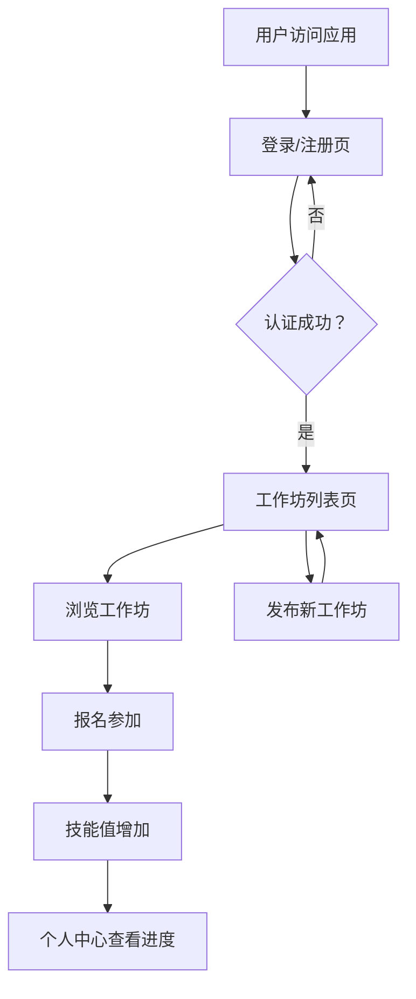

## 1. 产品概述

手工艺工作坊管理与社区互动平台，为手工艺爱好者提供发布、参与线下手工工作坊的在线社区，支持用户跟踪参与记录与技能成长。

- 目标用户：手工艺爱好者、手工工作坊组织者
- 核心价值：连接手工艺人与学习者，构建技能成长追踪体系

## 2. 核心功能

### 2.1 用户角色

| 角色 | 注册方式 | 核心权限 |
|------|---------|---------|
| 普通用户 | 用户名+密码+邮箱注册 | 浏览工作坊、发布工作坊、报名参与、查看个人中心 |

### 2.2 功能模块

1. **用户认证模块**：用户注册、登录、自动跳转
2. **工作坊管理模块**：发布工作坊、浏览列表、报名/取消报名
3. **个人中心模块**：已报名工作坊、历史参与记录、技能树进度展示

### 2.3 页面详情

| 页面名称 | 模块名称 | 功能描述 |
|---------|---------|---------|
| 登录/注册页 | 认证表单 | 用户输入用户名、密码、邮箱完成注册或登录，密码长度6-20位 |
| 工作坊列表页 | 工作坊卡片网格 | 展示所有工作坊，顶部发布按钮，支持报名与取消报名 |
| 工作坊列表页 | 发布模态框 | 填写工作坊名称、时间、地点、人数上限、材料清单 |
| 用户个人中心页 | 已报名列表 | 展示用户已报名和历史参与的工作坊卡片 |
| 用户个人中心页 | 技能树组件 | 六边形网格展示工艺技能等级与经验值 |

## 3. 核心流程

用户注册/登录 → 进入工作坊列表页 → 浏览/发布工作坊 → 报名参与 → 参加工作坊 → 技能成长 → 个人中心查看进度

## 4. 用户界面设计

### 4.1 设计风格

- 主色调：#8b5cf6（紫色），辅色：#c084fc（浅紫）
- 背景色：#faf5ff（淡紫背景）
- 卡片样式：白色背景、圆角16px、阴影#00000008
- 按钮样式：圆角设计，悬浮有缩放或颜色变化过渡效果
- 字体：系统默认字体
- 布局：卡片式网格布局，响应式设计

### 4.2 页面设计概览

| 页面名称 | 模块名称 | UI元素 |
|---------|---------|---------|
| 登录/注册页 | 认证表单 | 渐变背景#c084fc到#e9d5ff，400px宽圆角16px白色表单框 |
| 工作坊列表页 | 卡片网格 | 每行最多3张卡片，320x220px卡片，响应式单列 |
| 工作坊列表页 | 进度条 | 8px高圆角进度条，绿色填充，悬浮显示百分比 |
| 工作坊列表页 | 发布模态框 | 半透明遮罩，480px宽白色表单框，输入框聚焦紫色阴影 |
| 个人中心页 | 技能树 | 六边形网格（36px边长），蓝色#3b82f6亮色填充已学技能 |
| 全局 | Toast提示 | 底部居中，圆角8px，深色背景白色文字，2.5秒自动消失 |

### 4.3 响应式设计

- 桌面端：工作坊列表每行最多3张卡片
- 移动端（<768px）：单列布局
- 所有组件自适应屏幕宽度

### 4.4 动画与交互

- 页面切换：0.3s淡入淡出或左滑动画
- 按钮悬浮：0.2s过渡效果
- 发布按钮悬浮：缩放1.05倍
- Toast提示：底部滑入，2.5秒自动消失
