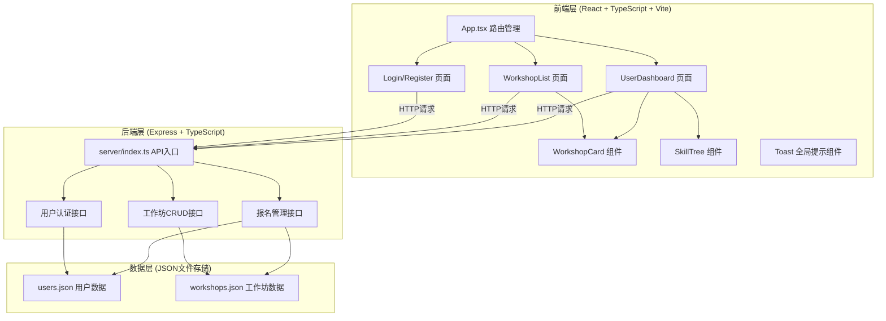
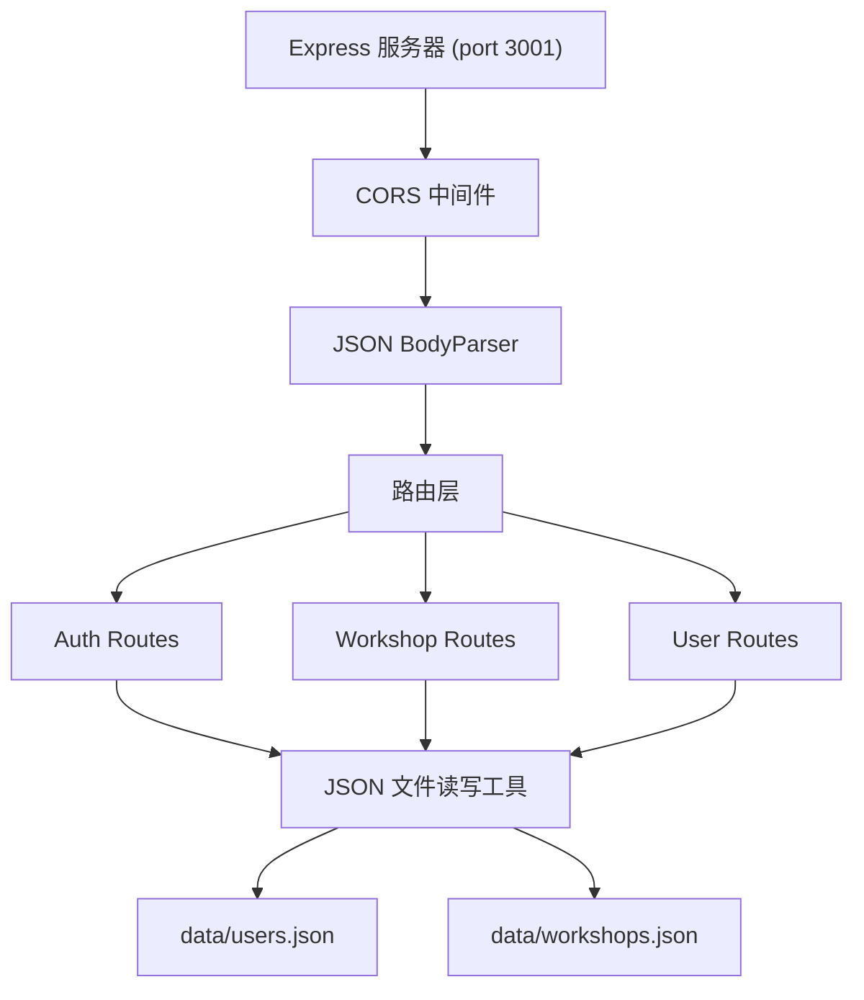
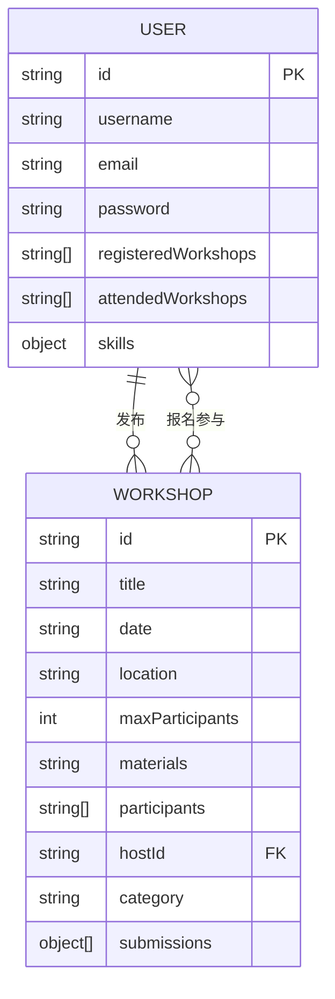

## 1. 架构设计



## 2. 技术说明

- 前端：React@18 + TypeScript + Vite + react-router-dom
- 后端：Express@4 + TypeScript + JSON文件存储
- 数据存储：本地JSON文件（users.json, workshops.json）
- 文件上传：multer（作品照片上传）
- 唯一ID：uuid
- 跨域：cors

## 3. 路由定义

| 前端路由 | 用途 |
|---------|------|
| /login | 登录/注册页面 |
| /workshops | 工作坊列表页（默认首页） |
| /dashboard | 用户个人中心页 |

| API路由 | 方法 | 用途 |
|---------|------|------|
| /api/auth/register | POST | 用户注册 |
| /api/auth/login | POST | 用户登录 |
| /api/workshops | GET | 获取所有工作坊 |
| /api/workshops | POST | 发布新工作坊 |
| /api/workshops/:id/register | POST | 报名参加工作坊 |
| /api/workshops/:id/cancel | POST | 取消报名 |
| /api/users/:id | GET | 获取用户信息（含已报名工作坊和技能） |
| /api/workshops/:id/submit | POST | 提交作品照片 |

## 4. API数据定义

```typescript
interface User {
  id: string;
  username: string;
  email: string;
  password: string;
  registeredWorkshops: string[];
  attendedWorkshops: string[];
  skills: Record<string, { level: number; exp: number }>;
}

interface Workshop {
  id: string;
  title: string;
  date: string;
  location: string;
  maxParticipants: number;
  materials: string;
  participants: string[];
  hostId: string;
  category: string;
  submissions: { userId: string; photo: string }[];
}

interface AuthResponse {
  success: boolean;
  userId: string;
  message?: string;
}

interface ToastMessage {
  id: string;
  text: string;
  type: 'success' | 'error' | 'info';
}
```

## 5. 服务端架构



## 6. 数据模型

### 6.1 实体关系



### 6.2 技能类型定义

- carpentry（木工）
- pottery（陶艺）
- weaving（编织）
- embroidery（刺绣）
- leathercraft（皮具）
- papercraft（纸艺）

每个技能包含：level（等级，整数）和exp（经验值，整数）
