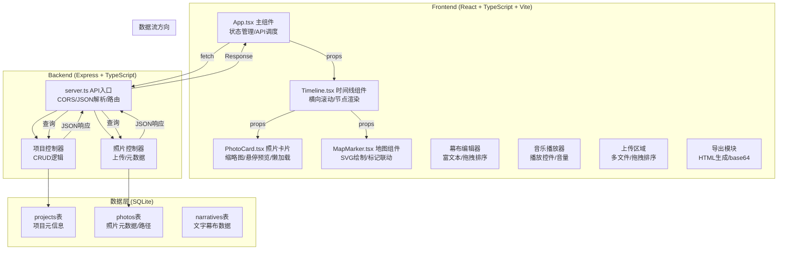
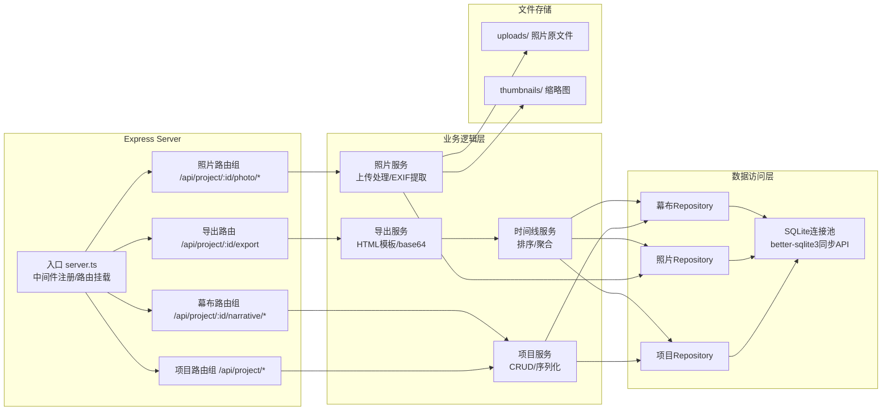
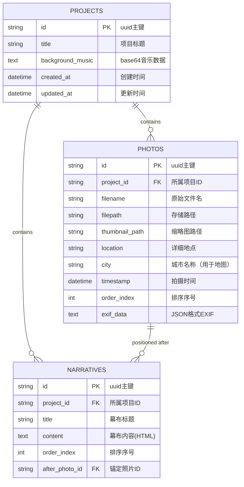

## 1. 架构设计



## 2. 技术说明

- **前端框架**：React 18 + TypeScript 5 + Vite 5
- **状态管理**：React useState/useReducer（轻量级场景，无需额外库）
- **构建工具**：Vite 5，输出目录 dist
- **后端框架**：Express 4 + TypeScript
- **数据库**：SQLite3（文件型数据库，零配置部署）
- **文件处理**：multer中间件处理照片上传、FileReader读取EXIF
- **跨域**：cors中间件允许前端访问API
- **唯一标识**：uuid生成项目ID和照片ID
- **图标**：lucide-react（遵循项目规范）

## 3. 路由定义

| 路由 (前端) | 用途 |
|------------|------|
| / | 主编辑页面，包含所有功能模块 |

## 4. API 定义

### 4.1 类型定义
```typescript
interface Project {
  id: string;
  title: string;
  createdAt: string;
  updatedAt: string;
  backgroundMusic?: string; // base64 or file path
}

interface Photo {
  id: string;
  projectId: string;
  filename: string;
  filepath: string;
  thumbnail?: string;
  location: string;
  city: string;
  timestamp: string; // ISO date string
  orderIndex: number;
  exifData?: Record<string, any>;
}

interface Narrative {
  id: string;
  projectId: string;
  title: string;
  content: string;
  orderIndex: number;
  afterPhotoId?: string;
}

interface TimelineNode {
  type: 'photo' | 'narrative';
  data: Photo | Narrative;
  orderIndex: number;
}
```

### 4.2 接口规范

| Method | Endpoint | Request | Response | 用途 |
|--------|----------|---------|----------|------|
| POST | /api/project | { title: string } | { projectId: string, ...Project } | 创建新项目 |
| GET | /api/project/:id | - | Project + photos[] + narratives[] | 获取项目完整数据 |
| POST | /api/project/:id/photo | multipart/form-data | Photo | 上传单张照片 |
| PUT | /api/project/:id/photo/:photoId | { location, city, timestamp, orderIndex } | Photo | 更新照片元数据 |
| DELETE | /api/project/:id/photo/:photoId | - | { success: boolean } | 删除照片 |
| POST | /api/project/:id/narrative | { title, content, afterPhotoId } | Narrative | 创建幕布节点 |
| PUT | /api/project/:id/narrative/:narrativeId | { title, content, orderIndex } | Narrative | 更新幕布 |
| DELETE | /api/project/:id/narrative/:narrativeId | - | { success: boolean } | 删除幕布 |
| GET | /api/project/:id/timeline | - | TimelineNode[] 排序后数据 | 获取时间线排序数据 |
| POST | /api/project/:id/music | multipart/form-data | { musicUrl: string } | 上传背景音乐 |
| GET | /api/project/:id/export | - | HTML Blob | 导出完整HTML文件 |

## 5. 服务器架构图



## 6. 数据模型

### 6.1 ER 图



### 6.2 DDL 语句

```sql
-- 项目表
CREATE TABLE IF NOT EXISTS projects (
    id TEXT PRIMARY KEY,
    title TEXT NOT NULL DEFAULT '我的旅行纪录片',
    background_music TEXT,
    created_at DATETIME DEFAULT CURRENT_TIMESTAMP,
    updated_at DATETIME DEFAULT CURRENT_TIMESTAMP
);

-- 照片表
CREATE TABLE IF NOT EXISTS photos (
    id TEXT PRIMARY KEY,
    project_id TEXT NOT NULL REFERENCES projects(id) ON DELETE CASCADE,
    filename TEXT NOT NULL,
    filepath TEXT NOT NULL,
    thumbnail_path TEXT,
    location TEXT DEFAULT '',
    city TEXT DEFAULT '',
    timestamp DATETIME NOT NULL,
    order_index INTEGER NOT NULL DEFAULT 0,
    exif_data TEXT
);
CREATE INDEX IF NOT EXISTS idx_photos_project ON photos(project_id);
CREATE INDEX IF NOT EXISTS idx_photos_order ON photos(project_id, order_index);

-- 幕布表
CREATE TABLE IF NOT EXISTS narratives (
    id TEXT PRIMARY KEY,
    project_id TEXT NOT NULL REFERENCES projects(id) ON DELETE CASCADE,
    title TEXT DEFAULT '',
    content TEXT DEFAULT '',
    order_index INTEGER NOT NULL DEFAULT 0,
    after_photo_id TEXT REFERENCES photos(id) ON DELETE SET NULL
);
CREATE INDEX IF NOT EXISTS idx_narratives_project ON narratives(project_id);
```

### 6.3 初始数据（演示用）

```sql
-- 插入示例项目
INSERT INTO projects (id, title, created_at) VALUES 
('demo-001', '2024云南深度游', '2024-05-01 10:00:00');

-- 插入示例照片
INSERT INTO photos (id, project_id, filename, filepath, location, city, timestamp, order_index) VALUES
('p1', 'demo-001', 'kunming.jpg', 'uploads/demo/kunming.jpg', '滇池海埂大坝', '昆明', '2024-05-01 09:30:00', 0),
('p2', 'demo-001', 'dali.jpg', 'uploads/demo/dali.jpg', '大理古城南门', '大理', '2024-05-02 14:20:00', 1),
('p3', 'demo-001', 'erhai.jpg', 'uploads/demo/erhai.jpg', '洱海双廊古镇', '大理', '2024-05-03 08:15:00', 2),
('p4', 'demo-001', 'lijiang.jpg', 'uploads/demo/lijiang.jpg', '丽江古城四方街', '丽江', '2024-05-04 16:45:00', 3),
('p5', 'demo-001', 'yulong.jpg', 'uploads/demo/yulong.jpg', '玉龙雪山4680平台', '丽江', '2024-05-05 11:00:00', 4);

-- 插入示例幕布
INSERT INTO narratives (id, project_id, title, content, order_index, after_photo_id) VALUES
('n1', 'demo-001', '春城初探', '抵达昆明，感受四季如春的气候，喂海鸥看日落。', 1, 'p1'),
('n2', 'demo-001', '风花雪月', '大理的慢生活：苍山洱海，古城骑行，三道茶。', 3, 'p2');
```
