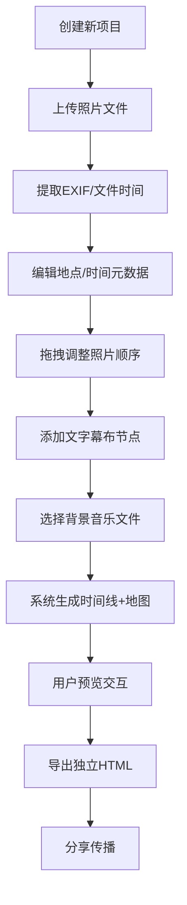

## 1. 产品概述

互动式旅行时间线纪录片生成工具，帮助旅行规划爱好者将零散照片按时间线拼接成互动式旅行纪录片，支持添加标注、地图和背景音乐，可导出为独立HTML分享。

- 核心价值：将零散旅行记忆转化为结构化、可交互、可分享的数字纪录片
- 目标用户：旅行爱好者、摄影爱好者、旅行博主

## 2. 核心功能

### 2.1 用户角色
| 角色 | 注册方式 | 核心权限 |
|------|---------|---------|
| 普通用户 | 本地使用（无需注册） | 创建项目、上传照片、编辑时间线、导出HTML |

### 2.2 功能模块
1. **主编辑界面**：顶部导航栏、时间线主体区、底部控制面板
2. **照片管理模块**：多文件上传、拖拽排序、EXIF时间提取、照片元数据编辑
3. **时间线渲染模块**：横向滚动时间线、照片卡片、渐变色连线、悬停预览
4. **文字幕布模块**：幕布节点创建、富文本编辑、拖拽排序
5. **地图标注模块**：SVG简易地图、地点标记、路径连线、点击联动
6. **背景音乐模块**：音频上传、播放控件、音量调节、base64内嵌导出
7. **项目管理模块**：项目创建、数据持久化、API接口
8. **导出模块**：独立HTML文件生成、资源内嵌

### 2.3 页面详情
| 页面名称 | 模块名称 | 功能描述 |
|---------|---------|---------|
| 主编辑页 | 顶部导航栏 | 项目标题展示、导出HTML按钮（悬停放大效果） |
| 主编辑页 | 横向时间线 | 70%页面高度、照片卡片按时间排序、渐变色连线连接、触屏滑动支持 |
| 主编辑页 | 照片卡片 | 缩略图(120x80圆角8px)、地点/日期标签、悬停预览(240x160阴影) |
| 主编辑页 | 文字幕布 | 半透明卡片(rgba(255,255,255,0.9)圆角16px)、可拖拽调整位置、富文本标题内容 |
| 主编辑页 | 控制面板 | 30%页面高度、背景#f0ede6圆角16px、左侧上传区右侧编辑器+地图 |
| 主编辑页 | 上传区 | 280px宽、虚线边框#bdbdbd、多文件选择、拖拽排序 |
| 主编辑页 | 地图预览 | 320x240圆角8px、SVG地图、圆点标记、带箭头路径连线 |
| 主编辑页 | 音乐控件 | 右上角圆形(r28px背景#1e88e5)、播放旋转动画(3s/圈)、音量调节0-100 |

## 3. 核心流程

用户创建新项目 → 上传多张照片（系统提取EXIF时间或使用文件修改时间）→ 编辑每张照片的地点和时间（可拖拽排序）→ 添加文字幕布节点（输入标题和内容）→ 选择背景音乐文件 → 系统自动生成时间线和SVG地图 → 用户预览交互效果 → 点击导出按钮生成独立HTML文件（音乐内嵌为base64）→ 分享HTML文件

## 4. 用户界面设计

### 4.1 设计风格
- **主色调**：温润米白色背景(#faf5eb)、深灰导航(#333)、蓝色系连线(#e0e0e0→#90caf9)、橙色标记(#ff5722)、深蓝路径(#1565c0)、亮蓝控件(#1e88e5)
- **卡片风格**：圆角统一(8/12/16px分级)、半透明幕布(rgba 0.9)、悬停阴影效果
- **字体**：system-ui 系统字体
- **间距**：卡片间隔12px、内边距16px、弹性适应(min-width: 320px)
- **动效**：播放控件3s/圈线性旋转、导出按钮悬停1.08倍放大、地图连线动画

### 4.2 页面设计概览
| 页面名称 | 模块名称 | UI元素 |
|---------|---------|--------|
| 主编辑页 | 顶部导航 | 56px高#333背景、左标题右导出按钮、悬停#555+scale1.08 |
| 主编辑页 | 时间线区 | 横向滚动容器、卡片12px间距、渐变连线、悬停预览层 |
| 主编辑页 | 照片卡片 | 120x80缩略图圆角8、地点文字、日期标签、悬停240x160阴影预览 |
| 主编辑页 | 幕布卡片 | rgba(255,255,255,0.9)、圆角16px、可拖拽句柄、标题+内容区 |
| 主编辑页 | 控制面板 | 30%高度#f0ede6背景圆角16、左上传右编辑+地图双栏 |
| 主编辑页 | 上传区 | 280px宽白色背景圆角12、#bdbdbd虚线边、拖拽提示区 |
| 主编辑页 | SVG地图 | 320x240圆角8、圆点标记、#1565c0路径线、#ff5722箭头三角 |
| 主编辑页 | 音乐控件 | 固定右上、r28圆形#1e88e5、旋转动画、音量滑块 |

### 4.3 响应式设计
- 桌面端优先设计，宽度自适应
- 最小宽度320px弹性布局
- 时间线支持触屏滑动手势
- 控制面板在小屏幕下垂直堆叠

### 4.4 性能优化
- 时间线滚动帧率≥50fps（使用transform/opacity动画避免重排）
- 100张照片初始加载≤3s（图片懒加载+缩略图策略）
- 照片懒加载：仅加载可见区域前后各3张缩略图
- 使用CSS硬件加速属性
