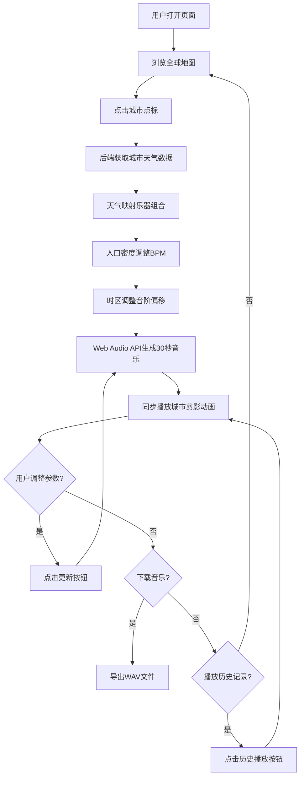

## 1. 产品概述

城市灵感音乐生成器是一个沉浸式 Web 应用，让用户在交互式全球地图上选择城市，系统根据该城市的天气、人口密度、时区和地标数据自动生成一段环境音乐，并配上动态像素风城市剪影动画。目标用户为音乐爱好者、创意工作者和城市文化探索者。

- 核心价值：将城市数据转化为可聆听的音乐体验，让每个城市拥有独特的"声音签名"
- 差异化：数据驱动的实时音乐生成 + 像素风视觉动画同步

## 2. 核心功能

### 2.1 功能模块

1. **主页面（唯一页面）**：全球地图 + 控制面板 + 城市剪影动画 + 历史记录

### 2.2 页面详情

| 页面名称 | 模块名称 | 功能描述 |
|---------|---------|---------|
| 主页面 | 全球地图 | Canvas自绘简化世界地图，背景#1a1a2e，陆地#16213e，海洋#0f3460，10个可点击城市点标 |
| 主页面 | 城市点标交互 | 直径12px渐变圆点(#e94560→#533483)，悬浮放大18px显示城市名，点击高亮发光 |
| 主页面 | 控制面板 | 宽360px背景#1a1a2e圆角16px，包含播放/暂停、音量滑块、参数调节、下载按钮 |
| 主页面 | 播放/暂停按钮 | 宽120px高44px圆角22px背景#e94560，悬浮缩放1.05倍+阴影 |
| 主页面 | 音量滑块 | 宽240px高6px圆角3px背景#16213e，滑块头16px圆#e94560 |
| 主页面 | 节拍强度滑块 | 宽240px高6px圆角3px，滑块头16px圆#533483，范围1-10 |
| 主页面 | 乐器混音滑块 | 宽240px高6px圆角3px，滑块头16px圆#0f3460，范围0-100% |
| 主页面 | 更新按钮 | 宽140px高44px圆角22px背景#533483，悬浮亮度1.1倍过渡0.2s |
| 主页面 | 下载按钮 | 宽140px高44px圆角22px背景#0f3460，悬浮透明度0.8过渡0.3s |
| 主页面 | 城市剪影动画 | 像素风城市轮廓，与音乐同步：晴天霓虹灯闪烁、雨天雨滴粒子效果 |
| 主页面 | 历史记录区域 | 高160px背景#16213e圆角12px，横向滚动展示最近5次生成记录 |
| 主页面 | 历史记录条目 | 城市名、天气图标（晴天#ffd700太阳、雨天#4ecdc4云朵）、播放时间、播放按钮(28px圆#e94560) |

## 3. 核心流程

用户打开页面 → 查看全球地图 → 点击城市点标 → 系统获取天气数据 → 根据天气/人口/时区生成30秒MIDI环境音乐 → 播放音乐并同步显示城市剪影动画 → 用户可调节参数并更新 → 历史记录自动保存 → 可下载WAV文件

## 4. 用户界面设计

### 4.1 设计风格

- **主色调**：深蓝紫色系 — #1a1a2e（主背景）、#16213e（卡片/陆地）、#0f3460（海洋/辅助）、#e94560（强调/CTA）、#533483（次要强调）
- **按钮风格**：圆角胶囊形（22px圆角），填充色块按钮，悬浮有缩放/阴影/亮度反馈
- **字体**：系统默认字体栈，像素风格辅助字体用于城市剪影区域
- **布局风格**：左右分栏（地图60% + 面板40%），响应式768px以下上下布局
- **图标风格**：天气图标使用简洁符号（太阳#ffd700、云朵#4ecdc4），播放使用三角/暂停符号
- **动画风格**：过渡0.2-0.3s，悬浮缩放，点击发光，粒子效果

### 4.2 页面设计概览

| 页面名称 | 模块名称 | UI元素 |
|---------|---------|--------|
| 主页面 | 地图区域 | Canvas全高，深蓝背景，简化大陆轮廓，渐变城市点标带悬浮/点击动画 |
| 主页面 | 控制面板 | 深色卡片，垂直排列：当前城市信息、播放控制、参数滑块组、更新/下载按钮 |
| 主页面 | 剪影动画区 | 像素风城市天际线，动态元素（霓虹灯/雨滴）与音频同步 |
| 主页面 | 历史记录 | 底部横条，卡片式条目横向滚动，半透明背景 |

### 4.3 响应式

- 桌面端（>768px）：地图左侧60% + 控制面板右侧40%
- 移动端（≤768px）：地图上方 + 控制面板下方，垂直堆叠布局
- 地图和控制面板均100%宽度，触摸优化点标点击区域
