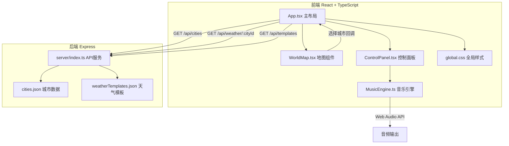
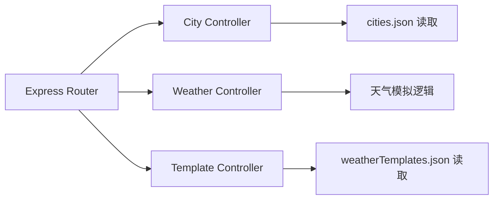
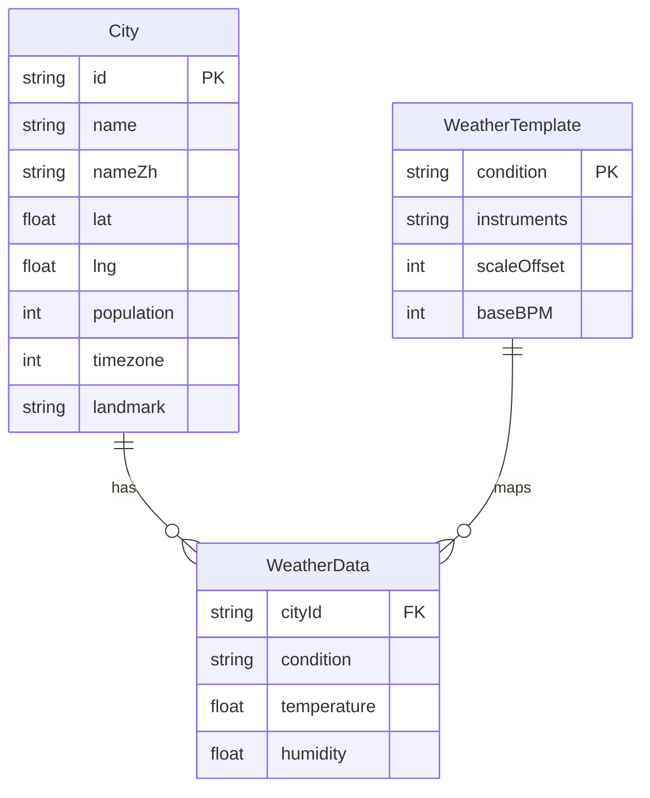

## 1. 架构设计



## 2. 技术说明

- **前端**：React@18 + TypeScript + Vite + CSS Modules/全局CSS
- **初始化工具**：vite-init (react-express-ts 模板)
- **后端**：Express@4 + TypeScript + CORS
- **数据库**：JSON文件存储（data/cities.json + data/weatherTemplates.json）
- **音频引擎**：Web Audio API（OscillatorNode、GainNode、BiquadFilterNode、白噪声生成）
- **动画**：Canvas 2D API（城市剪影 + 粒子系统）
- **状态管理**：React useState + props传递

## 3. 路由定义

| 路由 | 用途 |
|------|------|
| / | 主页面（地图 + 控制面板 + 历史） |

## 4. API 定义

### 4.1 TypeScript 类型

```typescript
interface City {
  id: string;
  name: string;
  nameZh: string;
  lat: number;
  lng: number;
  population: number;
  timezone: number;
  landmark: string;
}

interface WeatherData {
  cityId: string;
  condition: "sunny" | "cloudy" | "rainy";
  temperature: number;
  humidity: number;
}

interface WeatherTemplate {
  condition: string;
  instruments: string[];
  scaleOffset: number;
  baseBPM: number;
}

interface MusicParams {
  cityId: string;
  beatIntensity: number;
  mainInstrumentVolume: number;
  bgVolume: number;
}

interface HistoryEntry {
  id: string;
  cityName: string;
  weatherIcon: string;
  weatherCondition: string;
  playTime: string;
  audioData: AudioBuffer;
}
```

### 4.2 API 端点

| 方法 | 路径 | 请求 | 响应 | 说明 |
|------|------|------|------|------|
| GET | /api/cities | - | City[] | 获取城市列表 |
| GET | /api/weather/:cityId | - | WeatherData | 获取城市天气（模拟） |
| GET | /api/templates | - | WeatherTemplate[] | 获取天气-乐器映射模板 |

## 5. 服务器架构



## 6. 数据模型

### 6.1 数据模型定义



### 6.2 数据文件定义

**cities.json** — 10个城市：东京、纽约、伦敦、巴黎、悉尼、开罗、里约热内卢、莫斯科、迪拜、新加坡

**weatherTemplates.json** — 3种天气模板：
- 晴天：钢琴+木吉他，音阶偏移0，BPM基数80
- 多云：电子琴+弦乐，音阶偏移-2，BPM基数70
- 雨天：钢琴+雨声白噪音，音阶偏移-5，BPM基数60

### 6.3 音乐生成算法

- BPM = baseBPM + (population / 1000000) × 5
- 昼夜偏移：UTC+时区 > 6 为白天（大调偏移+2），否则为夜晚（小调偏移-3）
- 30秒 = (BPM/60) × 30 拍
- Web Audio合成：OscillatorNode生成音调，GainNode控制音量包络，BiquadFilterNode低通滤波，白噪声通过AudioBuffer + ScriptProcessor生成
