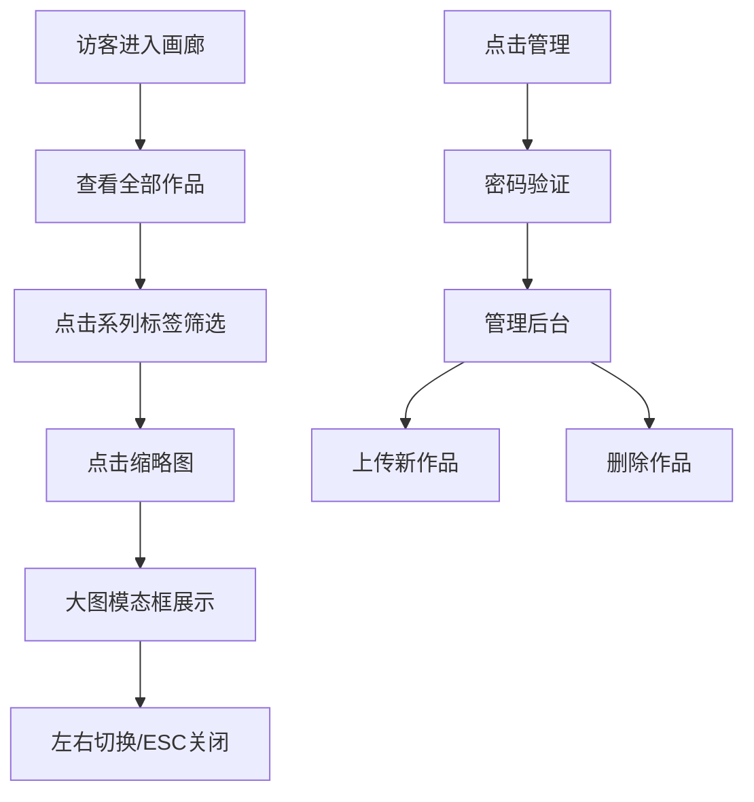

## 1. 产品概述

虚拟画廊作品管理系统是为独立插画师打造的在线作品集展示平台，让来访者如同参观画廊般浏览系列画作，同时提供便捷的作品上传与管理功能。

- 核心价值：为插画师提供优雅的作品展示空间，建立个人品牌形象
- 目标用户：独立插画师（创作者）、艺术爱好者（访问者）
- 市场定位：轻量级、高审美的个人艺术作品展示解决方案

## 2. 核心功能

### 2.1 用户角色

| 角色 | 认证方式 | 核心权限 |
|------|----------|----------|
| 访客 | 无需认证 | 浏览画廊、查看画作详情、按系列筛选 |
| 管理员 | 密码验证（gallery2024） | 上传作品、删除作品、管理作品列表 |

### 2.2 功能模块

1. **画廊主页**：系列标签筛选、瀑布流缩略图展示、大图模态框浏览
2. **后台管理页**：密码登录、作品上传表单、作品列表管理、删除确认

### 2.3 页面详情

| 页面名称 | 模块名称 | 功能描述 |
|----------|----------|----------|
| 画廊主页 | 导航栏 | 品牌标识、页面切换、响应式布局 |
| 画廊主页 | 系列标签 | 胶囊形标签、系列筛选、横向滚动 |
| 画廊主页 | 缩略图网格 | 瀑布流布局、图片懒加载、悬浮动效、骨架屏 |
| 画廊主页 | 大图模态框 | 全屏浏览、左右切换、ESC关闭、图片预加载 |
| 后台管理页 | 登录验证 | 密码输入、错误提示 |
| 后台管理页 | 上传表单 | 标题/系列/描述输入、图片选择、预览、进度条 |
| 后台管理页 | 作品列表 | 缩略图展示、删除操作、确认对话框 |

## 3. 核心流程

### 访客浏览流程
访客进入画廊 → 查看默认全部作品 → 点击系列标签筛选 → 点击缩略图查看大图 → 左右箭头切换同系列画作 → ESC或点击空白关闭

### 管理员上传流程
点击"管理"导航 → 输入密码登录 → 填写画作信息 → 选择图片文件 → 预览缩略图 → 点击上传 → 显示进度条 → 上传成功刷新列表

### 管理员删除流程
进入管理页 → 找到目标作品 → 点击删除按钮 → 弹出确认对话框 → 确认删除 → 从列表和服务器移除

## 4. 用户界面设计

### 4.1 设计风格
- **主色调**：浅紫色系 #7c3aed（品牌主色）、#f3e8ff（淡紫背景）、#faf5ff（页面背景）
- **辅助色**：#e53e3e（删除按钮）、#e9d5ff（进度条背景）
- **按钮风格**：圆角8px，悬浮变亮，过渡0.3s ease-out
- **字体**：展示字体采用富有艺术感的 serif 字体，正文采用清晰的 sans-serif 字体
- **布局**：顶部固定导航栏，卡片式网格布局，优雅留白

### 4.2 页面设计概述

| 页面名称 | 模块名称 | UI元素 |
|----------|----------|--------|
| 画廊主页 | 导航栏 | 高56px、白底、浅阴影、左侧品牌名、右侧导航链接 |
| 画廊主页 | 系列标签 | 胶囊形34px高、选中态背景填充、8px间距、横向滚动 |
| 画廊主页 | 缩略图卡片 | 200px宽、高度自适应、圆角8px、悬浮上移-4px加阴影 |
| 画廊主页 | 大图模态框 | 半透明背景#000000b3、最大80%视口、圆形切换按钮 |
| 后台管理页 | 上传表单 | 120px高文本域、140x40px选择按钮、150x150预览区 |
| 后台管理页 | 作品列表 | 60x60缩略图、圆形删除按钮32px |

### 4.3 响应式设计
- **桌面端**（≥768px）：缩略图卡片200px宽，导航字体16px
- **移动端**（<768px）：缩略图卡片160px宽，导航字体14px，系列标签可横向滚动
- 统一过渡动画：ease-out 0.3s

### 4.4 动效设计
- 骨架屏：灰色矩形脉冲动画，数据加载后平滑过渡
- 悬浮效果：卡片上移+阴影增强，按钮亮度提升
- 模态框：淡入淡出，图片缩放过渡
- 进度条：流畅填充动画
