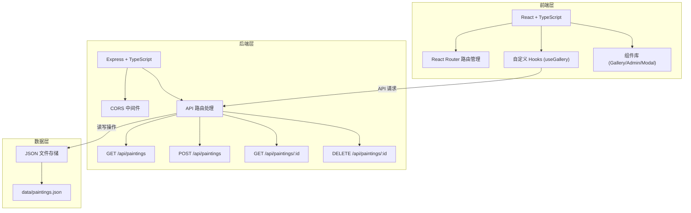
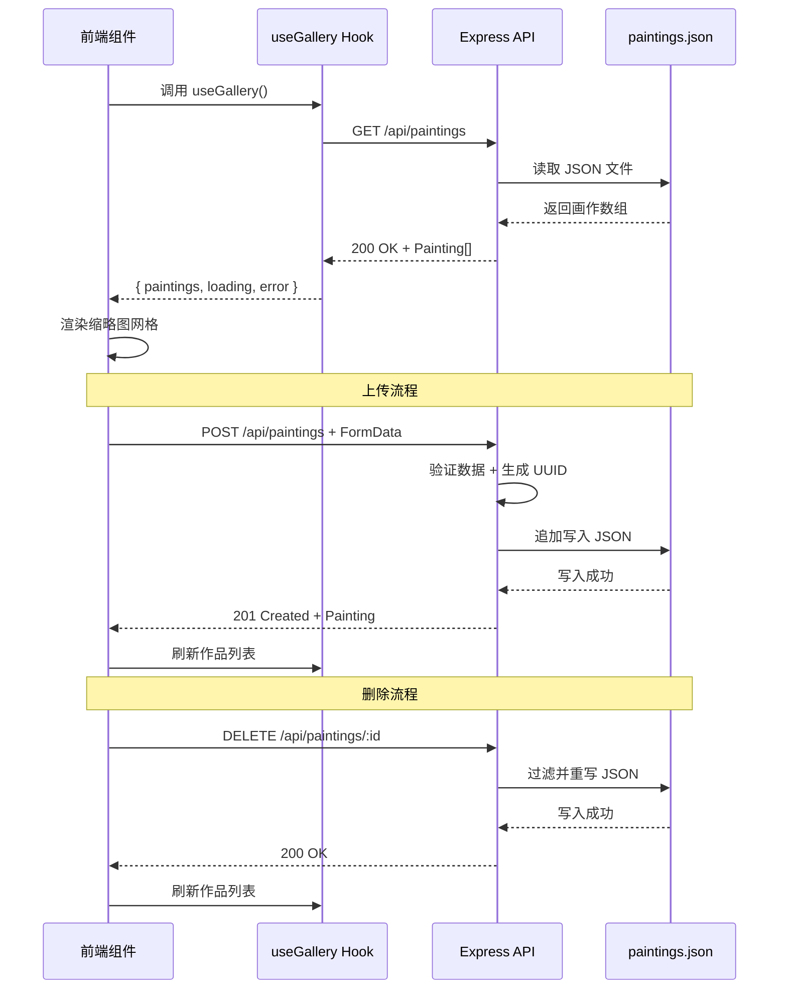
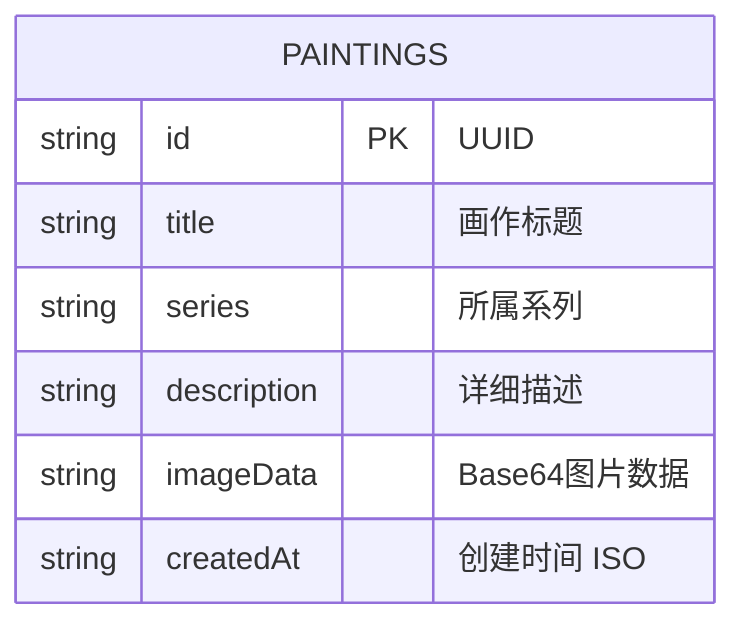

## 1. 架构设计



## 2. 技术描述

- **前端**：React 18 + TypeScript + Vite + React Router DOM
- **状态管理**：React Context + 自定义 Hooks
- **构建工具**：Vite 5.x
- **后端**：Express 4.x + TypeScript
- **数据存储**：JSON 文件（data/paintings.json）
- **开发模式**：前后端同启，Vite 代理 /api 至后端

### 核心依赖
```
react, react-dom, react-router-dom, express, cors, uuid,
typescript, vite, @vitejs/plugin-react,
@types/react, @types/react-dom, @types/express, @types/node
```

## 3. 路由定义

| 路由 | 组件 | 用途 |
|------|------|------|
| / | Gallery | 画廊主页，展示画作缩略图网格 |
| /admin | Admin | 后台管理页，上传和管理作品 |
| * | Gallery | 404 重定向至画廊 |

## 4. API 定义

### 类型定义

```typescript
interface Painting {
  id: string;
  title: string;
  series: string;
  description: string;
  imageData: string; // base64 编码
  createdAt: string;
}
```

### 接口列表

| 方法 | 路径 | 描述 | 请求体 | 响应 |
|------|------|------|--------|------|
| GET | /api/paintings | 获取所有作品列表 | - | `Painting[]` |
| GET | /api/paintings/:id | 获取单幅作品详情 | - | `Painting` |
| POST | /api/paintings | 上传新作品 | `{ title, series, description, imageData }` | `Painting` |
| DELETE | /api/paintings/:id | 删除作品 | - | `{ success: true }` |

## 5. 数据流图



## 6. 数据模型

### 6.1 数据结构



### 6.2 初始数据结构示例

```json
{
  "paintings": [
    {
      "id": "550e8400-e29b-41d4-a716-446655440000",
      "title": "春日樱花",
      "series": "四季物语",
      "description": "描绘春天樱花盛开的唯美场景，柔和的粉色调与轻盈的花瓣飘落营造出梦幻氛围。",
      "imageData": "data:image/jpeg;base64,/9j/4AAQSkZJRg...",
      "createdAt": "2024-01-15T10:30:00.000Z"
    }
  ]
}
```

### 6.3 存储机制
- 数据持久化：`data/paintings.json` 文件存储
- 读写策略：每次请求读取文件，修改后重写整个文件
- 并发控制：Node.js 单线程自然顺序处理，文件操作采用原子写入
- 索引：无额外索引，通过数组 filter/find 查询

## 7. 项目文件结构

```
├── package.json            # 项目依赖与脚本
├── vite.config.js          # Vite 构建配置（含 API 代理）
├── tsconfig.json           # TypeScript 配置（严格模式）
├── index.html              # 入口 HTML
├── src/
│   ├── App.tsx             # 根组件：路由与全局布局
│   ├── components/
│   │   ├── Gallery.tsx     # 画廊主视图组件
│   │   └── Admin.tsx       # 后台管理组件
│   ├── hooks/
│   │   └── useGallery.ts   # 数据获取自定义 Hook
│   └── context/
│       └── GalleryContext.tsx  # 全局状态管理
├── server/
│   └── index.ts            # Express 后端服务
└── data/
    └── paintings.json      # 画作数据存储
```

## 8. 性能优化策略

- **图片懒加载**：使用 Intersection Observer API 仅加载视口内图片
- **预加载机制**：大图模态框切换时预加载前后两张图片
- **骨架屏**：数据加载前显示占位动画，提升感知性能
- **Vite 代理**：开发环境避免跨域，生产环境可统一部署
- **Base64 存储**：小图片直接内嵌，减少 HTTP 请求
