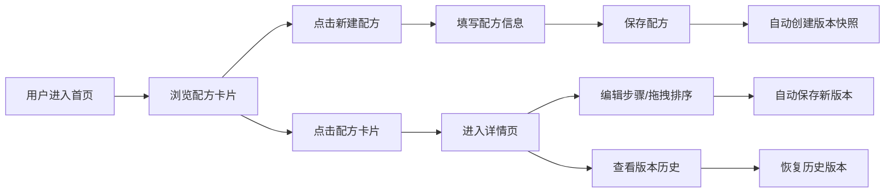

## 1. 产品概述

厨房日志是一款面向厨艺爱好者的实验性食谱记录与分享应用，解决传统菜谱收藏夹中难以记录失败尝试、调整记录不直观的问题。用户可以记录配方、追踪版本历史、探索烹饪实验过程。

- 目标用户：喜欢尝试新配方、需要记录烹饪调整过程的厨艺爱好者
- 核心价值：让每一次烹饪实验都有迹可循，支持版本回溯和配方迭代

## 2. 核心功能

### 2.1 功能模块

1. **首页**：配方卡片网格、新建配方、全局搜索
2. **详情页**：步骤编辑器（拖拽排序）、版本历史侧边栏、配方详情展示

### 2.2 页面详情

| 页面名称 | 模块名称 | 功能描述 |
|---------|---------|---------|
| 首页 | 配方卡片网格 | 展示所有配方卡片，支持菜系标签筛选，卡片底色随菜系变化 |
| 首页 | 新建配方卡片 | 输入菜名、描述、预估耗时、添加至少3个主要食材，食材项可删除 |
| 首页 | 全局搜索面板 | 按菜名、食材或菜系标签搜索，300ms防抖，无结果时显示提示和厨师图标 |
| 详情页 | 步骤编辑器 | 分步烹饪步骤，支持图片，垂直线连接，拖拽排序，当前步骤发光圆点指示 |
| 详情页 | 版本历史侧边栏 | 时间线展示所有历史版本，显示保存时间和变更摘要，支持版本恢复 |

## 3. 核心流程

## 4. 用户界面设计

### 4.1 设计风格
- **主色调**：暖白色 #fff7ed（背景），深棕色 #292524（文字），橙红色 #ea580c（强调色）
- **菜系标签色**：中式 #fef3c7、西式 #dbeafe、日式 #fce7f3、融合 #e0e7ff
- **按钮风格**：圆角设计，平滑过渡（0.2s ease）
- **字体**：Georgia, serif（标题），系统 sans-serif（正文）
- **布局风格**：卡片式布局，固定顶部导航栏，最大宽度1200px居中
- **视觉风格**："厨房日志"感，柔和阴影，圆角设计，温暖亲切

### 4.2 页面设计概述

| 页面名称 | 模块名称 | UI元素 |
|---------|---------|-------|
| 首页 | 导航栏 | 固定顶部64px，背景#292524，白色粗体标题，搜索图标，用户头像 |
| 首页 | 新建配方卡片 | 表单输入，食材列表带删除按钮，菜系标签选择 |
| 首页 | 配方卡片网格 | 多列布局，卡片圆角12px带浅阴影，悬浮加深阴影并上移4px |
| 首页 | 搜索面板 | 搜索框宽300px高40px圆角20px，实时搜索结果列表 |
| 详情页 | 步骤编辑器 | 垂直线连接步骤，发光圆点指示当前步骤，绿色对勾标记完成 |
| 详情页 | 版本侧边栏 | 宽280px背景#f8fafc，时间线样式 |

### 4.3 响应式
- 桌面端优先设计
- 小于768px时卡片变为单列，搜索面板全宽
- 触摸设备优化拖拽交互

### 4.4 动效与过渡
- 所有按钮、卡片、输入框平滑过渡（transition 0.2s ease）
- 卡片悬浮时阴影加深并向上平移4px
- 搜索结果实时显示（300ms防抖）
- 无结果时厨师图标淡入淡出
