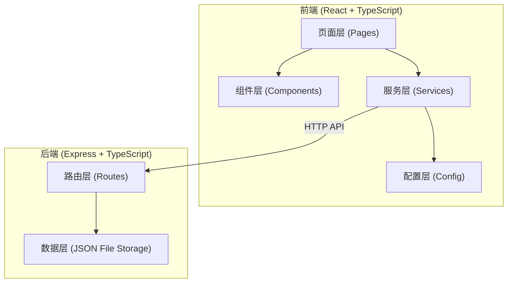
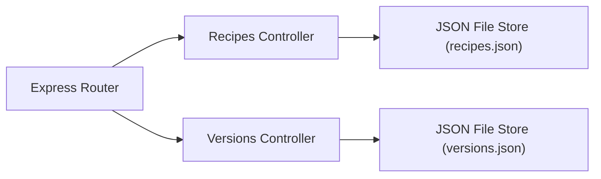
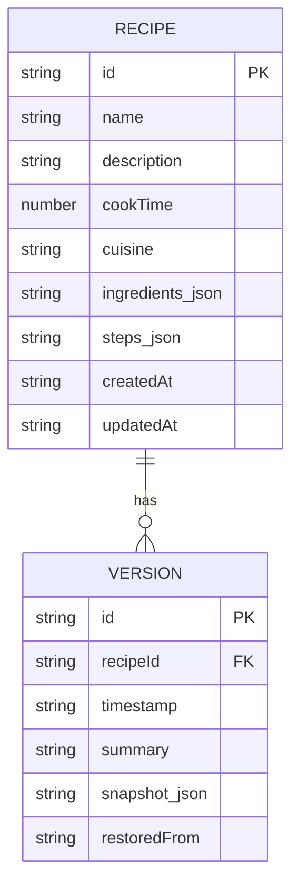

## 1. 架构设计



## 2. 技术描述

- **前端**：React 18 + TypeScript + Vite
- **路由**：react-router-dom v6
- **后端**：Express 4 + TypeScript
- **数据存储**：JSON 文件（data/recipes.json, data/versions.json）
- **构建工具**：Vite（端口3000）
- **状态管理**：React useState/useEffect（轻量级场景）
- **HTTP客户端**：fetch API（自定义拦截器）

## 3. 路由定义

| 路由 | 用途 |
|-----|------|
| / | 首页 - 配方列表与新建 |
| /recipe/:id | 详情页 - 步骤编辑与版本历史 |

## 4. API 定义

### 4.1 类型定义

```typescript
interface Ingredient {
  id: string;
  name: string;
  quantity: string;
  unit: string;
}

interface Step {
  id: string;
  text: string;
  image?: string;
}

interface Recipe {
  id: string;
  name: string;
  description: string;
  cookTime: number;
  cuisine: 'chinese' | 'western' | 'japanese' | 'fusion';
  ingredients: Ingredient[];
  steps: Step[];
  createdAt: string;
  updatedAt: string;
}

interface Version {
  id: string;
  recipeId: string;
  timestamp: string;
  summary: string;
  snapshot: Recipe;
  restoredFrom?: string;
}
```

### 4.2 接口列表

| 方法 | 路径 | 描述 |
|-----|------|------|
| GET | /api/recipes | 获取所有配方列表 |
| GET | /api/recipes/:id | 获取单个配方详情 |
| POST | /api/recipes | 创建新配方 |
| PUT | /api/recipes/:id | 更新配方（自动创建版本快照） |
| DELETE | /api/recipes/:id | 删除配方 |
| GET | /api/versions/:recipeId | 获取配方的版本历史 |
| POST | /api/versions/:recipeId/restore/:versionId | 恢复到指定版本 |

## 5. 服务器架构



## 6. 数据模型

### 6.1 数据模型定义



### 6.2 文件存储结构

- `data/recipes.json` - 配方数据数组
- `data/versions.json` - 版本历史数据数组

## 7. 项目文件结构

```
├── package.json
├── index.html
├── tsconfig.json
├── vite.config.js
├── src/
│   ├── config/
│   │   └── api.ts
│   ├── components/
│   │   ├── RecipeCard.tsx
│   │   └── StepEditor.tsx
│   ├── pages/
│   │   ├── HomePage.tsx
│   │   └── DetailPage.tsx
│   └── services/
│       └── api.ts
├── server/
│   └── index.ts
└── data/
    ├── recipes.json
    └── versions.json
```

## 8. 性能要求

- 首屏渲染时间 ≤ 500ms
- 版本历史加载响应时间 < 300ms
- 搜索防抖 300ms
- 过渡动画统一 0.2s ease
