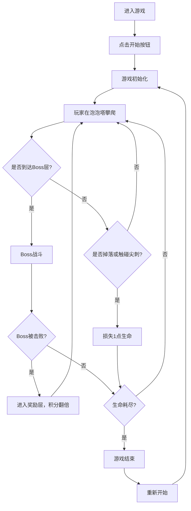

## 1. 产品概述

梦境泡泡塔是一款休闲益智类网页游戏，玩家在由彩色泡泡组成的悬浮高塔中向上攀爬，通过巧妙利用不同泡泡的物理特性（弹性、粘性、易碎）来跳跃到更高层，同时躲避危险的黑色尖刺泡泡。

- **核心玩法**：策略性跳跃 + 物理特性运用 + Boss战斗
- **目标用户**：休闲游戏玩家，喜欢挑战性和策略性游戏的用户
- **产品价值**：提供轻松有趣的碎片化游戏体验，考验玩家的反应能力和策略思维

## 2. 核心 Features

### 2.1 用户角色

| 角色 | 注册方式 | 核心权限 |
|------|----------|----------|
| 玩家 | 无需注册 | 游戏游玩、暂停、重新开始 |

### 2.2 Feature 模块

1. **游戏主场景**：无尽泡泡塔攀爬、泡泡物理交互、碰撞检测
2. **Boss战斗系统**：每5层出现Boss，追踪尖刺反弹机制
3. **状态管理系统**：层数、得分、生命值、游戏阶段管理
4. **UI界面系统**：HUD显示、暂停菜单、开始按钮
5. **视觉效果系统**：泡泡呼吸动画、星空背景、粒子特效

### 2.3 页面详情

| 页面名称 | 模块名称 | Feature 描述 |
|----------|----------|--------------|
| 游戏主界面 | 无尽塔渲染 | Canvas绘制向上延伸的泡泡塔，每层3-5个彩色泡泡环形排列 |
| 游戏主界面 | 泡泡交互 | 点击/拖拽泡泡触发不同物理反应（弹性、粘性、易碎） |
| 游戏主界面 | 玩家控制 | 玩家角色跳跃、下落、碰撞检测 |
| Boss战界面 | Boss行为 | 深紫色旋转尖刺球，周期性发射追踪小尖刺 |
| Boss战界面 | 反弹机制 | 利用弹力泡泡反弹尖刺击中Boss |
| HUD界面 | 状态显示 | 左侧显示层数（24px白色粗体）、得分（每秒+10）、生命值（3颗红心） |
| HUD界面 | 暂停按钮 | 右上角圆形暂停按钮（直径36px，双竖线图标） |
| 开始界面 | 开始按钮 | 底部渐变按钮（宽160px高52px，圆角26px，#c084fc→#a855f7） |
| 暂停菜单 | 暂停覆盖层 | 显示暂停文字和继续按钮 |

## 3. 核心流程

### 3.1 游戏主流程

玩家进入游戏 → 点击开始按钮 → 游戏开始，玩家从第一层泡泡塔开始 → 点击/拖拽泡泡触发物理效果 → 跳跃到更高层 → 每5层进入Boss战 → 击败Boss获得积分翻倍 → 继续攀爬 → 掉落或生命耗尽 → 游戏结束 → 可重新开始

### 3.2 Boss战斗流程

进入Boss层 → Boss开始旋转并发射追踪尖刺 → 玩家利用弹力泡泡反弹尖刺 → 尖刺击中Boss造成伤害 → Boss血量归零 → 获得奖励积分 → 进入下一层

## 4. 用户界面设计

### 4.1 设计风格

- **主色调**：深紫色星空背景 (#0a0a23)，泡泡渐变色从 #ff6b6b 到 #48dbfb
- **强调色**：Boss深紫色 (#6c3483)，尖刺红色 (#c0392b)，UI紫色渐变 (#c084fc→#a855f7)
- **按钮风格**：圆角26px，线性渐变背景，悬浮时亮度1.1倍，过渡0.3s
- **字体**：使用现代无衬线字体，数字放大显示
- **布局风格**：全屏Canvas游戏区域，左侧HUD信息栏，右上角暂停按钮，底部开始按钮
- **动画风格**：泡泡呼吸动画（2秒周期缩放），星空粒子向下滚动，Boss旋转动画

### 4.2 页面设计概览

| 页面名称 | 模块名称 | UI 元素 |
|----------|----------|----------|
| 游戏主界面 | 泡泡塔 | 彩色半透明泡泡（半径30-50px），环形排列，柔和光晕，呼吸动画 |
| 游戏主界面 | 玩家角色 | 简洁的圆形玩家，跟随物理运动 |
| 游戏主界面 | 背景 | Canvas粒子星空，50颗白色小星向下缓慢滚动 |
| Boss战界面 | Boss | 深紫色旋转尖刺球（直径120px，尖刺20px），30度/秒旋转 |
| Boss战界面 | 追踪尖刺 | 红色小尖刺，速度200px/秒 |
| HUD界面 | 层数显示 | 24px白色粗体数字，左侧显示 |
| HUD界面 | 得分显示 | 白色文字，每秒+10分 |
| HUD界面 | 生命值 | 3颗红心（20x20px），失命变灰 |
| HUD界面 | 暂停按钮 | 圆形36px，双竖线图标，半透明背景 |
| 开始界面 | 开始按钮 | 宽160px高52px，圆角26px，紫色渐变，白色加粗文字 |
| 暂停菜单 | 覆盖层 | 半透明黑色背景，"暂停中"文字，继续按钮 |

### 4.3 响应性

- **桌面优先设计**：针对PC端浏览器优化，全屏游戏体验
- **移动端适配**：支持触摸操作，响应式布局
- **触摸优化**：支持点击和拖拽操作

### 4.4 性能要求

- **帧率**：稳定60fps
- **优化策略**：Canvas分层渲染，对象池复用，物理计算精简
- **粒子控制**：星空粒子数固定50颗，泡泡碎片及时回收

## 5. 泡泡物理特性

| 泡泡类型 | 颜色特征 | 触发效果 |
|----------|----------|----------|
| 弹性泡泡 | 偏蓝色系 | 将玩家弹起200px高度 |
| 粘性泡泡 | 偏绿色系 | 玩家吸附3秒后松开 |
| 易碎泡泡 | 偏红色系 | 触碰后破碎，生成3个小碎片飞散 |
| 尖刺泡泡 | 黑色 | 触碰后损失1点生命 |
