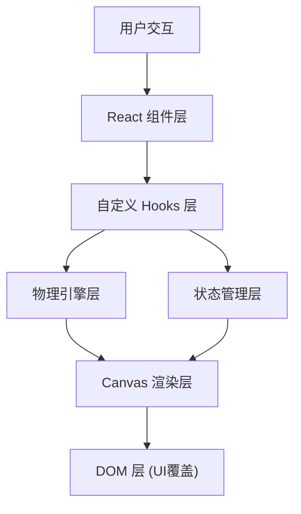
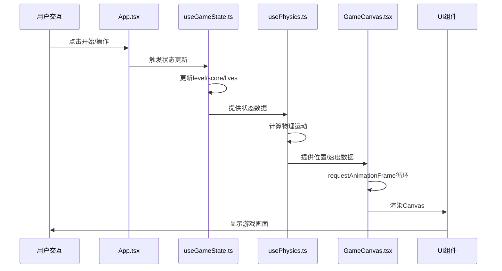

## 1. 架构设计



## 2. 技术描述

- **前端框架**：React@18 + TypeScript
- **构建工具**：Vite@5
- **渲染技术**：HTML5 Canvas 2D API
- **状态管理**：React Hooks (useState, useReducer, useRef)
- **物理引擎**：自定义轻量级物理系统（usePhysics Hook）
- **开发服务器**：Vite dev server，端口 5173

## 3. 文件结构

| 文件路径 | 职责描述 |
|----------|----------|
| `package.json` | 项目依赖配置，启动脚本 |
| `index.html` | 入口HTML文件，背景#0a0a23，无滚动条 |
| `vite.config.js` | Vite构建配置，dev端口5173 |
| `tsconfig.json` | TypeScript配置，严格模式，esnext目标 |
| `src/main.tsx` | React应用入口，渲染根组件 |
| `src/App.tsx` | 根组件，组合GameCanvas和UI组件 |
| `src/GameCanvas.tsx` | 主游戏循环，Canvas绘制，Boss战斗逻辑 |
| `src/usePhysics.ts` | 物理计算Hook：泡泡特性、碰撞检测、重力模拟 |
| `src/useGameState.ts` | 游戏状态Hook：层数、得分、生命值、泡泡配置 |
| `src/PauseMenu.tsx` | 暂停菜单覆盖层组件 |
| `src/types.ts` | 全局TypeScript类型定义 |
| `src/constants.ts` | 游戏常量配置 |

## 4. 核心类型定义

```typescript
// 泡泡类型
type BubbleType = 'elastic' | 'sticky' | 'fragile' | 'spike';

// 泡泡接口
interface Bubble {
  id: string;
  x: number;
  y: number;
  radius: number;
  type: BubbleType;
  color: string;
  glowColor: string;
  breathPhase: number; // 呼吸动画相位 0-1
  isBroken: boolean;
  fragments: Fragment[];
}

// 碎片接口
interface Fragment {
  x: number;
  y: number;
  vx: number;
  vy: number;
  radius: number;
  color: string;
  life: number;
}

// 玩家接口
interface Player {
  x: number;
  y: number;
  vy: number;
  radius: number;
  isStuck: boolean;
  stuckTimer: number;
  currentBubbleId: string | null;
}

// Boss接口
interface Boss {
  x: number;
  y: number;
  radius: number;
  rotation: number;
  health: number;
  maxHealth: number;
  spikeTimer: number;
  active: boolean;
}

// 追踪尖刺接口
interface TrackingSpike {
  id: string;
  x: number;
  y: number;
  vx: number;
  vy: number;
  speed: number;
  isReflected: boolean;
  active: boolean;
}

// 星星粒子接口
interface Star {
  x: number;
  y: number;
  size: number;
  speed: number;
  alpha: number;
}

// 游戏状态
type GamePhase = 'menu' | 'playing' | 'paused' | 'boss' | 'reward' | 'gameover';

// 游戏状态接口
interface GameState {
  phase: GamePhase;
  level: number;
  score: number;
  lives: number;
  maxLives: number;
  scoreMultiplier: number;
  bubbles: Bubble[][]; // 每层泡泡数组
  boss: Boss | null;
  trackingSpikes: TrackingSpike[];
  cameraY: number;
}
```

## 5. 常量配置

```typescript
// 游戏常量
export const GAME_WIDTH = 800;
export const GAME_HEIGHT = 600;
export const LAYER_HEIGHT = 120;
export const BUBBLE_MIN_RADIUS = 30;
export const BUBBLE_MAX_RADIUS = 50;
export const BUBBLE_BREATH_PERIOD = 2000; // 2秒

// 玩家常量
export const PLAYER_RADIUS = 15;
export const GRAVITY = 0.5;
export const ELASTIC_BOUNCE = -200; // 弹性弹跳速度
export const STICKY_DURATION = 3000; // 粘性持续3秒

// Boss常量
export const BOSS_RADIUS = 60;
export const BOSS_SPIKE_LENGTH = 20;
export const BOSS_ROTATION_SPEED = 30; // 度/秒
export const BOSS_MAX_HEALTH = 100;
export const BOSS_DAMAGE_PER_HIT = 15;
export const BOSS_SPIKE_SPEED = 200;
export const BOSS_SPAWN_INTERVAL = 5; // 每5层

// 分数常量
export const SCORE_PER_SECOND = 10;
export const SCORE_BOSS_HIT = 200;

// 颜色配置
export const COLOR_START = '#ff6b6b';
export const COLOR_END = '#48dbfb';
export const BOSS_COLOR = '#6c3483';
export const SPIKE_COLOR = '#c0392b';
export const BG_COLOR = '#0a0a23';
```

## 6. 数据流设计



## 7. 性能优化策略

1. **Canvas分层渲染**：背景星空层、游戏主体层、UI层分离
2. **对象池模式**：复用泡泡碎片和追踪尖刺对象，避免频繁GC
3. **离屏Canvas**：预渲染泡泡光晕效果
4. **requestAnimationFrame**：使用浏览器原生动画循环，稳定60fps
5. **增量更新**：只更新屏幕可见区域的泡泡
6. **节流处理**：玩家输入事件节流，避免频繁物理计算
7. **Web Workers**：考虑将物理计算移至Worker（如性能需要）

## 8. 核心模块接口

### useGameState Hook 接口
```typescript
function useGameState(): {
  gameState: GameState;
  startGame: () => void;
  pauseGame: () => void;
  resumeGame: () => void;
  resetGame: () => void;
  hitSpike: () => void;
  addScore: (points: number) => void;
  nextLevel: () => void;
  defeatBoss: () => void;
}
```

### usePhysics Hook 接口
```typescript
function usePhysics(
  gameState: GameState,
  deltaTime: number
): {
  player: Player;
  updatedBubbles: Bubble[][];
  updatedSpikes: TrackingSpike[];
  handleBubbleInteraction: (bubbleId: string) => void;
  checkCollisions: () => void;
}
```
