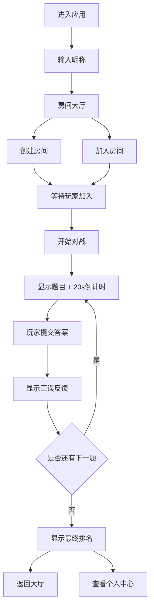

## 1. 产品概述

单词竞技场是一个多人协作的词汇对战平台，旨在通过竞技化的游戏方式提升语言学习者的背单词效率和互动性。

- 主要目的：解决传统背单词App互动性差、学习效率低的问题，让学习者在多人对战中巩固词汇
- 目标用户：语言学习者、学生、备考人群
- 市场价值：通过社交化、游戏化的学习方式，提高用户粘性和学习效果

## 2. 核心功能

### 2.1 用户角色

| 角色 | 注册方式 | 核心权限 |
|------|----------|----------|
| 普通用户 | 昵称输入 | 创建/加入房间、参与对战、查看个人数据 |

### 2.2 功能模块

1. **首页/房间大厅**：房间列表、创建房间、加入房间、用户信息入口
2. **对战房间**：实时对战、倒计时、答题、得分展示、玩家状态
3. **个人中心**：词汇成长曲线、对战统计、设置（音效开关）

### 2.3 页面详情

| 页面名称 | 模块名称 | 功能描述 |
|-----------|-------------|---------------------|
| 房间大厅 | 房间列表 | 以卡片网格展示可用房间，实时刷新，显示房间名、人数、难度 |
| 房间大厅 | 创建房间 | 弹窗表单，设置房间名、对战轮数（5/10轮）、词汇难度（初级/中级/高级） |
| 房间大厅 | 加入房间 | 点击房间卡片加入，人数不足时允许加入 |
| 对战房间 | 对战核心 | 展示题目、倒计时环形进度条、输入框、提交按钮 |
| 对战房间 | 玩家状态 | 显示所有玩家头像、本轮得分条、实时得分同步 |
| 对战房间 | 答案反馈 | 正确绿色闪光+10分，错误红色闪烁+0分，微动画效果 |
| 个人中心 | 统计卡片 | 总对战次数、胜率、词汇量估计值 |
| 个人中心 | 成长曲线 | Canvas绘制折线图，横轴日期纵轴词汇量 |
| 个人中心 | 设置 | 音效开关控制 |

## 3. 核心流程

用户进入应用后，输入昵称即可开始。可以选择创建新房间或加入已有房间。房间满员后开始对战，每轮20秒限时答题，所有玩家提交或超时后进入下一题。对战结束后显示最终排名，用户可返回大厅或查看个人成长数据。

## 4. 用户界面设计

### 4.1 设计风格

- **主色调**：深蓝到深紫渐变背景（#0f0c29 → #302b63）
- **强调色**：#6366f1（主按钮）、#22c55e（正确/初级）、#ef4444（错误/高级）、#eab308（中级）
- **字体**：使用现代无衬线字体，题目32px白色粗体，正文16px浅白色
- **布局**：居中对战舞台（最大宽1000px），磨砂玻璃效果背景
- **动效**：卡片悬浮上移6px、得分条宽度过渡0.5s、答案反馈闪光动画、按钮涟漪效果

### 4.2 页面设计概述

| 页面名称 | 模块名称 | UI元素 |
|-----------|-------------|-------------|
| 房间大厅 | 房间卡片 | 宽280px高200px圆角16px，磨砂玻璃背景，难度标签，悬浮上移动效 |
| 对战房间 | 对战舞台 | 磨砂玻璃背景，居中题目大字，下方输入框+提交按钮，顶部倒计时环 |
| 对战房间 | 得分条 | 高20px圆角10px，渐变填充，玩家头像圆形40px |
| 对战房间 | 倒计时 | 直径60px环形进度条，颜色从绿色渐变到红色 |
| 个人中心 | 统计卡片 | 磨砂玻璃背景，数据大字展示，点击缩放动效 |
| 个人中心 | 折线图 | Canvas绘制，#6366f1折线，圆形数据点，浅白色坐标轴 |

### 4.3 响应式

- 桌面优先设计，窗口宽度小于768px时自适应
- 房间列表变为单列布局
- 对战区域缩小至全宽，输入框宽度100%
- 字体大小调整至18px
- 环形倒计时移至左上角

## 5. 性能约束

- 题目切换与分数更新响应时间 ≤ 200ms
- 20秒倒计时内操作无卡顿
- 折线图渲染帧率 ≥ 30fps
