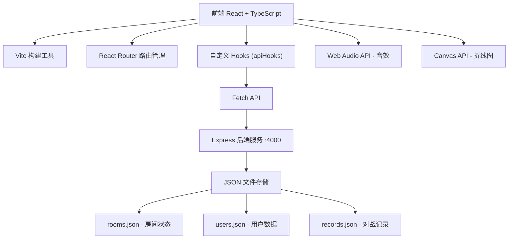

## 1. 架构设计



## 2. 技术描述

- **前端**：React@18 + TypeScript + Vite + React Router DOM@6
- **后端**：Express@4 + CORS + UUID
- **数据存储**：JSON 文件（rooms.json, users.json, records.json）
- **构建工具**：Vite（代理 /api 到 4000 端口）
- **样式方案**：CSS Modules + 自定义 CSS 变量

## 3. 目录结构

```
auto87/
├── package.json
├── index.html
├── tsconfig.json
├── vite.config.js
├── server/
│   └── index.js          # Express 服务端
├── src/
│   ├── App.tsx           # 主应用组件
│   ├── main.tsx          # 入口文件
│   ├── components/
│   │   ├── WordArena.tsx      # 对战核心组件
│   │   ├── RoomList.tsx       # 房间列表
│   │   ├── CreateRoomModal.tsx # 创建房间弹窗
│   │   ├── PlayerAvatar.tsx   # 玩家头像
│   │   ├── ScoreBar.tsx       # 得分条
│   │   ├── CountdownTimer.tsx # 倒计时环
│   │   └── Profile.tsx        # 个人中心
│   ├── services/
│   │   ├── apiHooks.ts        # API Hooks
│   │   └── mockWords.ts       # 单词库
│   ├── types/
│   │   └── index.ts           # TypeScript 类型定义
│   ├── utils/
│   │   ├── audio.ts           # 音效工具
│   │   └── chart.ts           # 图表工具
│   └── styles/
│       └── globals.css        # 全局样式
```

## 4. 路由定义

| 路由 | 页面组件 | 功能 |
|------|----------|------|
| `/` | HomePage | 昵称输入入口 |
| `/lobby` | LobbyPage | 房间大厅，展示房间列表 |
| `/room/:roomId` | RoomPage | 对战房间 |
| `/profile` | ProfilePage | 个人中心 |

## 5. API 定义

### TypeScript 类型定义

```typescript
// 用户类型
interface User {
  id: string;
  nickname: string;
  avatarColor: string;
  totalGames: number;
  wins: number;
  vocabulary: number;
  history: { date: string; vocabulary: number }[];
}

// 房间类型
interface Room {
  id: string;
  name: string;
  creatorId: string;
  players: Player[];
  maxPlayers: number;
  rounds: number;
  difficulty: 'easy' | 'medium' | 'hard';
  status: 'waiting' | 'playing' | 'finished';
  currentRound: number;
  currentQuestion: Question | null;
  timeRemaining: number;
}

// 玩家类型
interface Player {
  userId: string;
  nickname: string;
  avatarColor: string;
  score: number;
  roundScores: number[];
  hasAnswered: boolean;
  answer: string;
  isCorrect: boolean;
}

// 题目类型
interface Question {
  id: string;
  word: string;
  meaning: string;
  pos: string;
  type: 'english-to-chinese' | 'chinese-to-english';
}

// 单词类型
interface Word {
  word: string;
  meaning: string;
  pos: string;
  difficulty: 'easy' | 'medium' | 'hard';
}
```

### API 接口

| 方法 | 路径 | 描述 | 请求体 | 响应 |
|------|------|------|--------|------|
| POST | `/api/users` | 创建/登录用户 | `{ nickname: string }` | `User` |
| GET | `/api/users/:id` | 获取用户信息 | - | `User` |
| GET | `/api/rooms` | 获取房间列表 | - | `Room[]` |
| POST | `/api/rooms` | 创建房间 | `{ name, rounds, difficulty, creatorId }` | `Room` |
| POST | `/api/rooms/:id/join` | 加入房间 | `{ userId }` | `Room` |
| POST | `/api/rooms/:id/start` | 开始对战 | - | `Room` |
| GET | `/api/rooms/:id` | 获取房间状态 | - | `Room` |
| POST | `/api/rooms/:id/answer` | 提交答案 | `{ userId, answer }` | `{ isCorrect, score }` |
| POST | `/api/rooms/:id/next` | 进入下一题 | - | `Room` |
| GET | `/api/records/:userId` | 获取对战记录 | - | `GameRecord[]` |

## 6. 数据流向

### 房间管理流程
1. 组件调用 `useCreateRoom` Hook → 发送 POST `/api/rooms`
2. Express 路由接收请求 → 生成 UUID → 写入 rooms.json
3. 返回房间数据 → 前端跳转至 `/room/:id`

### 对战流程
1. WordArena 组件接收 roomId → 轮询 GET `/api/rooms/:id`
2. 服务端根据当前轮次从 mockWords 抽取题目
3. 玩家提交答案 → POST `/api/rooms/:id/answer`
4. 服务端校验答案 → 更新玩家得分 → 返回结果
5. 所有玩家提交或超时 → 触发下一题

### 数据同步
- 前端每 500ms 轮询房间状态
- 得分更新通过状态同步实时展示
- 个人中心数据从 users.json 读取

## 7. 核心模块调用关系

```
App.tsx (路由管理)
├── LobbyPage
│   ├── RoomList (调用 useGetRooms)
│   └── CreateRoomModal (调用 useCreateRoom)
├── RoomPage
│   └── WordArena
│       ├── CountdownTimer
│       ├── ScoreBar
│       ├── PlayerAvatar
│       ├── (调用 useGetRoom, useSubmitAnswer, useNextQuestion)
│       └── (引用 mockWords)
└── ProfilePage
    ├── (调用 useGetUser, useGetRecords)
    └── (使用 chart.ts 绘制折线图)

apiHooks.ts
├── useCreateUser
├── useGetUser
├── useGetRooms
├── useCreateRoom
├── useJoinRoom
├── useGetRoom
├── useSubmitAnswer
└── useNextQuestion

audio.ts (Web Audio API)
├── playCorrectSound (523Hz → 1047Hz, 0.2s)
├── playWrongSound (200Hz → 100Hz, 0.3s)
└── playTimeoutSound (440Hz, 0.1s)
```
