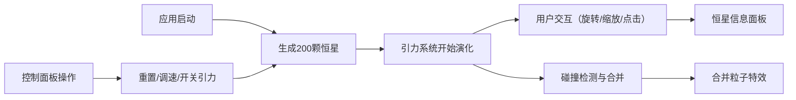

## 1. 产品概述

星团引力模拟3D可视化应用，帮助天文爱好者直观理解多体引力系统演化与恒星并合现象。通过交互式3D场景展示200颗恒星在引力作用下的运动、碰撞和合并过程。

- 目标用户：天文爱好者、学生、科普教育工作者
- 核心价值：将抽象的引力物理概念转化为直观可视的动态演示

## 2. 核心功能

### 2.1 功能模块

1. **3D星团场景**：200颗恒星的球状星团生成、引力模拟、碰撞合并
2. **交互控制**：鼠标拖拽旋转、右键平移、滚轮缩放、点击查看恒星信息
3. **控制面板**：重置星团、速度调节、引力开关、状态实时显示
4. **粒子特效**：恒星合并时的环形粒子爆炸效果
5. **信息面板**：点击恒星显示详细属性

### 2.2 页面详情

| 页面名称 | 模块名称 | 功能描述 |
|-----------|-------------|---------------------|
| 主页面 | 3D场景区域 | 渲染星团，处理引力更新、碰撞检测与合并逻辑，支持鼠标交互 |
| 主页面 | 控制面板 | 重置按钮、速度滑块、引力开关、恒星总数和合并次数显示、FPS和时间统计 |
| 主页面 | 信息面板 | 点击恒星弹出，显示ID、质量、速度、合并历史 |

## 3. 核心流程

用户打开应用 → 自动生成200颗恒星的球状星团 → 引力系统开始演化 → 用户可通过鼠标旋转/缩放视角 → 点击恒星查看详情 → 恒星碰撞产生合并特效 → 通过控制面板调整参数或重置

## 4. 用户界面设计

### 4.1 设计风格

- **主色调**：深空暗色主题，背景 #0a0a0f
- **卡片底色**：#1e1e2e
- **强调色**：#e94560
- **次要文字**：#a0a0b0
- **恒星颜色**：从蓝色 #00d4ff（小质量）渐变到红色 #ff4757（大质量）
- **按钮样式**：圆角8px，背景#e94560，白色文字
- **面板样式**：圆角10-12px，半透明背景（透明度0.9）
- **动画**：0.3秒透明度过渡动画
- **字体**：现代无衬线字体，清晰易读

### 4.2 页面设计概述

| 页面名称 | 模块名称 | UI元素 |
|-----------|-------------|-------------|
| 主页面 | 3D场景区域 | 占窗口80%宽度，彩色恒星球体，合并粒子特效 |
| 主页面 | 控制面板 | 右侧固定宽度280px，包含按钮、滑块、复选框、状态文字 |
| 主页面 | 信息面板 | 点击恒星弹出，宽200px圆角10px，显示恒星属性 |

### 4.3 响应性

- 桌面端优先设计，3D场景自适应窗口大小
- 控制面板固定在右侧，不随窗口缩放改变宽度
- 触摸设备支持基础手势操作

### 4.4 3D场景指导

- **环境**：纯黑深空背景，无额外光源，恒星自发光
- **光照**：每颗恒星使用自发光材质，颜色由质量决定
- **相机**：透视相机，初始视野50-150可调，支持轨道控制
- **交互**：OrbitControls，支持绕Y轴旋转、右键平移、滚轮缩放
- **动画**：每帧更新位置和速度，合并时触发粒子爆炸动画
- **性能**：保持至少30FPS，粒子特效60帧后自动回收
