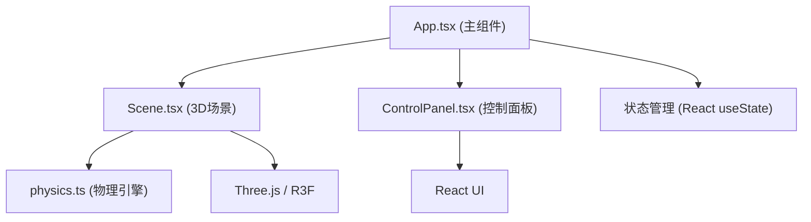

## 1. 架构设计



## 2. 技术描述

- **前端框架**：React 18 + TypeScript
- **3D渲染**：Three.js + @react-three/fiber + @react-three/drei
- **构建工具**：Vite
- **状态管理**：React useState（轻量级场景，无需额外状态管理库）
- **样式方案**：内联样式 + CSS变量
- **物理引擎**：自建纯函数物理模块

## 3. 文件结构

```
auto88/
├── index.html                 # 入口页面
├── package.json               # 项目依赖
├── tsconfig.json              # TypeScript配置
├── vite.config.js             # Vite配置
└── src/
    ├── App.tsx                # 主组件，组装场景和控制面板
    ├── Scene.tsx              # 3D场景组件
    ├── ControlPanel.tsx       # 控制面板组件
    └── physics.ts             # 引力计算与碰撞合并工具函数
```

## 4. 数据模型

### 4.1 恒星数据结构

```typescript
interface Star {
  id: number;
  position: THREE.Vector3;
  velocity: THREE.Vector3;
  radius: number;
  mass: number;
  color: THREE.Color;
  merged: boolean;
}
```

### 4.2 粒子特效数据结构

```typescript
interface MergeParticle {
  id: number;
  position: THREE.Vector3;
  velocity: THREE.Vector3;
  life: number;
  maxLife: number;
  color: THREE.Color;
}
```

## 5. 核心接口

### physics.ts 导出函数

```typescript
/**
 * 更新恒星位置和速度
 * @param stars 恒星数组
 * @param G 引力常数
 * @param softening 软参数
 * @param speedMultiplier 速度倍率
 * @param gravityEnabled 引力是否启用
 * @returns 更新后的恒星数组
 */
export function updateStars(
  stars: Star[],
  G: number,
  softening: number,
  speedMultiplier: number,
  gravityEnabled: boolean
): Star[];

/**
 * 检测并处理恒星合并
 * @param stars 恒星数组
 * @returns { stars: Star[], mergedCount: number, mergeEvents: MergeEvent[] }
 */
export function mergeStars(stars: Star[]): {
  stars: Star[];
  mergedCount: number;
  mergeEvents: MergeEvent[];
};
```

## 6. 性能优化策略

1. **对象池模式**：合并粒子特效使用对象池，避免频繁创建销毁
2. **帧间隔优化**：物理计算与渲染同步，每帧更新一次
3. **粒子自动回收**：合并粒子60帧后自动标记并回收
4. **引用优化**：使用不可变数据结构，避免不必要的重渲染
5. **InstancedMesh**：考虑使用实例化网格渲染大量恒星（如性能需要）

## 7. 依赖版本

- react: ^18.2.0
- react-dom: ^18.2.0
- three: ^0.160.0
- @react-three/fiber: ^8.15.0
- @react-three/drei: ^9.92.0
- typescript: ^5.3.0
- vite: ^5.0.0
- @vitejs/plugin-react: ^4.2.0
- @types/react: ^18.2.0
- @types/react-dom: ^18.2.0
- @types/three: ^0.160.0
