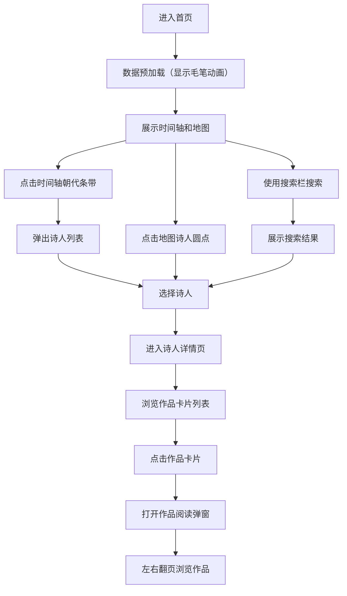

## 1. 产品概述

古诗词意境可视化探索应用，通过交互式时间轴和手绘风格中国地图，让用户从朝代和地域维度探索与比较多位诗人的代表作及其意境氛围。

- **核心价值**：以直观的可视化方式呈现中国古典诗词的时空分布，帮助用户感受不同朝代、不同地域的诗词风格差异
- **目标用户**：诗词爱好者、学生、文化研究者
- **产品定位**：文化教育类可视化应用，兼具观赏性和实用性

## 2. 核心功能

### 2.1 用户角色

| 角色 | 注册方式 | 核心权限 |
|------|----------|----------|
| 普通用户 | 无需注册 | 浏览时间轴、地图、诗人详情，搜索诗人，阅读诗词作品 |

### 2.2 功能模块

1. **首页**：时间轴组件（上半屏）、地图组件（下半屏）、顶部搜索栏
2. **诗人详情页**：诗人信息展示、作品卡片列表、水墨风格意境标签云、作品阅读弹窗
3. **通用功能**：搜索功能、数据预加载、路由导航

### 2.3 页面详情

| 页面名称 | 模块名称 | 功能描述 |
|---------|----------|----------|
| 首页 | 时间轴组件 | 横向滚动浏览唐、宋、元、明、清五个朝代，彩色条带表示诗人数量，点击弹出诗人列表 |
| 首页 | 地图组件 | Canvas2D绘制手绘风格中国地图，发光圆点标记诗人位置，悬浮显示信息，点击跳转详情 |
| 首页 | 搜索栏 | 按诗人姓名或朝代关键词搜索，下拉展示结果，点击跳转详情页 |
| 诗人详情页 | 诗人信息区 | 展示头像占位符、生卒年份、籍贯等基本信息 |
| 诗人详情页 | 作品列表区 | 卡片式展示代表作品，悬浮动效，点击弹窗阅读全诗 |
| 诗人详情页 | 意境标签云 | 动态生成水墨风格标签云，字体大小与作品数量正相关 |
| 通用 | 作品阅读弹窗 | 半透明背景，浮墨动画，支持左右翻页浏览同一诗人作品 |

## 3. 核心流程

用户进入首页后，系统异步预加载所有诗人数据，同时展示加载动画。数据加载完成后，用户可以通过三种方式探索：
1. 横向滚动时间轴，点击朝代条带查看诗人列表，选择诗人进入详情页
2. 浏览地图，点击发光圆点进入对应诗人详情页
3. 使用顶部搜索栏搜索诗人姓名或朝代，选择结果进入详情页

在诗人详情页，用户可以浏览作品列表，点击作品卡片打开阅读弹窗，欣赏全诗并可左右翻页浏览其他作品。

## 4. 用户界面设计

### 4.1 设计风格

- **整体风格**：水墨画/中国风，简约雅致，富有文化气息
- **主背景色**：浅宣纸色 `#faf5ef`
- **主文字色**：深墨色 `#2c2c2c`
- **朝代标志色**：唐 `#e76f51`、宋 `#f4a261`、元 `#e9c46a`、明 `#2a9d8f`、清 `#264653`
- **按钮风格**：圆角设计，背景 `#333`，文字白色，悬浮时背景 `#555`，过渡动画 `0.2s`
- **卡片风格**：圆角 `12px`，白色背景 `#ffffff`，阴影 `0 4px 12px rgba(0,0,0,0.1)`，悬浮时阴影加深并向上平移 `6px`
- **字体**：标题使用具有书法感的衬线字体，正文使用清晰易读的宋体或黑体
- **布局**：卡片式布局，留白充足，层次分明
- **动画**：所有交互元素均有 `0.3s ease-in-out` 过渡动画

### 4.2 页面设计概述

| 页面名称 | 模块名称 | UI元素 |
|---------|----------|---------|
| 首页 | 搜索栏 | 宽度300px，高度40px，圆角8px，背景#f8f9fa，边框#e9ecef，聚焦时边框#495057 |
| 首页 | 时间轴 | 横向分段，彩色条带宽度与诗人密度正相关，当前阶段高亮，其他半透明，tooltip展示信息 |
| 首页 | 地图 | 米黄色背景#f5f0e1，九段虚线山脉，蓝色半透明河流，灰色省份边界，发光圆点呼吸动画 |
| 诗人详情页 | 诗人信息 | 左侧2/3区域，圆形头像占位符（直径120px），生卒年、籍贯信息 |
| 诗人详情页 | 作品卡片 | 宽280px高180px，圆角12px，白色背景，悬浮动效 |
| 诗人详情页 | 标签云 | 右侧1/3区域，水墨风格，字体大小渐变，颜色#2b2b2b到#6b6b6b |
| 通用 | 阅读弹窗 | 半透明白色rgba(255,255,255,0.95)，圆角20px，宽600px高400px，中央浮墨旋转动画 |

### 4.3 响应式设计

- **设计原则**：桌面优先，移动适配
- **断点**：768px
- **移动端适配**：
  - 首页时间轴和地图由上下排列变为标签页切换
  - 详情页左右布局变为上下布局（标签云移至作品列表下方）
  - 触摸操作优化，增大点击区域

### 4.4 动画与交互

- **加载动画**：旋转毛笔图标，动画周期1.5秒
- **地图圆点**：呼吸脉动动画，每2秒缩放1.2倍后恢复
- **浮墨动画**：Canvas2D绘制不规则黑色墨点旋转扩散
- **卡片悬浮**：阴影加深，向上平移6px，0.3s ease-in-out过渡
- **页面切换**：平滑过渡，响应时间小于500ms
- **动画帧率**：保持在55FPS以上

## 5. 性能要求

- 页面切换响应时间：< 500ms（不含API数据加载）
- 动画帧率：≥ 55FPS
- 数据预加载：首页浏览时异步加载所有诗人数据，包含作品全文
- 模拟延迟：后端API添加2秒延迟以测试加载状态
