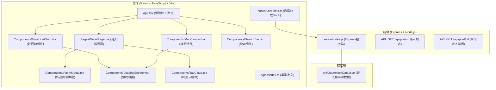
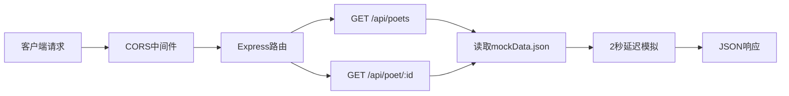
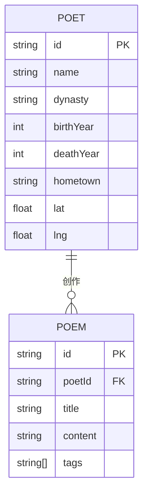

## 1. 架构设计



## 2. 技术选型说明

### 2.1 前端技术栈

| 技术 | 版本/说明 | 用途 |
|------|----------|------|
| React | 18.x | 用户界面构建库 |
| React DOM | 18.x | React DOM渲染 |
| React Router DOM | 6.x | 前端路由管理 |
| TypeScript | 5.x | 类型安全 |
| Vite | 5.x | 构建工具和开发服务器 |
| @vitejs/plugin-react | 4.x | Vite React插件 |
| @types/react | 18.x | React类型定义 |
| @types/react-dom | 18.x | React DOM类型定义 |
| Zustand | 4.x | 状态管理（预加载数据共享） |

### 2.2 后端技术栈

| 技术 | 版本/说明 | 用途 |
|------|----------|------|
| Express | 4.x | Web应用框架 |
| CORS | 2.x | 跨域资源共享 |
| UUID | 9.x | 唯一标识符生成 |
| @types/express | 4.x | Express类型定义 |
| Node.js | 18.x+ | 运行环境 |

### 2.3 构建与开发

- **初始化工具**：Vite脚手架（react-ts模板）
- **启动脚本**：`npm run dev` - 同时启动前端Vite开发服务器和后端Express服务器
- **代码规范**：TypeScript严格模式（`strict: true`）

## 3. 路由定义

| 路由路径 | 页面组件 | 功能描述 |
|---------|----------|----------|
| `/` | 首页（App.tsx内联） | 展示时间轴和地图，提供搜索功能 |
| `/poet/:id` | DetailPage.tsx | 展示诗人详情、作品列表和标签云 |

## 4. API 定义

### 4.1 类型定义

```typescript
// 诗词作品
interface Poem {
  id: string;
  title: string;
  content: string;
  tags: string[];
}

// 诗人
interface Poet {
  id: string;
  name: string;
  dynasty: '唐' | '宋' | '元' | '明' | '清';
  birthYear: number;
  deathYear: number;
  hometown: string;
  coordinates: {
    lat: number;
    lng: number;
  };
  poems: Poem[];
}

// 朝代信息
interface DynastyInfo {
  name: string;
  color: string;
  poets: Poet[];
}
```

### 4.2 接口列表

#### GET /api/poets

**描述**：获取所有诗人列表（包含作品全文）

**响应**：
```json
{
  "success": true,
  "data": [
    {
      "id": "uuid",
      "name": "李白",
      "dynasty": "唐",
      "birthYear": 701,
      "deathYear": 762,
      "hometown": "陇西成纪",
      "coordinates": { "lat": 34.38, "lng": 105.93 },
      "poems": [...]
    }
  ]
}
```

#### GET /api/poet/:id

**描述**：根据ID获取单个诗人详情

**请求参数**：
- `id` (path): 诗人唯一标识符

**响应**：
```json
{
  "success": true,
  "data": {
    "id": "uuid",
    "name": "李白",
    "dynasty": "唐",
    ...
  }
}
```

**错误响应**：
```json
{
  "success": false,
  "message": "诗人不存在"
}
```

### 4.3 服务器特性

- **监听端口**：3001
- **CORS配置**：允许所有来源跨域请求
- **模拟延迟**：所有接口添加2秒延迟以测试加载状态
- **数据来源**：从 `src/Data/mockData.json` 读取

## 5. 服务器架构



## 6. 数据模型

### 6.1 实体关系图



### 6.2 数据说明

- **数据量**：至少10位诗人，每位诗人至少2首代表作
- **数据来源**：静态JSON文件 `src/Data/mockData.json`
- **ID生成**：使用UUID v4
- **朝代覆盖**：唐、宋、元、明、清五个朝代均有诗人分布
- **坐标数据**：诗人籍贯或活跃地的经纬度，用于地图标记

### 6.3 初始数据规划

| 诗人 | 朝代 | 籍贯 | 代表作品 | 意境标签 |
|------|------|------|----------|----------|
| 李白 | 唐 | 陇西成纪 | 《将进酒》《静夜思》 | 豪放、浪漫 |
| 杜甫 | 唐 | 河南巩县 | 《春望》《登高》 | 沉郁、写实 |
| 苏轼 | 宋 | 四川眉山 | 《念奴娇·赤壁怀古》《水调歌头》 | 豪放、旷达 |
| 李清照 | 宋 | 山东济南 | 《声声慢》《如梦令》 | 婉约、凄美 |
| 辛弃疾 | 宋 | 山东济南 | 《破阵子》《永遇乐》 | 豪放、爱国 |
| 关汉卿 | 元 | 河北安国 | 《窦娥冤》《一枝花·不伏老》 | 豪放、悲情 |
| 马致远 | 元 | 北京 | 《天净沙·秋思》《汉宫秋》 | 悲秋、婉约 |
| 唐寅 | 明 | 江苏苏州 | 《桃花庵歌》《落花诗》 | 飘逸、洒脱 |
| 袁枚 | 清 | 浙江杭州 | 《所见》《苔》 | 清新、自然 |
| 纳兰性德 | 清 | 北京 | 《木兰词》《长相思》 | 婉约、深情 |

## 7. 目录结构

```
auto89/
├── .trae/documents/          # 项目文档
├── src/
│   ├── App.tsx               # 根组件
│   ├── main.tsx              # 入口文件
│   ├── index.css             # 全局样式
│   ├── types/
│   │   └── index.ts          # TypeScript类型定义
│   ├── store/
│   │   └── usePoetStore.ts   # Zustand状态管理
│   ├── hooks/
│   │   └── usePoets.ts       # 数据获取Hook
│   ├── Components/
│   │   ├── TimeLineChart.tsx # 时间轴组件
│   │   ├── MapCanvas.tsx     # 地图组件
│   │   ├── SearchBar.tsx     # 搜索组件
│   │   ├── PoemModal.tsx     # 作品阅读弹窗
│   │   ├── LoadingSpinner.tsx# 加载动画
│   │   ├── TagCloud.tsx      # 标签云组件
│   │   └── PoetCard.tsx      # 诗人卡片组件
│   ├── Pages/
│   │   └── DetailPage.tsx    # 诗人详情页
│   └── Data/
│       └── mockData.json     # 诗人和诗词数据
├── server/
│   └── index.js              # Express服务器
├── index.html                # HTML入口
├── package.json              # 依赖配置
├── tsconfig.json             # TypeScript配置
├── vite.config.js            # Vite配置
└── .gitignore
```

## 8. 关键技术实现点

### 8.1 时间轴组件
- 横向滚动容器，支持鼠标拖拽和滚轮滚动
- 朝代条带宽度根据诗人数量动态计算
- 点击条带弹出诗人列表卡片
- 导航按钮快速切换朝代

### 8.2 地图组件
- Canvas2D绘制手绘风格地图轮廓
- requestAnimationFrame实现圆点呼吸动画
- 经纬度坐标转换为Canvas像素坐标
- 鼠标事件检测（悬浮、点击）

### 8.3 作品阅读弹窗
- Canvas2D实现浮墨旋转动画
- 左右翻页切换作品
- 键盘快捷键支持（ESC关闭，左右箭头翻页）

### 8.4 标签云组件
- 根据标签出现频率动态计算字体大小
- 随机分布布局，避免标签重叠
- 颜色从#2b2b2b到#6b6b6b渐变

### 8.5 状态管理
- Zustand存储预加载的诗人数据
- 避免重复请求，提升页面切换速度
- 加载状态全局管理
