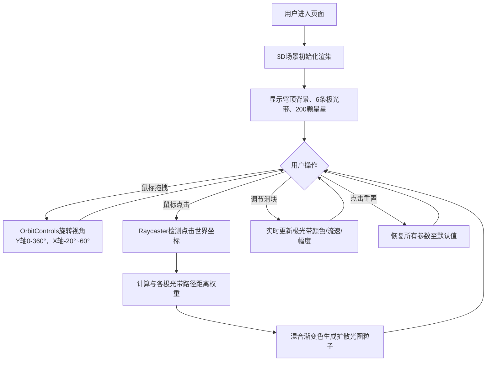

## 1. 产品概述
极光交互画布是一款沉浸式3D视觉体验应用，用户通过鼠标交互在三维空间中操控动态流动的彩色极光带，实现艺术创作与视觉疗愈。
- 面向视觉爱好者、数字艺术家及普通用户，提供直观的极光粒子参数调节体验
- 核心价值在于高性能实时渲染、细腻的视觉效果和流畅的交互反馈

## 2. 核心功能

### 2.1 用户角色
| 角色 | 注册方式 | 核心权限 |
|------|----------|----------|
| 普通用户 | 无需注册 | 浏览3D场景、调节极光参数、交互体验 |

### 2.2 功能模块
1. **3D场景画布**: 半透明穹顶背景、6条极光带粒子系统、200颗飘浮星星
2. **交互控制**: 鼠标拖拽旋转视角、点击发射扩散光圈
3. **参数控制面板**: 每条极光带独立颜色/流速/幅度调节、重置按钮

### 2.3 页面详情
| 页面名称 | 模块名称 | 功能描述 |
|----------|----------|----------|
| 主画布页 | 3D场景渲染 | 渲染穹顶、极光带、星星粒子，支持OrbitControls视角控制 |
| 主画布页 | 极光带粒子系统 | 6条各200粒子沿贝塞尔曲线流动，BufferGeometry attribute更新机制 |
| 主画布页 | 星星粒子系统 | 200颗白色星星随机闪烁，缓慢旋转漂浮 |
| 主画布页 | 点击交互 | Raycaster检测点击位置，发射40粒子扩散光圈，颜色按距离权重混合 |
| 主画布页 | 控制面板 | 毛玻璃效果UI，6组独立控制滑块，颜色选择器，重置按钮 |

## 3. 核心流程

用户打开页面 → 3D场景加载渲染（穹顶+极光带+星星） → 鼠标拖拽旋转视角探索场景 → 点击场景任意位置发射扩散光圈 → 通过右侧面板调节极光带颜色/流速/波动幅度 → 点击重置按钮恢复默认参数

## 4. 用户界面设计

### 4.1 设计风格
- **主色调**: 深空蓝 `#0a0e27`，极光渐变色 `#00ff87`（绿）→ `#6f00ff`（紫）
- **强调色**: 重置按钮珊瑚红 `#ff6b6b`，悬浮态 `#ff4757`
- **背景**: 半透明穹顶 `#0a0e27` 透明度 0.95，控制面板毛玻璃 `rgba(255,255,255,0.1)`
- **字体**: 现代无衬线字体，标题 14px，标签 12px
- **布局**: 桌面端右侧固定垂直居中控件面板，窄屏顶部横向滚动面板
- **按钮样式**: 圆角 18px，颜色选择器圆形直径 28px，圆角 50%
- **控件过渡**: 悬浮亮度 1.2 倍，过渡 0.2s；重置按钮点击 scale(0.95)

### 4.2 页面设计概述
| 页面名称 | 模块名称 | UI元素 |
|----------|----------|----------|
| 主画布页 | 3D场景 | 全屏Canvas，深蓝穹顶，彩色流动极光，闪烁星星，扩散光圈动效 |
| 主画布页 | 控制面板 | 毛玻璃面板(圆角16px，边框1px rgba(255,255,255,0.2)，内边距24px)，6组垂直堆叠控制组，底部重置按钮 |
| 主画布页 | 控制组单元 | 圆形颜色选择器(直径28px)，流速滑块(宽180px高6px圆角3px，轨道#2a2d4a，填充对应极光色)，波动幅度滑块 |

### 4.3 响应式
- **桌面端（≥768px）**: 控制面板固定右侧，距边缘20px，垂直居中
- **窄屏端（<768px）**: 控制面板移至顶部，宽度100%，高度120px，可横向滚动，控件尺寸适当缩放（颜色选择器20px，滑块宽度120px）

### 4.4 3D场景指引
- **环境与氛围**: 深空背景，半透明穹顶包裹，营造宇宙极光沉浸感
- **光照设置**: 无额外光源，依赖粒子自发光(AdditiveBlending)实现辉光效果
- **相机设置**: PerspectiveCamera fov=60，OrbitControls enablePan=false，enableZoom=true
- **视角范围**: Y轴旋转0-360°，X轴俯仰-20°~60°，阻尼系数0.9
- **渲染顺序**: 穹顶renderOrder=0(关闭depthWrite)，星星renderOrder=1，极光带renderOrder=2，光圈renderOrder=3
- **后期处理**: AdditiveBlending叠加混合，实现发光粒子效果
- **性能预算**: 粒子总数≤2000（极光1200+星星200+光圈40×并发池），稳定60FPS
