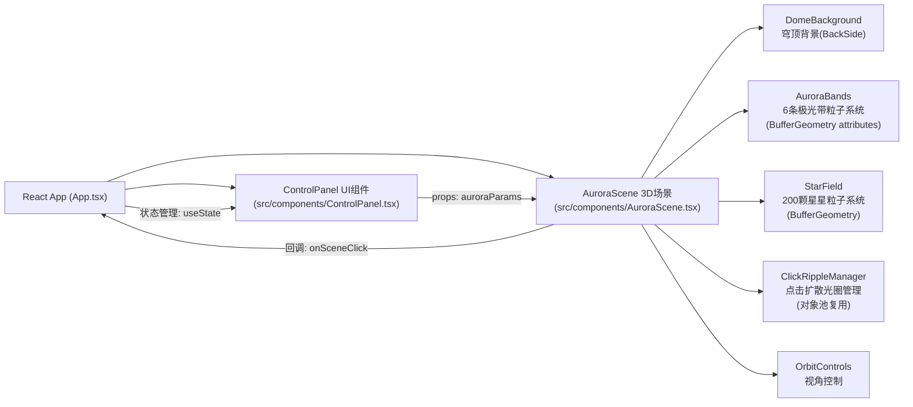

## 1. 架构设计



## 2. 技术描述
- **前端框架**: React@18 + TypeScript@5 + Vite@5
- **3D渲染**: three@0.160 + @react-three/fiber@8 + @react-three/drei@9
- **初始化工具**: vite-init (react-ts模板)
- **后端**: 无（纯前端项目）
- **状态管理**: React useState (轻量场景，无需zustand)
- **样式方案**: 原生CSS + CSS变量（无需Tailwind，精细自定义UI）

## 3. 路由定义
| 路由 | 用途 |
|------|------|
| / | 主画布页（唯一页面，全屏3D场景+右侧控制面板） |

## 4. API定义
无后端API，纯前端应用。内部TypeScript类型定义如下：

```typescript
// 单条极光带参数
interface AuroraBandParams {
  id: number;
  color: string;        // hex颜色，如 '#00ff87'
  flowSpeed: number;    // 流动速度 0.5-1.5
  amplitude: number;    // 波动幅度 0.5-3.0
}

// 全局极光参数（6条）
type AuroraParams = AuroraBandParams[];

// 贝塞尔曲线控制点
interface BezierCurve {
  p0: THREE.Vector3;
  p1: THREE.Vector3;
  p2: THREE.Vector3;
  p3: THREE.Vector3;
}

// 光圈粒子状态
interface RippleParticle {
  active: boolean;
  angle: number;
  life: number;         // 0-1
  maxLife: number;      // 秒
  origin: THREE.Vector3;
}
```

## 5. 数据模型

### 5.1 粒子数据模型（BufferGeometry attributes）

**极光带粒子 Attributes**:
| Attribute | 类型 | 维度 | 说明 |
|-----------|------|------|------|
| position | Float32Array | 3 | 粒子世界坐标，每帧直接更新TypedArray |
| color | Float32Array | 3 | 粒子RGB颜色，基于极光色+渐变插值 |
| size | Float32Array | 1 | 粒子像素大小 3-8px随机 |
| aOffset | Float32Array | 1 | 粒子在贝塞尔曲线上的偏移量(0-1)，初始化随机 |
| aSpeed | Float32Array | 1 | 单粒子流动速度倍率 0.8-1.2随机 |
| aPhase | Float32Array | 1 | 波动相位偏移 0-2π随机 |

**星星粒子 Attributes**:
| Attribute | 类型 | 维度 | 说明 |
|-----------|------|------|------|
| position | Float32Array | 3 | 星星世界坐标（球壳分布） |
| color | Float32Array | 3 | 固定白色(1,1,1) |
| size | Float32Array | 1 | 星星像素大小 1-3px随机 |
| aTwinkleSpeed | Float32Array | 1 | 闪烁周期 2-5秒随机 |
| aTwinklePhase | Float32Array | 1 | 闪烁相位 0-2π随机 |
| aOpacity | Float32Array | 1 | 基础透明度 0.3-0.8随机 |

## 6. 核心性能优化方案

### 6.1 BufferGeometry Attribute更新机制
- 所有粒子系统使用单个BufferGeometry + Points，而非逐个Mesh
- 每帧更新`geometry.attributes.position.needsUpdate = true`
- 直接操作底层Float32Array，避免创建新的Vector3/Color对象
- TypedArray原地修改，零GC压力

### 6.2 渲染顺序与深度测试
```
穹顶: renderOrder=0, depthWrite=false, Side=BackSide
星星: renderOrder=1, depthWrite=false, transparent=true
极光: renderOrder=2, depthWrite=false, AdditiveBlending
光圈: renderOrder=3, depthWrite=false, AdditiveBlending
```

### 6.3 点击光圈对象池
- 预分配5组×40粒子=200粒子的光圈粒子池
- 复用已消散的光圈，避免频繁创建销毁BufferGeometry

### 6.4 距离权重颜色混合算法
点击点P世界坐标，对每条极光带贝塞尔曲线采样N=10个点，取最近距离d_i：
- 权重w_i = 1 / (d_i² + ε)，ε=1.0防止除零
- 归一化w_i → Σw_i=1
- 最终颜色 = Σ(w_i × 极光带i的渐变色)
