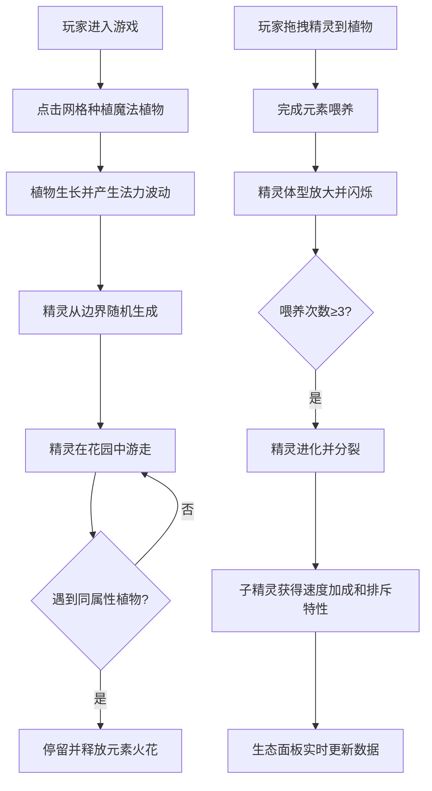

## 1. 产品概述

魔法学院植物园精灵生态模拟游戏，玩家通过种植魔法植物、喂养精灵生物来构建动态生态系统。解决传统模拟经营类游戏生物多样性低、互动反馈不丰富的问题。

- **核心玩法**：在8x8网格花园中种植发光魔法植物，吸引不同属性的精灵生物，通过拖拽喂养促进精灵进化和繁殖，维护生态平衡。
- **目标用户**：喜欢模拟经营、收集养成类游戏的休闲玩家。
- **市场价值**：创新的精灵生态系统和丰富的视觉反馈，提供沉浸式的魔法花园体验。

## 2. 核心功能

### 2.1 功能模块

1. **花园网格系统**：8x8种植区域，魔法植物种植与生长
2. **精灵生态系统**：12种元素精灵的生成、游走、互动、进化
3. **粒子特效系统**：脉冲波纹、元素火花、排斥动画等视觉效果
4. **交互系统**：植物种植、精灵拖拽喂养
5. **生态面板**：精灵统计、等级分布、健康值监控

### 2.2 页面详情

| 页面名称 | 模块名称 | 功能描述 |
|-----------|-------------|---------------------|
| 游戏主界面 | 花园网格 | 8x8格种植区域，显示植物生长状态和法力波动 |
| 游戏主界面 | 精灵渲染 | Canvas绘制12种像素风精灵，显示游走动画 |
| 游戏主界面 | 粒子特效 | 脉冲波纹、元素火花、排斥圆圈等动画效果 |
| 游戏主界面 | 生态面板 | 右侧220px宽半透明面板，显示精灵总数、等级分布、生态健康值 |

## 3. 核心流程

## 4. 用户界面设计

### 4.1 设计风格

- **主题**：深色魔法主题
- **主色调**：背景 #0f0e17，主色 #ff8906，高亮 #e53170
- **花园地板**：夜色石板纹理 #2d2a35，网格线微弱发光 #ff890630
- **按钮样式**：圆角8px，hover时0.2s放大和颜色过渡
- **字体**：14px白色细体
- **动画**：植物种植缩放动画（0.5s弹性效果）、精灵平滑转向（≤30度）、拖拽发光描边

### 4.2 页面设计概述

| 页面名称 | 模块名称 | UI元素 |
|-----------|-------------|-------------|
| 游戏主界面 | 花园网格 | 8x8格子、夜色石板纹理、微弱发光网格线 |
| 游戏主界面 | 魔法植物 | 3种元素颜色、脉冲波纹动画、法力波动范围 |
| 游戏主界面 | 精灵生物 | 16x24px像素色块、12种元素颜色、平滑游走动画 |
| 游戏主界面 | 粒子特效 | 元素火花粒子、排斥红色圆圈、喂养闪烁效果 |
| 游戏主界面 | 生态面板 | 半透明背景 #1a1a2e80、水平柱状图、健康值进度条 |

### 4.3 响应式

- 桌面端优先设计，全屏Canvas渲染
- 固定花园尺寸（800x800px）+ 右侧面板（220px）
- 整体居中布局

## 5. 性能需求

- **帧率**：游戏逻辑不低于30FPS
- **粒子限制**：最大同时存在300个粒子
- **交互响应**：拖拽时无卡顿，hover过渡流畅
