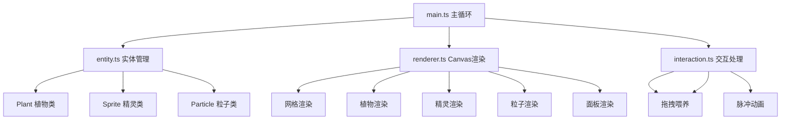

## 1. 架构设计



## 2. 技术描述

- **前端技术栈**：TypeScript + Vite，无外部图形库，纯Canvas渲染
- **构建工具**：Vite
- **语言**：TypeScript（严格模式，target ES2020）
- **渲染方式**：HTML5 Canvas 2D API
- **状态管理**：GameState 接口统一管理游戏状态

## 3. 项目结构

```
├── package.json          # 项目配置和依赖
├── index.html            # 入口页面
├── tsconfig.json         # TypeScript配置
├── vite.config.js        # Vite配置
└── src/
    ├── main.ts           # 游戏主循环、定时器、状态管理
    ├── entity.ts         # 植物、精灵、粒子类定义
    ├── renderer.ts       # Canvas渲染逻辑
    └── interaction.ts    # 鼠标交互处理
```

## 4. 数据模型

### 4.1 核心接口定义

```typescript
interface GameState {
  plants: Plant[];
  sprites: Sprite[];
  particles: Particle[];
  ripples: Ripple[];
  gridSize: number;
  cellSize: number;
  totalSprites: number;
  levelDistribution: Record<string, number>;
  ecoHealth: number;
  selectedSprite: Sprite | null;
  isDragging: boolean;
}

interface Plant {
  id: string;
  element: 'fire' | 'ice' | 'thunder';
  x: number;
  y: number;
  gridX: number;
  gridY: number;
  growthProgress: number;
  growthTime: number;
  manaRadius: number;
  color: string;
  plantedAt: number;
  scale: number;
}

interface Sprite {
  id: string;
  element: string;
  x: number;
  y: number;
  vx: number;
  vy: number;
  speed: number;
  size: number;
  color: string;
  feedCount: number;
  level: number;
  isEvolved: boolean;
  isMutated: boolean;
  stayTimer: number;
  flashTimer: number;
  scale: number;
}

interface Particle {
  id: string;
  x: number;
  y: number;
  vx: number;
  vy: number;
  life: number;
  maxLife: number;
  size: number;
  color: string;
  type: 'spark' | 'repel';
}
```

### 4.2 常量定义

| 常量 | 值 | 说明 |
|------|----|------|
| GRID_SIZE | 8 | 花园网格尺寸 |
| CELL_SIZE | 100 | 每格像素大小 |
| SPRITE_SIZE | {w: 16, h: 24} | 精灵尺寸 |
| MAX_PARTICLES | 300 | 最大粒子数量 |
| MIN_SPEED | 40 | 精灵最小速度(px/s) |
| MAX_SPEED | 80 | 精灵最大速度(px/s) |
| STAY_DURATION | 5000 | 精灵停留时间(ms) |
| FEED_THRESHOLD | 3 | 进化所需喂养次数 |
| REPEL_DISTANCE | 60 | 排斥触发距离(px) |
| RIPPLE_DURATION | 1500 | 脉冲波纹周期(ms) |

## 5. 核心算法

### 5.1 精灵平滑转向
- 每帧更新方向，转向角限制在±30度内
- 使用线性插值平滑速度向量

### 5.2 生态健康值计算
```
健康值 = (精灵多样性指数 × 0.5 + 植物存活率 × 0.5) × 100
多样性指数 = 精灵种类数 / 12
植物存活率 = 存活植物数 / 总种植数
```

### 5.3 碰撞检测
- 精灵与植物：距离检测（精灵位置到植物中心 < 法力波动半径）
- 精灵与精灵：距离检测（两精灵距离 < 60px触发排斥）

### 5.4 精灵进化逻辑
- 喂养次数达到3次触发进化
- 分裂为2个子精灵：1只保持原属性，1只属性随机变异
- 子精灵速度提升15%
- 获得排斥特性

## 6. 渲染流程

每帧执行顺序：
1. 清空Canvas
2. 绘制花园网格和底板
3. 更新并绘制脉冲波纹
4. 绘制所有植物（含法力波动范围）
5. 更新并绘制所有粒子
6. 更新精灵位置和状态
7. 绘制所有精灵（含拖拽描边）
8. 绘制右侧生态面板
9. 绘制UI交互提示
