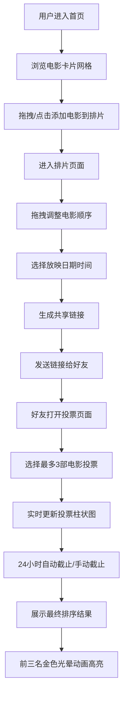

## 1. 产品概述

家庭电影夜排片应用，帮助用户从预设电影库中选择影片，安排放映顺序并生成个性化放映表，支持好友投票选择想看影片。

- 主要目的：为家庭聚会、朋友观影活动提供便捷的排片和投票工具
- 目标用户：家庭用户、朋友聚会组织者、电影爱好者

## 2. 核心功能

### 2.1 用户角色

| 角色 | 注册方式 | 核心权限 |
|------|----------|----------|
| 排片创建者 | 无需注册，直接使用 | 创建排片、编辑排片顺序、截止投票、查看最终结果 |
| 投票用户 | 通过共享链接访问 | 浏览待选影片、每人投3票、查看实时投票结果 |

### 2.2 功能模块

1. **首页**：电影卡片网格展示、排片区域预览、拖拽添加电影
2. **排片页面**：拖拽排序电影、选择放映日期时间、生成共享链接、查看最终排序
3. **投票页面**：待选电影列表、投票操作、实时票数柱状图展示

### 2.3 页面详情

| 页面名称 | 模块名称 | 功能描述 |
|----------|----------|----------|
| 首页 | 电影卡片网格 | 展示所有电影卡片，鼠标悬停动画，点击翻转查看详情 |
| 首页 | 排片区域 | 左侧展示排片列表，支持拖拽排序和移除，显示总时长和自动放映日期 |
| 排片页面 | 排片管理 | 拖拽调整顺序、选择日期时间、生成共享链接、手动截止投票 |
| 排片页面 | 最终结果 | 按票数降序排列，前三名金色光晕动画，高亮票数最高影片时段 |
| 投票页面 | 电影列表 | 展示排片表中所有待选电影 |
| 投票页面 | 投票操作 | 每人3票，方块按钮切换投票状态 |
| 投票页面 | 柱状图 | 实时更新票数柱状图，柱顶显示票数 |

## 3. 核心流程

用户从首页浏览电影库，通过拖拽或点击将感兴趣的电影加入排片区域，在排片页面调整顺序并选择放映时间，生成共享链接发送给好友。好友通过链接进入投票页面，为喜欢的电影投票（最多3票）。投票实时更新柱状图，24小时后自动截止或创建者手动截止，最终按票数排序展示前三名金色高亮。

## 4. 用户界面设计

### 4.1 设计风格

- **主色调**：深紫到蓝黑渐变背景（#2e1065 到 #1e1b4b）
- **强调色**：亮紫色 #c084fc，金色 #f59e0b
- **文字颜色**：白色和淡紫色
- **卡片/面板**：半透明毛玻璃效果（背景 rgba(255,255,255,0.05)，圆角 16px，backdrop-filter(blur 8px)）
- **按钮风格**：圆角按钮，悬停放大，过渡动画 0.3s
- **字体**：系统默认字体
- **布局风格**：顶部导航栏 + 主内容区，居中最大宽度 1200px
- **图标风格**：Emoji 图标（如 🎬）

### 4.2 页面设计概览

| 页面名称 | 模块名称 | UI元素 |
|----------|----------|--------|
| 首页 | 导航栏 | 高 60px，左侧 🎬 logo + 标题，右侧圆形用户头像 |
| 首页 | 电影卡片 | 260px × 360px，圆角 16px，悬停上移 8px + 阴影放大，翻转 3D 动画 0.4s |
| 首页 | 排片区域 | 左侧列表表格，右侧总时长和日期 |
| 排片页面 | 排片列表 | 拖拽半透明跟随，目标位置虚线边框高亮 |
| 投票页面 | 投票按钮 | 方块按钮，选中时 #c084fc + 2px 白色内发光 |
| 投票页面 | 柱状图 | 垂直柱，动态高度过渡 0.3s，柱顶显示票数 |
| 结果页 | 前三名 | 金色 #f59e0b 光晕闪烁动画，周期 1s |

### 4.3 响应式设计

- 桌面端：电影卡片每行 3-4 张
- 平板端：电影卡片每行 2 张
- 手机端：电影卡片每行 1 张，卡片宽度自适应屏幕
- 所有交互元素触摸优化

